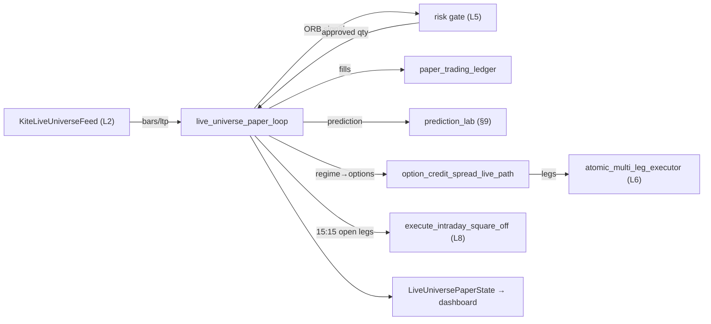
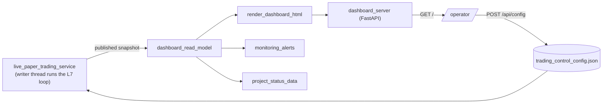

# SYSTEM MAP — the living architecture & data-flow map

> ⚠️ **STALE FOR THE REBUILD, 2026-08-13.** Everything below describes the system as it stood
> BEFORE the 2026-08-10 reset (`A.26`) — 353 modules across packages that no longer exist in
> `src/`. It is kept because its runtime flows and its maintenance ledger are still the best record
> of what the archived system did and why. **For what exists today, read `docs/FEATURE_MAP.md`**,
> which `A.94` made the build document. The current tree is 140 modules; `F01` (the cost reality
> filter) and `F02` (the order path, `src/nse_algo_trader/order_path/`) are the two features
> complete under the rebuild. Regenerating this map from the new tree is tracked in `BACKLOG.md`.
>
> **Added since, and not drawn below.** This list is appended to rather than rewritten, so the gap
> between this map and the tree is always visible rather than merely known. Tree measured
> **2026-08-16: 145 modules across 21 packages** (was 140 on 2026-08-13).
>
> - *2026-08-13* — `deployable_capital_resolver` (`L1.17` — live sizing measured from the broker
>   and bounded by the operator ceiling) and `paper_capital_ledger` +
>   `dashboard/paper_capital_surface_renderer` (`L1.18` — the paper trading book's event-sourced
>   virtual money, surfaced at `/paper-capital`). The live/paper halves of one decision, exposing
>   the same four members so a sizing consumer picks a source by mode. `A.102` scopes the resolver
>   to LIVE: a real account in debit must not stop a book trading imaginary money.
> - *2026-08-15* — `F04`'s paper loop end to end (`L10.02`), `capture_liveness_record` and the
>   scheduled depth capture (`L0.33`, `A.118`/`A.119`), and `market_depth/
>   bar_tape_join_verification_engine` + `bar_tape_join_verdict_store` (`L0.36`, `M14`) — the
>   comparison of the bar store against the depth tape, whose refusals union into the replay
>   engine's inadmissible set so a refuted join produces no paper fill.
> - *2026-08-16* — the join engine's null replaced (`A.123`: beta-binomial with a per-session
>   intra-instrument correlation, exact leave-one-out) and a POWER gate added to `JOIN_VERIFIED`
>   (`A.124`: `smallest_trials_that_can_verify`, with what verified CLAIMS as a third operator
>   policy input). Surfaced on `/microstructure`. Specs `docs/research/241`, `242`.


**This is the single source of truth for how this project is built and how
data flows through it.** Read THIS first — before opening any source file.
A fresh agent (on any server) should be able to understand the whole system
from this one document, and any human/agent should be able to find "which
files make up feature X, what flows into it, what it emits, and how data
moves file-to-file inside it" without grepping the tree.

- **Format:** a Data-Flow Diagram (features = processes) fused with the C4
  model's Component→Code levels. Rendered in **Mermaid** (text = git-diffable,
  agent-parseable, renders in any Markdown/Artifact viewer).
- **Generated from the real code** (AST import graph), not memory — so it is
  true to what is actually on the server. Last regenerated: **2026-07-27** (nodes + edges reconciled
  against the §0 extractor — every feature package has a node, every material data-flow edge drawn).
- **353 Python modules across 28 feature packages** (`src/nse_algo_trader/`; +1 top-level `__init__`): broker_credentials(3),
  broker_sessions(9), universe_registry(6), market_data(35), indicators(13), strategy_engine(11),
  risk_management(7), broker_oms(12), paper_trading(61), session_management(3), dashboard(19),
  memory_reflection(7), participant_positioning(5), llm_strategy(17), conscience(15), sentience(10), epistemics(3), predictive_core(13), society(3), news_sentiment(22), axiology(3), will(3), capital_allocation(9), intrinsic_motivation(6), autopoiesis(14), segment_bots(24), portfolio_supervisor(10), option_alpha(9).

> **Feature Catalogue dashboard (Rule R, 2026-08-03):** new project-wide catalogue at `/catalogue` —
> the whole picture (built / partial / planned / discussed / idea / forgotten-skip / blocked), 708 feature
> rows + 197 atlas branches, mined from SYSTEM_MAP+MASTER_PROGRESS+BACKLOG+ideas+218 research docs (5
> read-only inventory agents). NEW rule **R (server-truth)**: the plan is authored
> (`dashboard/feature_catalogue_authored.json`) but every BUILD-STATUS is MEASURED, not hand-typed —
> `dashboard/feature_catalogue_status_prober.py` scans the live 303-module set on disk and reconciles each
> row (built/partial/`unverified`/blocked/planned/not-built) with a generation timestamp;
> `dashboard/render_feature_catalogue_html.py` renders three views (Catalogue · measured Status-Wall ·
> AI-Atlas) in the crypto Feature-Catalogue design. Wired: `/catalogue` route in `dashboard_server` +
> nav link on the main dashboard. Live-verified (HTTP 200, 235 built code-backed, 84/197 atlas, 266
> forgotten) + screenshot-confirmed all 3 views + dark. Spec: `docs/research/feature_catalogue_dashboard_spec_2026-08-03.md`.
>
> **3-segment-bot redesign — slice 1 (INDEX-OPT vol-regime engine, 2026-08-03):** new `segment_bots/`
> package (26th). Shared seam `segment_bot_protocol.py` (`SegmentBot` Protocol · `TradeProposal` · structures
> · `BotCompetency`) that all 3 bots + the supervisor bind to (bots PROPOSE only — crypto §03b). First deep
> engine `index_option_bot/volatility_regime_engine.py`: GJR-GARCH(1,1,1) skew-t + HAR-RV conditional-vol
> forecast (`arch`) fused with a `statsmodels` Markov-switching **filtered (point-in-time) regime** posterior;
> carried fitted state via `VolatilityRegimeStore` (+ metrics ledger); Rule-Q maturity ladder (EWMA fallback
> below 250 obs, honest `gathering`); output `VolatilityRegimeState` (regime · forecast σ · VRP) drives the
> premium-harvest decision. 7 tests (fit · simplex-invariant · blend-bounds · maturity-gate · adversarial ·
> persist). Rule-F: earned path verified on 2,145 real NSE 5m bars (regime=calm, VRP+, harvest=True); daily
> earned-path awaits ≥250 trading days (29 stored → accrual blocker, Rule K). Consumer = the assembled
> INDEX-OPT bot (slice 5, queued). Spec: `docs/research/index_option_bot_engine_spec_2026-08-03.md`.
>
> **Option bots now TRADE on their earned directional edge (2026-08-04):** diagnosed why index/stock option
> bots stood aside while cash traded — `iv_rank` is None across the universe (needs ~60 sessions of ATM-IV
> history; store has ~6–36), so the vol-edge selector branches never fire. Fix: both structure selectors gain
> an EARNED-TREND branch — when the arbiter returns a directional verdict (already gated by 0.55 confidence +
> 0.10 margin) at gathering/mid IV, the bot expresses it as a DEFINED-RISK directional debit spread (CE for
> LONG, PE for SHORT via new `_put_debit_spread`), flagged `directionally_earned` so the policy trades it on
> the arbiter's gate, NOT the vol-conviction floor (directional buying needs no vol edge). `StructureDecision`
> gained `directionally_earned`; selectors/policies thread `trend_conviction` (from the brain verdict).
> Rule-Q cold-start extended to both option `_size_lots` (1-lot paper floor when unearned, was `return 0`).
> `DirectionalSideBrain` gained a per-cycle training budget (`max_new_trains_per_cycle=4` + `begin_cycle()`)
> so a full-universe pass never blocks the pod tick — cold-start spreads over cycles, earned models persist.
> `pod_paper_lifecycle` order-id dedup fixed (keyed by bot|underlying|side, not epoch — was duplicating
> positions every cycle). **Live-verified (market open):** NIFTY/TRENT/CANBK propose directional debit
> spreads; stock_option_bot tile ACTIVE (9 proposed · 2 accepted), 2 option positions OPEN alongside cash.
> +7 selector/policy/brain/lifecycle tests. Index bot earns incrementally under the budget. Rationale strings
> corrected (Rule O honesty). OPEN (Rule K): precise option-leg mid P&L in the lifecycle (directional
> underlying-proxy today); IV-rank history to unlock the premium-selling paths.
>
>  **Option-alpha slice 3 (Structure Payoff Optimizer — the bot invents its own trades, 2026-08-04):** `terminal_distribution_model.py` Monte-Carlo-samples the underlying's expiry price under a regime-mixture, fat-tailed (Student-t, ν from stress) model with drift from the arbiter conviction. `structure_payoff_optimizer.py` enumerates REAL-STRIKE candidate structures from the live chain per profit-engine (Θ condors/strangles, Δ debit spreads, ν/Γ long convexity), prices each over the distribution (entry cashflow from live premiums + terminal intrinsic per sample) → E[P&L], CVaR, P(profit), max-loss, and returns the max-EV DEFINED-RISK one; `build_plan_from_optimized_structure` maps it to an `OptionStructurePlan` (real strikes + moneyness). Contract LOT SIZE now comes from the LIVE Kite instrument dump (`live_lot_size` on the chain; the hardcoded map was stale — NIFTY is 65 not 75), so the payoff economics use the real lot. Wired into BOTH bots' `_build_proposal` (`_synthesize_structure`) — swaps the template for the synthesized structure, provenance carries E[P&L]/CVaR/P(profit). Live-verified: NIFTYNXT50 condor S74500CE/B74900CE/S73900PE/B73500PE E[P&L]+42,314 P(profit)99%, BANKNIFTY +11,317, MIDCPNIFTY +9,026 on real strikes. Scorer damps long-vega on EXPIRY DAY so Γ/Θ take 0-DTE (NIFTY expiry → gamma). 16 tests. Design: `docs/research/option_alpha_slice3_structure_payoff_optimizer.md`.
>
> **LIVE option-chain feed — index bots trade TODAY's real chain (2026-08-04):** the #1 user blocker fixed.
> New `market_data/live_option_chain_source.py` — `KiteLiveOptionChainSource` (through the `broker_sessions`
> seam, never imports kiteconnect) assembles the real chain: resolve the underlying's NFO (NSE) / BFO (BSE)
> option instruments, center a ±20 strike window on the live index spot (Kite ltp), batch-`quote` the CE/PE
> legs (LTP+OI+vol), return the canonical schema; cached ~45s per underlying. `MultiBrokerLiveOptionChainSource`
> tries providers in order (Kite now; Upstox/Angel/Breeze/Groww creds present → queued providers, Rule K).
> Wired into `MarketStoreOptionAdapter` (new `live_chain_source`): `option_chain`/`nearest_expiry` prefer the
> LIVE chain, fall back to the stored bhavcopy if no session (Rule J). `PodRunner` passes it to BOTH the index
> AND stock adapters (`_spec_for` handles a single-stock F&O underlying: name=symbol, NFO, spot=`NSE:<symbol>`).
> **Live-verified (market open):** NIFTY chain now = today's 2026-08-04 expiry @ spot 24,484 ATM 24500 (was
> stale 2026-06-15 @ 23,853); SENSEX via BFO @ 78,367; stock chains live too (RELIANCE @ 1,292, INFY, TRENT,
> SBIN); both bots propose structures on the real today-expiry strikes; live positions open (index
> NIFTYNXT50/FINNIFTY, stock HDFCAMC/TRENT/CANBK). 3 hermetic wiring tests. Scope: 5 NSE indices +
> SENSEX/BANKEX + all ~210 F&O stocks (user-authorized beyond phase-1). OPEN (Rule K): other-broker providers
> (Upstox/Angel/Breeze/Groww) + live strike resolution in the router (paper legs still use stored spot) + live
> ATM-IV. Design: `docs/research/live_option_chain_feed.md`.
>
> **Option-alpha slice 2 (Opportunity Scorer) + live marks (2026-08-04):** new
> `option_alpha/option_opportunity_scorer.py` — scores all 5 profit engines (Θ/Δ/ν/Γ/RV) per name from the
> feature vector, argmax-selects the winner (abstains below a floor), ranks the universe cross-sectionally, and
> DISPATCHES the structure via `selector.select_for_engine(engine, …)` — replacing the first-match branch
> priority. RV is a CROSS-SECTIONAL skew/term percentile (only the most-dislocated names score); ν rewards
> cheap-vol-in-calm OR stress (own the tail). `OpportunityScoreLedger` persists per-cycle scores for the
> slice-5 learner. Wired into BOTH the index AND stock bots (each with its own OpportunityScoreLedger; stock adds the event-gate pre_event feature). Real-data: NIFTYNXT50→Θ→condor, NIFTY→ν→long
> strangle, FINNIFTY→RV→condor. ALSO: the pod lifecycle now MARKS open positions each cycle at the LIVE
> intraday underlying price (`pod_runner._price_of` → latest 5m `price_bars` bar) → the dashboard Option
> tables show a moving LTP + unrealised P&L (directional exact; neutral-structure per-leg P&L = slice 4).
> 9 scorer + lifecycle-mark tests. Specs: `docs/research/option_alpha_slice2_opportunity_scorer.md`.
> OPEN (Rule K, TOP): the option CHAIN is a STALE stored bhavcopy (2026-06-15) — the bot cannot trade today's
> live index/stock CE-PE until a LIVE option-chain feed is wired (user priority: index options first).
>
> **Option-alpha slice 1 (VRP richness) + pod trades visible in segment tables (2026-08-04):** new
> `option_alpha/` package (28th) — see the OPTALPHA node. Both option bots refactored to a TWO-PASS propose
> (gather all names' regime/surface → cross-sectional `assess_universe` → build per name) so the vol-richness
> engine ranks the whole universe's VRP; both selectors gate rich→sell-premium / cheap→buy-vol on the
> richness signal (iv_rank legacy fallback). Real-data: NIFTYNXT50→iron_condor, FINNIFTY→short_strangle,
> TRENT→iron_condor — the Θ premium-harvest engine now fires in flat markets. ALSO fixed the user-visible
> gap: `dashboard_read_model._with_pod_option_positions` surfaces the pod's OPEN option positions into the
> main dashboard's Option-Index / Option-Stocks tables + open-counts (the pod trades in a separate process
> from the live-paper service that fills those boards, so they read "0 open" before). Live-verified: Option
> Index 2 open (NIFTYNXT50, FINNIFTY), Option Stocks 5 open (IOC, KOTAKBANK, TRENT, BHEL, KALYANKJIL);
> screenshot-confirmed. 6 engine tests. Design: `docs/research/option_alpha_slice1_vol_richness_engine.md`.
>
> **Pod real-clock + intraday square-off (2026-08-04):** the pod-tick loop passed a synthetic epoch
> (0,1,2…), so the lifecycle's age-based intraday square-off never fired (positions would carry overnight —
> a rule violation). Fixed in `dashboard_server` `_run_pod_tick_loop`: real `time.time()` epoch drives
> position ageing, and `IntradaySquareOffSchedule.should_force_square_off_now(now_ist, NseMarketClock())`
> forces `run_cycle(force_square_off=True)` in the 15:15–15:30 IST window (composes existing session-mgmt
> machinery). Pod-tick failures now log (Rule O.3) instead of silent `pass`. Verified: 11:23 IST → force
> False (correct, pre-window); dashboard healthy after restart.
>
> **Deep intraday underlying feed — option bots woken (slice 2b, 2026-08-04):** the index/stock bots stood
> aside because their `price_series` used only the DAILY F&O-derived underlying price (~36 points) — below the
> regime engine's 250-obs and the directional brain's 400-sample bars. New
> `market_data/underlying_intraday_price_source.py` (`UnderlyingIntradayPriceSource`) serves the DEEP 5m
> series already stored in `price_bars` (460–2,166 bars/underlying, live through today) by resolving the
> underlying to its real `instrument_token` via a CACHED `instrument_token_map.json` (Kite-decoupled: reads
> stored data only, never imports kiteconnect; `refresh_underlying_token_map` rebuilds the cache through the
> broker seam, run by `scripts/refresh_instrument_token_map.py`). `MarketStoreOptionAdapter.price_series`
> now prefers this deep series, falling back to the daily one. **Real-data-verified (market open):** NIFTY
> depth 36→519; the volatility-regime engine now earns (`calm`, was `gathering`) and the BULL/BEAR brain earns
> (NIFTY → LONG, "BULL wins P=0.58, margin 0.22"). The bots still abstain on NIFTY today because IV-rank is
> MID (a directional read needs a cheap/rich-IV structure — a correct data-driven stand-aside, selector
> rationale fixed to say so, not a deadlock); they will structure directional CE/PE on a vol edge. 4 source
> tests. Design: `docs/research/pod_paper_lifecycle_engine.md` (slice 2b). OPEN (Rule K): first pod cycle
> trains all brains (~18s each) — amortized as they persist; full-universe train cadence to profile.
>
> **Pod paper lifecycle engine — cold-start unblocked (slice 2a, 2026-08-04):** the segment-bot pod was in a
> cold-start deadlock (bots gated `propose` on earned competency + nothing ever closed their trades back →
> competency could never accrue). Fixed WITHOUT a new data source (adapters already serve real full-universe
> data): (1) Rule-Q cold-start — all 3 bots propose from birth at a paper floor (dropped the unearned
> `return []`); `PortfolioSupervisor` grants an unearned bot a `_WARMUP_WEIGHT` (1/6) instead of 0.0; LIVE
> weight still gated at the execution seam. (2) New `portfolio_supervisor/pod_paper_lifecycle.py`
> (`PodPaperLifecycleEngine` + `PodOpenPositionStore`): carries open positions as persisted state, marks them
> at real adapter prices each cycle, exits on stop / target / mandatory intraday square-off, and on close
> feeds a `ClosedTrade` back to the owning bot → competency accrues + head trains. Wired into
> `PodRunner.run_cycle` (`_price_of` = cash bhavcopy last-price → option-underlying spot). Supervisor gained
> `proposals_by_bot`/`accepted_by_bot`; pod publishes `by_bot`/`closed_this_cycle`/`open_positions`.
> **Live-verified (market open):** pod went 0 → 482 proposals, 3 accepted, 3 open positions tracked;
> cash_intraday_bot tile is LIVE ("482 proposed · 3 accepted"); competency accrual confirmed end-to-end
> (closed_trades increments on square-off). 7 lifecycle + 2 supervisor tests. Index/stock still stand aside
> (only 36 price bars → no vol/trend edge — the data-depth gate slice 2b addresses). Design:
> `docs/research/pod_paper_lifecycle_engine.md`.
>
> **Per-bot heartbeat (2026-08-04):** `PortfolioSupervisor` now returns `proposals_by_bot` +
> `accepted_by_bot` (base bot name, per-instrument suffix stripped via `_count_by_bot`); `pod_runner._persist`
> publishes a `by_bot` block in `last_cycle.json` (per bot: segment · proposals · accepted · closed_trades ·
> competency · is_earned). `segment_bot_surface_prober` reads it → each bot tile shows its OWN "this cycle:
> N proposed · M accepted" pulse + goes `active` the cycle it proposes, instead of the shared pod pulse.
> 2 supervisor tests; live-verified (by_bot in last_cycle.json + snapshot; wall screenshot shows the row).
> Closes the wall's Rule-K per-bot-heartbeat item. Still 0/cycle until real data adapters (next slice).
>
> **Operations Wall + bot/directional surfaces (2026-08-04):** every feature now visible "like a TV wall".
> New `dashboard/segment_bot_surface_prober.py` MEASURES the 3 segment bots + 2 directional AI features
> (BULL P↑ / BEAR P↓) from the real code (pod_runner + bot-module AST imports) + persisted stores (closed
> trades → Rule-Q maturity, per-underlying engines earned) + pod `last_cycle.json` heartbeat — never
> hand-typed (Rule R); unmeasurable = `NOT-INSTRUMENTED`, never green. Injected always-on in
> `dashboard_read_model.build_dashboard_snapshot` (overrides the live service's placeholder rows), so the
> bots show with or without live auth. 5 new manifest keys in `dashboard_feature_surface`. New
> `dashboard/render_operations_wall_html.py` → route `/wall`: a manifest-driven live tile wall (status light
> + icon + word, never colour-alone per dataviz) with the 5 as a pinned hero row + all 74 operational
> features; any FUTURE feature auto-appears (a not-yet-surfaced tile fails the Rule-N audit). Nav link on `/`;
> `scripts/screenshot_dashboard.py` gained `--path`. Live-verified: `/wall` + `/` HTTP 200, `/api/snapshot`
> carries all 5 bot surfaces, screenshot shows 79/79 surfaced (16 live · 59 gathering · pod pulse 74s).
> 9 prober/merge tests + coverage audit green; ruff+mypy clean. Design:
> `docs/research/operations_wall_and_bot_surfaces.md`. OPEN (Rule K): per-bot live heartbeat awaits the pod
> publishing a per-bot breakdown (pod-level totals only today).
>
> **Directional verdict → 3 bots (slices 2–4, 2026-08-04):** new shared `segment_bots/directional_ai/
> directional_side_brain.py` (`DirectionalSideBrain`) — the consumer that ended the slice-1 orphan. It owns
> a per-underlying persisted `BullBearDirectionalEngine`, trains lazily on the bot's own price history
> (triple-barrier samples), and serves an arbitrated `DirectionalVerdict` (BULL/BEAR → arbiter →
> LONG/SHORT/NEUTRAL). Wired into all three bots, REPLACING the passive `adapter.trend_side` NEUTRAL stub
> as the primary directional source (stub survives only as an optional injected live-trend override):
> INDEX-OPT + STOCK-OPT feed `verdict.side` into their structure selectors (wakes the dormant CE/PE /
> call-vs-put branches); CASH uses it as a per-name **confirmation gate** that vetoes a cross-sectional
> long/short pick only when the name's own earned time-series brain firmly opposes it (Rule Q: neutral/
> gathering = book unchanged). 5 brain tests + all 3 bot suites green (20 passed); ruff+mypy clean.
> Design: `docs/research/directional_verdict_wiring.md`. OPEN (Rule K): dashboard surfaces for the 3 bots +
> their directional brains (next), OHLC-bars upgrade, retrain-cadence hook, full-universe perf profile.
>
> **Feature Catalogue AST resolver (Rule R/G hardening, 2026-08-03):** replaced the note-text heuristic with
> `dashboard/feature_catalogue_ast_resolver.py` — the real `ast` import graph + BFS reachability from the
> runnable entry points. Now measures code presence (built 296), **wiring vs orphan** (73 orphans no entry
> point reaches — Rule G), atlas reconciled UP to **85/197** (code wins over stale 🔴 prose), unverified
> 50→30, and **live auto-discovery** of 75 undocumented modules (real code in no authored row → auto-surfaced,
> so the board never falls behind the code). New tiles ORPHANS · UNDOCUMENTED. Spec:
> `docs/research/feature_catalogue_ast_resolver_2026-08-03.md`.
>
> **Build-order slice 0.0 (idea #10 Kite-decouple, 2026-08-02):** moved the ONLY Kite leak outside the
> broker seam — `dashboard_server._build_authenticated_kite_client`'s `from kiteconnect import KiteConnect`
> — into `broker_sessions/authenticated_kite_client_builder.py` (`build_authenticated_kite_client_if_valid`,
> exported from the `broker_sessions` package). `dashboard_server` now delegates to the seam and imports
> WITHOUT loading `kiteconnect` (verified). New **architecture guard test** `tests/test_architecture/
> test_kite_boundary.py` fails if any module outside broker_credentials/broker_sessions/broker_oms/
> market_data imports `kiteconnect` — locking the Kite-decoupled boundary. Rule `feedback_kite_decoupled_architecture`.
>
> **Build-order slice B49 (idea #8 dashboard surface, 2026-08-02):** enhanced the `strategic_llm_analyst`
> feature surface in `dashboard/live_paper_trading_service.py` to surface the cost-ladder **lane structure**
> — a `lead lane` metric (shows `claude-code-subscription · claude-haiku-4-5` leading the pool) + a note
> that the flat-cost subscription leads with auto-failover to local→free-cloud→paid. Verified live on the
> dashboard (`--expect claude-code-subscription` ✅). Completes slice 0.1's Rule-N dashboard visibility.
>
> **Build-order slice 0.1 (idea #8 LLM gateway, 2026-08-02):** added
> `llm_strategy/claude_code_subscription_provider.py` — the Claude Code Max/Pro **subscription** as an
> `LlmProvider` (Agent SDK, Haiku+minimal, subscription OAuth verified end-to-end). Wired FIRST in
> `llm_provider_registry.build_free_tier_provider_pool` (new `subscription_provider_factory` seam +
> `_build_subscription`): the subscription LEADS the swappable pool (maximized), and on its cap raises
> `LlmRateLimitError` so the existing `SwappableMultiProviderLlmClient` fails over to local/free/paid.
> Spec: `docs/research/llm_gateway_spec_2026-08-02.md`. Reuses the whole existing failover/cost-ladder.

---

## §0 · HOW TO READ AND MAINTAIN THIS MAP  (read before editing)

### How to read
- A **feature** = one package under `src/nse_algo_trader/` (≈ one layer).
  It is a box/subgraph. Inside it are its **files** (the "code" level).
- An **edge A → B labelled `X`** means *data `X` flows from A into B* (in
  code: B imports/calls A and consumes its output). Direction = data flow,
  NOT import direction (import is the reverse arrow).
- **Shapes:** `([rounded])` = a feature/process · `[(cylinder)]` = a data
  store (file/DB on disk) · `[/parallelogram/]` = an external entity
  (Kite API, NSE website, the browser operator).
- **Layer number** in each feature = its position in the build pipeline
  (see `docs/flowcharts/00_project_overview.md` for the roadmap).

### How to MAINTAIN (do this on EVERY new file or feature — Rule H)
When you add/rename/delete a file or feature, or change what flows between
them, you MUST update this map in the same change:
1. **Regenerate the ground truth** — run the extractor (below) to get the
   current file list, roles, and the real import/data-flow edges. Never
   hand-guess the graph; derive it from the code.
2. **Update §1** (system diagram) if a feature-to-feature edge appeared or
   vanished. Update §2 (the feature's registry block: files table + inputs/
   outputs + internal-flow diagram). Update §3 if a runtime loop changed.
3. **Append to §4** (maintenance ledger): date, what changed, why.
4. Keep every file's one-line role in sync with its module docstring (Rule C
   names + docstrings are the source of the role text).

### The extractor (run to regenerate ground truth)
```bash
python3 - <<'PY'
import ast; from pathlib import Path; from collections import defaultdict
SRC=Path("src/nse_algo_trader")
def feat(p): r=p.relative_to(SRC).parts; return r[0] if len(r)>1 else "(top)"
def doc(t): d=ast.get_docstring(t); return (d.splitlines()[0].strip() if d else "")
edges=defaultdict(set); files=defaultdict(list)
for m in sorted(SRC.rglob("*.py")):
    f=feat(m); files[f].append(m.stem)
    if m.name=="__init__.py": continue
    for n in ast.walk(ast.parse(m.read_text())):
        if isinstance(n,ast.ImportFrom) and n.module and n.module.startswith("nse_algo_trader"):
            tf=n.module.split(".")[1]
            if tf!=f: edges[f].add(tf)   # f imports tf  => data tf -> f
for f in sorted(edges): print(f, "<-", sorted(edges[f]))
PY
```
Edge reading: `A <- [B, C]` printed by the extractor means **A imports B and
C**, i.e. **data flows B→A and C→A**. §1 draws it in data-flow direction.

---

## §1 · SYSTEM DATA-FLOW (all features + external entities + stores)

Verified feature edges (2026-07-24): market_data←universe · indicators←market_data
· strategy_engine←{indicators,market_data,universe} · risk_management←{strategy,universe}
· broker_oms←{strategy,universe} · paper_trading←{broker_oms,indicators,market_data,
risk_management,session_management,strategy_engine,universe} · session_management←
{broker_oms,paper_trading,universe} · llm_strategy←memory_reflection ·
dashboard←(everything incl. llm_strategy) · broker_sessions←
broker_credentials.

```mermaid
flowchart TD
    %% external entities
    KITE[/"Zerodha Kite API<br/>(quotes · historical · orders · auth)"/]
    NSE[/"NSE official reports<br/>(bhavcopy · OI · ban · MWPL)"/]
    OP[/"Operator browser<br/>(phone / laptop)"/]
    NEWSRSS[/"Indian financial-news RSS<br/>ET Markets · BusinessLine"/]

    %% data stores
    SQL[("market_data.sqlite3<br/>bars + EOD reports")]
    CFG[("trading_control_config.json<br/>the dashboard knobs")]
    TOK[("kite_access_token.json")]
    MEMDB[("experience_memory.sqlite3<br/>closed §9 experiments + provenance")]
    INCDB[("safety_incidents.sqlite3<br/>VII.14 forensic incident record")]
    NEWSDB[("news.sqlite3<br/>II SENSES ingested headlines (deduped) + news_levels (S2 extracted index S/R)")]

    %% features (layer #)
    CRED(["broker_credentials<br/>L0 · env/.env secrets"])
    SESS(["broker_sessions<br/>L0 · daily Kite auth (TOTP)"])
    UNI(["universe_registry<br/>L1 · instruments + tradable universe"])
    MD(["market_data<br/>L2 · bars + reports + live feed + store · VPIN toxicity · market breadth (II SENSES internals)"])
    IND(["indicators<br/>L3 · EMA/RSI/ATR/ADX/ST/VWAP + IV/PCR"])
    STR(["strategy_engine<br/>L4 · ORB · regime gate · spread legs"])
    RISK(["risk_management<br/>L5 · defined-risk gate + sizing"])
    OMS(["broker_oms<br/>L6 · OrderIntent · sim/kite · atomic exec"])
    PT(["paper_trading<br/>L7 · live universe loop + §9 lab + gates"])
    SQOFF(["session_management<br/>L8 · 15:15 safe square-off"])
    DASH(["dashboard<br/>L9 · read-model · service · server · HTML"])
    MEM(["memory_reflection<br/>L10 / Trunk XV MEMORY · experience memory (closed §9 experiments) · calibration/Brier · recalibration · assumption registry · consolidation engine → semantic memory"])
    PART(["participant_positioning<br/>L10 §10 · opponent ledger (NSE participant OI · FII lean · churn/conviction)"])
    LLM(["llm_strategy<br/>L11 · swappable LLM · analyst · debate-risk gate · causal · allocator · council · stress rehearsal"])
    CONSC(["conscience<br/>Trunk VII CONSCIENCE (SUPREME) ✅ COMPLETE 14/14 · constitution · Referee · off-switch · wireheading + deceptive-alignment tripwires · incident post-mortem · goal-integrity · mechanistic interpretability · scalable oversight · instrumental-convergence limiter · red-team harness · ethics/law reasoner · power budgets · adversarial-input defense"])
    SENT(["sentience<br/>Trunk VIII SENTIENCE ✅ COMPLETE 13/13 · Global Workspace integrator: collect→attention (selective + state-dependent)→compete→coalition→ignite→broadcast (blinker) → trims entries; + self-model · attention schema · rumination · cross-modal binding · metacognition · indicator scoreboard"])
    EPIST(["epistemics<br/>Trunk XIII EPISTEMICS · contradiction resolution (regime vs global belief, z-test) · deception/misinfo resistance (beta-reputation of information sources)"])
    PRED(["predictive_core<br/>Trunk IX PREDICTIVE-CORE · surprise/free-energy monitor · ensemble world-models; **ML WIN-PROBABILITY ENGINE (research/156): LightGBM → walk-forward CV (AUC 0.844) → calibrated P(win) → fractional-Kelly entry-SIZE multiplier; acts once earned**; **WORLD-MODEL PLANNING ENGINE (research/166/167): count-based generative market-state model (regime×vol, Dirichlet+Katz, EB reward) → finite-horizon value iteration → EFE-scored, confidence-gated (κ×[1−disagreement], surprise-zeroed) entry size/VETO; abstains until trustworthy — real 3290-bar model**"])
    SOC(["society<br/>Trunk VI SOCIETY · consensus/conflict-resolution (track-record-weighted; deadlock→proven desk) · multi-agent memory governance (trusted vs quarantined desks)"])
    AXIO(["axiology<br/>Trunk XIV AXIOLOGY · the system's EXPLICIT VALUES: explicit_utility_function (U = return − risk − drawdown − tail, named value weights over real realized returns) + value_drift_monitor (recent-vs-baseline risk drift = value-alignment signal). Read-only boards; allocator/value-alignment consumers QUEUED"])
    WILL(["will<br/>Trunk III WILL · volition: multi_objective_arbitration (per-mechanism objectives — XIV utility · return · −risk · confidence — normalised + augmented-Chebyshev MCDM → Pareto front + ranking) + goal_priority_scheduler (concurrency-budgeted priority plan). Consumes XIV utility. Read-only; entry-loop consumer QUEUED"])
    CAPALLOC(["capital_allocation<br/>Trunk III WILL (acting) · **CAPITAL-ALLOCATION OPTIMIZER (research/163, Rule-P engine): CVXPY-solved risk-budget allocation across simultaneous candidates — Mean-CVaR (Rockafellar-Uryasev, empirical scenarios) / Ledoit-Wolf Mean-Variance fallback / Risk-Parity / Qlib Enhanced-indexing; caps · gross/net · cardinality (reweighted-ℓ1) · integer lot-rounding · turnover; carried state store**. Real: CVaR 0.75 ≤ equal-wt 2.36 (tail-risk reduced). Advisory size-DOWN lever at entry sites until earned (≥10 trading days)"])
    CURIOSITY(["intrinsic_motivation<br/>Trunk XII INTRINSIC MOTIVATION · **CURIOSITY / LEARNING-PROGRESS engine (research/164/165, Rule-P engine):** per-(strategy×regime) learning-progress (Oudeyer IAC — Q_LP over Brier-error windows) + count-based novelty β/√(N+1) (cold-start) + boredom → softmax LP-bandit exploration priority. 6 modules + carried state store. Real: top-ranks the 6 UNOBSERVED regime cells, demotes mastered ORB (n=265). STEERS the replay curriculum (safe, decision-grade) — closes the win-prob thin-data gap"])
    AUTOPOIESIS(["autopoiesis<br/>Trunk X AUTOPOIESIS / SELF-PRODUCTION · **COMPONENT-LIFECYCLE HOMEOSTAT (research/168-172, Rule-P engine): the organism maintaining ITSELF.** MAPE-K loop (level-triggered, k8s-controller style) over an explicit MEMBERSHIP registry (40 components / 37 maintenance edges; self vs EXOGENOUS boundary) → PCA T²+SPE/Q + EWMA health index → right-censored Weibull-AFT RUL (lifelines) w/ Wiener first-passage cold-start → hierarchical Gamma-Poisson partial pooling (class priors make day-1 estimates principled) → CBM Bellman value-iteration control-limit policy {monitor·repair·replace·quarantine} → OTP-style supervision tree (restart intensity MaxR/MaxT) + pybreaker CLOSED/OPEN/HALF_OPEN + tenacity jittered retries under a repair BUDGET, referee/off-switch pre-checked. Operational-closure audit (Chemical Organization Theory: closed ∧ self-maintaining, networkx SCC/condensation) — real finding: `win_probability_model` [VITAL] is maintained by NOTHING (load_or_train can never retrain it) + `session.angel_one` has no expiry check. Append-only SQLite state survives restart. **WIRED (2026-07-27): vitality-gate size lever + hard veto at ALL 4 entry sites · 5-min MAPE-K service cadence · `component_lifecycle_homeostat` dashboard surface LIVE (vitality 0.500, 36 components, advisory dry-run repair)**"])
    NEWS(["news_sentiment<br/>Trunk II SENSES · sentiment/news: S1 tier-1 RSS → staleness reject → dedup store; S2 index S/R extraction (→ news_levels) BUILT; S4a+S4b acquisition LADDER BUILT (fast curl_cffi static → Chromium render fallback; store-dedup = NEW-per-poll live delta); S4c NSE corporate-announcement FILINGS BUILT (curl_cffi session, IST→UTC, tier EXCHANGE_FILING); S3 per-source RELIABILITY BUILT (tier-seeded beta-reputation + freshness + Stouffer → board filings 91% > news 67% > stale 50%); **S7 news-ENTRY-GATE BUILT (PRIMARY): per-symbol news-event risk sizes-down/defers entries (both cash-ORB sites, advisory until earned); sense 🟢**; NSE symbol↔name GAZETTEER (F&O-bounded) resolves headlines → S7 covers headlines (17→31 symbols); STOCK-S/R LEVEL extraction (analyst targets/support/resistance per F&O stock → news_levels); SENTIMENT (finance-VADER → DIRECTIONAL S7 gate); INDEX-LEVEL option gate (S2 index news_levels → both option entry sites) — index levels decision-wired; S5 TELEGRAM social-tier ingestion (advisory-until-proven, S3-floored); FinBERT sentiment (ProsusAI/finbert, PRIMARY behind the scorer seam, finance-VADER fallback — more accurate on real headlines); S4d vision/proxy + signal-earning-harnesses QUEUED"])

    SEGBOTS(["segment_bots<br/>3 SEGMENT-SPECIALIST BOTS + supervisor (redesign 2026-08-03, Rule-P). Shared `SegmentBot` seam (propose-only, crypto §03b). **`directional_ai/` (2 AI features per bot, crypto §03b BULL/BEAR):** BULL model (calibrated P(up)→CALL/BUY) + BEAR model (P(down)→PUT/SELL), each LightGBM + isotonic + walk-forward + SHAP + ADWIN drift on FULL un-filtered sample w/ **counterfactual triple-barrier labels**; `DirectionalArbiter` (both-confident→FLAT, margin-gated) → the side that DECIDES the trade; Rule-Q gathering→neutral. Real-data verified on 2,093 NIFTY triple-barrier samples. QUEUED: wire trend_side into the 3 bots + directional TV dashboard board. **INDEX-OPT slice 1 — volatility-regime engine:** GJR-GARCH(1,1,1) skew-t + HAR-RV conditional vol (arch) fused with statsmodels Markov-switching FILTERED (point-in-time) regime posterior → VolatilityRegimeState (regime · σ · VRP) → premium-harvest decision; carried fitted state + Rule-Q ladder. **Slice 2 — IV-surface engine:** per-contract BSM IV (vollib) + raw-SVI smile fit per expiry (scipy, no-arb, liquid band) → ATM IV · 25Δ risk-reversal · term-structure · IV-rank vs carried rolling history (`ImpliedVolRankStore`). **Slice 3 — structure selector + deterministic policy:** regime+surface → `OptionStructurePlan` (stress-gate stand-aside · sell-premium iron-condor/strangle · rich-skew put-credit-spread · buy-cheap-vol · 0DTE iron-fly) → sized `TradeProposal` (transparent expectancy/tail, Rule-Q size gate, forced P1 fallback that generates the slice-4 training set). All real-data verified (slice 1+2+3 E2E on real NIFTY → iron_condor proposal). **Slice 4 — learned head:** `win_probability_head.py` — 13-feature LightGBM under leakage-free walk-forward + isotonic calibration + SHAP + river ADWIN drift + joblib persistence + Rule-Q ladder (deterministic passthrough until ≥200 labelled trials); hermetic AUC 0.81, SHAP recovers signal (⛔ real-trial accrual = open blocker). **Slice 5 — assembled bot:** `IndexOptionBot(SegmentBot)` composes all 4 engines via a DI `IndexOptionDataAdapter` seam + `BotTrackRecordStore` (competency ladder + labelled-trial accrual); propose→refine(head)→learn loop; real-data E2E on real NIFTY → iron_condor 3-lot proposal (P(win) 0.6). ⛔ DECISION consumer = the portfolio SUPERVISOR (built, slice 6). **STOCK-OPTION bot (built):** reuses regime/IV-surface/head engines (own stores, choice-B) + single-name brains — `option_flow_signals` (PCR + PCR-shift-z + unusual vol/OI, in-house) · `event_calendar_gate` (earnings vol-crush proximity) fed by **`nse_event_calendar_source`** (real NSE `/api/event-calendar` scraper — curl_cffi session, persisted cache; fetched 733 real events, ADROITINFO T-1 → PRE_EVENT) · single-name selector (event/flow-gated); real-data verified on real INFY F&O (PCR-OI 0.60 → iron_condor). **CASH-INTRADAY bot (built):** cross-sectional GBDT (Qlib analog) — `cross_sectional_features` (9 Alpha-style factors × rank+z across the universe) → `cross_sectional_alpha_model` (LightGBM regressor, walk-forward rank-IC, factor-composite fallback until earned, drift) → cost-aware long/short book (top/bottom decile); real-data verified on the FULL 2,416-name EQ cash universe (`CashBhavcopyUniverseAdapter` over `cash_bhavcopy_delivery`, Rule L). ALL 3 BOTS + SUPERVISOR built. QUEUED: live-loop wiring · dashboard boards · event-scraper · §8b upgrades"])

    SUPERVISOR(["portfolio_supervisor<br/>PORTFOLIO SUPERVISOR (redesign slice 6, Rule-P) — the pod frame above the segment bots. Collects every bot's `TradeProposal` → drops expired → price-reconciliation guard (choice-B) → competency-weights each edge → **capital allocation on the existing CVXPY `CapitalAllocationOptimizer`** → **net-exposure netting** per underlying (crypto §03b #1: don't trade against yourself) → **arbiter** (accept/resize/veto — the ONE place a trade is chosen) → ONE hard portfolio-CVaR stop + **§8b cross-bot crowding monitor** (net-directional-bias + exposure-Herfindahl + same-name pile-ups → gross-risk shrink before the correlated drawdown; CROWDING tile on /pod) that override every bot. **§8b dispersion overlay** (`dispersion_overlay`: backs out NIFTY implied correlation from real index-vs-constituent ATM IVs → sell/buy index-vol-vs-constituents; computed each PodRunner cycle + DISPERSION tile on /pod; real-data ρ 0.20). Emits `ArbitratedOrder`s → **`PodOrderRouter`** resolves each to a concrete `Instrument` (cash / option-leg via an `InstrumentResolver` seam) → `OrderIntent` → broker (paper/live). 9 tests; real bot + allocator + SimulatedBrokerClient placement verified. **Production wiring (built):** `market_store_data_adapters` (real F&O-bhavcopy/ATM-IV/cash cross-section adapters + `MarketStoreInstrumentResolver`) + **`PodRunner`** (assemble pod on production adapters → run cycle → route orders → persist `last_cycle.json`) run every 5 min by a dashboard **pod-tick thread**; `/pod` board reads the real cycle. Verified end-to-end on real data (earned → real NIFTYNXT50 proposal → supervisor → router). ⛔ LIVE intraday feed (5m/live chain) + allocator experience-earning = open blockers"])

    OPTALPHA(["option_alpha<br/>SHARED OPTION-ALPHA ENGINES (clean-sheet selection redesign 2026-08-04, Rule-P) that both option bots bind to. **Slice 1 — `vol_risk_premium_richness_engine`:** the cross-sectional 'is premium rich or cheap?' signal that replaces the perpetually-None IV-rank. Per cycle, per name: VRP = ATM_IV − forecast_RV (from the regime engine) → a Bayesian-shrinkage percentile over TWO axes — TIME-SERIES (name's own rolling VRP history, carried state `VrpHistoryStore`) + CROSS-SECTION (ranked vs the whole universe this cycle) — blended by history-length shrinkage `w=n/(n+k)` (thin name leans on the cross-section). Output `VolRichnessState(richness∈[0,1])` → both selectors' rich→SELL-premium / cheap→BUY-vol gates, waking the Θ/premium-harvest engine (iron condor · strangle · credit spread) in FLAT markets. Real-data verified: NIFTYNXT50→iron_condor, FINNIFTY→short_strangle, TRENT→iron_condor. QUEUED (redesign slices 2-5): opportunity scorer · terminal-distribution structure optimizer · liquidity filter + per-leg P&L · book optimizer. Spec: `docs/ideas/option_bots_profit_taxonomy_and_redesign.md`"])

    MD -->|"daily/5m index bars → log returns + realized variance"| SEGBOTS
    SEGBOTS -->|"per-name VRP + realized vol (cross-sectional pass)"| OPTALPHA
    OPTALPHA -->|"VolRichnessState → rich/cheap structure gate"| SEGBOTS
    SEGBOTS -->|"TradeProposal (propose-only)"| SUPERVISOR
    CAPALLOC -->|"CVXPY capital allocation across sleeves (reused)"| SUPERVISOR
    SUPERVISOR -->|"ArbitratedOrder → PodOrderRouter → OrderIntent"| OMS
    SUPERVISOR -->|"ArbitratedOrder (paper/live via router)"| PT
    SUPERVISOR -->|"pod board: bots · competency · alloc · netting · CVaR (/pod, Rule N)"| DASH
    AUTOPOIESIS -->|"organism vitality lever (size-DOWN ≤1.0) + hard veto on an ACUTE VITAL failure"| PT
    PT -->|"real vital signs: thread liveness · store mtime/integrity · token expiry · psutil host"| AUTOPOIESIS
    AUTOPOIESIS -->|"health · closure violations · RUL · repair plan · throttle"| DASH
    CRED -->|"api key/secret · TOTP"| SESS
    SESS -->|"access token"| TOK
    TOK -->|"auth"| MD
    TOK -->|"auth"| OMS
    KITE -->|"instrument master"| UNI
    KITE -->|"ltp · historical bars"| MD
    NSE -->|"report files"| MD
    MD --> SQL
    UNI -->|"Instrument · TradableUniverse"| MD
    UNI -->|"Instrument"| STR
    UNI -->|"Instrument"| RISK
    UNI -->|"Instrument"| OMS
    MD -->|"PriceBar · reports"| IND
    MD -->|"PriceBar (live+replay)"| PT
    IND -->|"AdxSeries · IV · indicator series"| STR
    IND -->|"ADX · IV"| PT
    STR -->|"ORB/CreditSpread signals"| RISK
    STR -->|"signals"| OMS
    STR -->|"regime + signals"| PT
    RISK -->|"RiskGateDecision"| PT
    OMS -->|"OrderIntent · fills · atomic exec"| PT
    PT -->|"open position legs"| SQOFF
    SQOFF -->|"square-off orders"| OMS
    CFG -->|"knobs"| DASH
    PT -->|"positions · P&L · §9 tables · closed experiments"| DASH
    DASH -->|"record ClosedExperiment"| MEM
    MEM -->|"calibration · prior-outcomes · reflection diff"| DASH
    MEM -->|"real calibration facts"| LLM
    MEM --> MEMDB
    LLM -->|"StrategicReflection (advisory)"| DASH
    LLM -->|"debate risk_score → entry gate (calibration-gated)"| PT
    NSE -->|"participant OI · FII/DII · MWPL · ban"| PART
    PART -->|"opponent lean → entry defer (§10)"| PT
    PART -->|"opponent-ledger panel"| DASH
    STR -->|"ORB config + replay backtester (red-team harness)"| CONSC
    CONSC -->|"constitutional posture verdict"| DASH
    CONSC -->|"Referee: hard pre-order gate (blocks violating orders)"| PT
    CONSC -->|"blocked verdicts + halts (forensic)"| INCDB
    MEM -->|"regime cohorts + calibration board"| EPIST
    EPIST -->|"belief contradictions + source-credibility verdicts"| DASH
    MEM -->|"prediction stream + calibration board"| PRED
    PRED -->|"surprise/free-energy + ensemble forecast"| DASH
    LLM -->|"council desk forecasts + reputations"| SOC
    SOC -->|"consensus + desk-governance verdicts"| DASH
    NEWSRSS -->|"headlines (RSS)"| NEWS
    NEWS --> NEWSDB
    NEWS -->|"feed freshness + fresh headlines"| DASH
    NEWS -->|"S7 news-event risk → cash gate + index S/R levels → option gate (size-down/defer)"| PT
    MEM -->|"realized-return series (340 real trades)"| AXIO
    AXIO -->|"explicit utility + value-drift verdict"| DASH
    MEM -->|"per-mechanism realized returns"| WILL
    AXIO -->|"explicit utility per mechanism (an objective)"| WILL
    WILL -->|"objective arbitration + goal schedule"| DASH
    MEM -->|"340 real trades → feature matrix (train the win-prob model)"| PRED
    PRED -->|"calibrated P(win) → fractional-Kelly entry-SIZE multiplier"| PT
    MD -->|"real price bars → generative market-state model"| PRED
    PRED -->|"world-model planning verdict → confidence-gated entry size/VETO"| PT
    MEM -->|"real P&L → empirical CVaR scenario matrix"| CAPALLOC
    PRED -->|"expected edge μ per candidate"| CAPALLOC
    CAPALLOC -->|"per-candidate allocation → entry-SIZE lever (advisory until earned)"| PT
    CAPALLOC -->|"allocation surface (mode · CVaR vs equal-wt · weights)"| DASH
    MEM -->|"per-(strategy×regime) Brier-error series"| CURIOSITY
    CURIOSITY -->|"regime exploration-priority → replay-curriculum selector"| PT
    CURIOSITY -->|"exploration plan (LP · novelty · boredom · regime priorities)"| DASH
    PT -->|"faculty verdicts (safety organs + advisories)"| SENT
    SENT -->|"caution multiplier — trims entries (tighten-only)"| PT
    SENT -->|"Global Workspace broadcast (dominant global focus)"| DASH
    DASH -->|"DashboardSnapshot (HTML/JSON)"| OP
    OP -->|"POST /api/config"| CFG
```

**The spine (build/data order):** `Kite/NSE → universe_registry → market_data
→ indicators → strategy_engine → risk_management → broker_oms →
paper_trading → session_management → dashboard → operator`. `broker_credentials
→ broker_sessions` is the side auth chain feeding Kite access to market_data,
broker_oms, and the dashboard. **`paper_trading` is the integration hub** — per
the §0 extractor it imports **10** feature packages (broker_oms, conscience,
indicators, llm_strategy, market_data, participant_positioning, risk_management,
session_management, strategy_engine, universe_registry). **`dashboard` is the
composition root + top observer** — it imports all 15 other packages (it builds
the live service and reads every feature's output).

> **Edge convention (honesty note):** arrows show the primary **DATA FLOW**
> (feature A's output feeding B), not raw import direction. Every one of the 16
> feature packages has a node and every *material* cross-feature edge above is
> drawn; the only edges deliberately omitted are the `dashboard`-as-composition-
> root imports (dashboard→every feature) — drawing all 15 would make the graph a
> hairball, so they are summarised by "dashboard reads all" rather than 15 arrows.
> `sentience` reads the faculty verdicts via the service (cached on `paper_trading`
> state), shown as `paper_trading → sentience`.

---

## §2 · FEATURE REGISTRY (files · inputs · outputs · internal flow)

Each block: purpose · files (role) · what flows IN/OUT · internal file→file flow.

### L0 · broker_credentials  (2 files)  — secrets in, never committed
- `broker_api_credentials_loader.py` — loads API key/secret from env/.env; `load_broker_api_credentials`, `load_env_file_into_environ`.
- `kite_login_credentials_loader.py` — loads Kite user/password/TOTP secret; `load_kite_login_credentials`.
- IN: `.env` (gitignored). OUT: credentials → broker_sessions.
- Internal: `kite_login_credentials_loader → broker_api_credentials_loader`.

### L0 · broker_sessions  (8 files)  — daily broker auth (Kite / Breeze / Angel One)
- `kite_access_token_store.py` — persists the daily token + expiry; `KiteAccessTokenFileStore`.
- `kite_totp_auto_login.py` — user+password+TOTP → request token → access token; `generate_and_store_daily_kite_access_token`.
- `refresh_kite_access_token.py` — CLI (cron pre-market) that refreshes if stale; `refresh_kite_access_token_if_needed`.
- **Breeze (§53 slice 4 #6a):** `breeze_session_token_store.py` (`BreezeSessionTokenFileStore`/`Record` — daily manual token + midnight/24h expiry) · `breeze_authenticated_client_builder.py` (`build_authenticated_breeze_client` — constructs + `generate_session`; injectable factory keeps the network-heavy `breeze_connect` import out of tests) · `set_breeze_session_token.py` (CLI to store the pasted apisession / print the login URL).
- **Angel One (task #18):** `angel_one_smartapi_session.py` — `build_angel_one_authenticated_historical_client(api_key, client_code, pin, totp_secret)` does the SmartAPI `generateSession` (loginByPassword, TOTP via pyotp) → jwtToken, returning `AngelOneAuthenticatedHistoricalClient` exposing `getCandleData(param)` (the shape the Angel adapter injects). No SDK; requests + pyotp. Session resets midnight IST → run daily.
- IN: credentials (L0). OUT: `kite_access_token.json` + `breeze_session_token.json` consumed by market_data/broker_oms/dashboard; the Angel client is built + injected into `AngelOneHistoricalBarSource` at the composition root (verify script today).
- Internal: `refresh → {totp_auto_login → access_token_store}`.

### L1 · universe_registry  (4 files)  — what is tradable
- `instrument_types.py` — `Instrument`, `ExchangeSegment`, `InstrumentKind`, `OptionRight` (the core type everything shares).
- `kite_instrument_master_loader.py` — classify Kite master rows → phase-1 universe; `build_phase1_instrument_universe`.
- `nse_index_options_reference.py` — the 5 NSE index-option underlyings.
- `live_tradable_universe.py` — mainboard cash + the FULL option universe (B34: every strike × every expiry, 5 idx + ~208 stk ≈ 28.5k contracts via `select_full_option_universe`, default in `assemble_tradable_universe`; `select_near_expiry_option_ladder` kept as opt-in fallback) + index-spot resolver; `fetch_live_tradable_universe`, `TradableUniverse`, `resolve_spot_instrument_by_option_underlying`. Each option look is scoped to the underlying's nearest expiry downstream (`_nearest_expiry_options_for_underlying` in `option_credit_spread_live_path.py`), so pricing stays bounded and picks stay same-expiry.
- IN: Kite instrument master + live spots. OUT: `Instrument` / `TradableUniverse` → market_data, strategy, risk, oms, paper_trading.

### L2 · market_data  (15 files)  — bars, reports, live feed, store
- `market_data_types.py` — `PriceBar`, `BarInterval`, `MarketTick`.
- `nse_corporate_action_source.py` — real NSE split/bonus records via `nselib` + the `subject`→price-factor parser (`CorporateAction`, `CorporateActionType`); feeds the replay continuity engine (§53 P3).
- `broker_data_source_protocols.py` — `HistoricalBarSource` / `LiveTickStreamSource` protocols.
- `kite_historical_bar_source.py` — Kite candles → `PriceBar` (minute…day; raises on sub-minute).
- `breeze_historical_bar_source.py` — **ICICI Breeze v2 → `PriceBar` at 1-second** fidelity (§53 slice 4 P4a): `BreezeHistoricalBarSource` (injected authenticated client — never imports `breeze_connect`, whose import does network I/O), chunks >1000-candle pulls + de-dupes, cash + option addressing. New `BarInterval.SECOND_1`. WIRED into replay via `paper_trading/historical_source_replay_feed_builder` (P4a-wire).
- **Multi-broker data adapters (PLAN §8a.12 — all on the `HistoricalBarSource` seam, injected client, never import the vendor SDK):** `groww_historical_bar_source.py` (Groww `get_historical_candles`, minute+, OI; + `GrowwRestHistoricalClient`) · `angel_one_historical_bar_source.py` (Angel `getCandleData`, ONE_MINUTE…ONE_DAY, no historical OI) · `upstox_historical_bar_source.py` (Upstox v3, minute+, OI; + `UpstoxRestHistoricalClient`) · `upstox_instrument_key_resolver.py` (parses the real Upstox NSE master → `instrument_key`: cash `NSE_EQ|ISIN`, options by underlying/CE-PE/strike/expiry; injected as the Upstox adapter's resolver) · `angel_one_symbol_token_resolver.py` (parses the real Angel OpenAPIScripMaster → `symboltoken`: cash NSE name, options by underlying/CE-PE/strike÷100/expiry; injected as the Angel adapter's resolver). **Upstox + Angel One real-data VERIFIED** (Upstox: Analytics Token → RELIANCE minute + NIFTY option bars with OI; Angel: `generateSession` → RELIANCE minute + NIFTY option bars, no OI). Groww still real-data-gated (⛔ ₹499/mo API subscription; token has no entitlement). Angel session login lives in `broker_sessions/angel_one_smartapi_session.py`.
- **Multi-broker failover/aggregation (task #20; research/84):** `multi_broker_historical_bar_source.py` — `MultiBrokerHistoricalBarSource` IS a `HistoricalBarSource` wrapping an ORDERED `list[NamedHistoricalBarSource]`, with a `SourceCombinationPolicy`: **FAILOVER** (default — first non-empty wins, failing over on RAISE (outage/rate-limit/resolver-KeyError) or EMPTY; all-fail → `[]`, never a crash) or **GAP_FILL** (union across ALL sources — each fills only timestamps a higher-priority source didn't cover, so a primary's mid-session gap is completed from a secondary; real-data verified: Upstox-morning + Angel-afternoon = 375 contiguous bars). Optional `on_source_attempt(SourceAttempt)` observer records which broker served/failed each instrument. Priority order is INJECTED (Rule L applied by the composition root, no hard-coded broker). Drops into every `HistoricalBarSource` consumer unchanged. **Real-data VERIFIED** (live Upstox+Angel: primary serves; broken-primary→Angel serves 375 real bars; reversed order respected). **WIRED INTO THE LOOP (task #20 purpose-consumer):** `LivePaperTradingService._maybe_activate_autonomous_multi_broker_replay()` builds the fleet (via `_build_available_broker_fleet_source`, Upstox→Angel from .env creds) as a MINUTE replay tier BETWEEN Breeze-1s and store-5m — verified producing real `bars_by_token`. Slice-2 gap-fill aggregation still QUEUED (BACKLOG).
- `fyers_historical_bar_source.py` — **Fyers deep FREE minute history** (cash+F&O+OI, ~9y since 2017; task #11): `FyersHistoricalBarSource` on the same `HistoricalBarSource` seam, injected client (never imports `fyers_apiv3`), ≤100/366-day chunking; the deep-minute complement to Breeze's 1-second. `SECOND_1` unsupported (Fyers min = 5s).
- `icici_security_master_stock_code_resolver.py` — **NSE symbol → ICICI stock_code** (§53 #6b): parses ICICI's real `NSEScripMaster.txt` (`ExchangeCode`→`ShortName`, EQ), injected as the Breeze adapter's `stock_code_resolver` (RELIANCE→`RELIND`); pure parser + separate network download.
- **Order-book DEPTH (§53 P4b — recorded forward, the only path to historical depth):** `market_depth_types.py` (`MarketDepthLevel`/`MarketDepthSnapshot`) · `broker_data_source_protocols.MarketDepthSource` (seam) · `kite_market_depth_source.py` (Kite `quote()` depth → snapshots) · `market_depth_snapshot_store.py` (own `market_depth.sqlite3`). Consumed by `paper_trading/live_market_depth_recorder`.
- `kite_live_tick_stream_source.py` — KiteTicker adapter (orphaned; superseded by the polling feed).
- `kite_live_universe_feed.py` — **the live-session feed**: batched-LTP breadth + `recent_intraday_bars` depth; `KiteLiveUniverseFeed`.
- `market_data_sqlite_store.py` — persists/loads bars + all 5 report types; `MarketDataSqliteStore`.
- `daily_nse_reports_ingestion_job.py`, `fo_bhavcopy_backfill_job.py` — ingestion jobs.
- **Delisted master (§53 task #13):** `delisted_securities_source.py` (`DelistedSecuritiesSource` seam + `BseDelistedSecuritiesSource` free BSE `ListofScripData`, ISIN-carrying + `DelistedSecuritiesMaster` lookup) · `delisted_securities_ingestion_job.py` (CLI/cron entry point) · stored via `MarketDataSqliteStore.save/load_delisted_securities`. Cross-source for the §53 survivorship / suspension-vs-delisting work.
- `nse_official_reports/*` (6) — downloader + 5 parsers (cash bhavcopy/delivery, F&O OI, ban list, MWPL, bulk/block deals).
- IN: Kite (ltp/historical), NSE report files, `Instrument`. OUT: `PriceBar` (live + replay) → indicators/paper_trading; report rows → indicators/risk; the SQLite store.

### L3 · indicators  (10 files)  — features off bars/options
- Price-series: `exponential_moving_average`, `relative_strength_index`, `average_true_range`, `average_directional_index` (uses ATR), `supertrend_indicator` (uses ATR), `session_anchored_vwap`.
- Options-derived: `black_scholes_implied_volatility` (price/delta/IV-inversion), `end_of_day_atm_implied_volatility` (uses BS), `implied_volatility_rank`, `put_call_ratio`.
- IN: `PriceBar` (price series) + F&O bhavcopy rows (options). OUT: `AdxSeries`, IV, indicator series → strategy_engine + paper_trading (ADX warmup, ATM-IV).
- Internal: `average_directional_index → average_true_range`; `supertrend → average_true_range`; `end_of_day_atm_iv → black_scholes_iv`.

### L4 · strategy_engine  (5 files)  — signals (never orders)
- `strategy_signal_types.py` — `OpeningRangeBreakoutSignal`, `CreditSpreadSignal`, `SignalDirection`, `CreditSpreadBias`.
- `opening_range_breakout_strategy.py` — `detect_opening_range_breakout`.
- `session_strategy_regime_gate.py` — `classify_adx_market_regime`, `choose_v1_session_strategy` (ORB vs credit-spread vs stand-aside).
- `credit_spread_leg_selector.py` — `select_credit_spread_legs` (uses IV + delta).
- `option_moneyness_classifier.py` — ATM/ITM/OTM.
- IN: indicator series + `Instrument`. OUT: signals + regime choice → risk_management, broker_oms, paper_trading.

### L5 · risk_management  (5 files)  — the defined-risk gate
- `strategy_signal_types` consumers: `pre_trade_risk_gate.py` — `evaluate_opening_range_breakout_signal`, `evaluate_credit_spread_signal` (the gate every signal passes or dies at).
- `option_combination_risk_profile.py` — undefined-risk/naked detection; `assess_option_combination_risk`.
- `margin_requirement_estimator.py` — conservative margins.
- `risk_based_position_sizer.py` — `RiskBudgetConfig`, fixed-fractional sizing.
- `discrete_lot_size_down_policy.py` (**B7, 2026-07-27**) — `compose_size_down_multipliers` (tighten-only fold of the fractional levers) + `size_down_discrete_lots` (round-half-up onto INDIVISIBLE option lots, stand-aside WITH a reason). Consumed by both option entry sites; cash keeps `apply_workspace_caution`.
- IN: signals (L4) + `Instrument` + the loop's size-down levers. OUT: `RiskGateDecision` (approved qty | machine-readable reasons) + `DiscreteLotSizeDownDecision` (granted lots | stand-aside reason) → paper_trading.
- Internal: `pre_trade_risk_gate → {margin_requirement_estimator, option_combination_risk_profile, risk_based_position_sizer}`; `discrete_lot_size_down_policy` is standalone (pure arithmetic, no intra-feature imports).

### L6 · broker_oms  (7 files)  — orders + execution parity
- `order_types.py` — `OrderIntent` (+ MARKET/LIMIT/**SL**/**SL-M**, product/validity/variety), `OrderExecutionResult`, lifecycle states.
- `broker_client_protocol.py` — `BrokerClient` (paper/live parity boundary).
- `simulated_broker_client.py` — paper fills + **SL/SL-M trigger emulation**.
- `kite_broker_client.py` — live Kite adapter (maps order types; MIS; SL-M-for-options → buffered SL-limit).
- `order_rate_limiter.py` — SEBI <10/s throttle.
- `signal_to_order_intents.py` — signals+approvals → `OrderIntent`s (ORB single; credit-spread hedge-first).
- `atomic_multi_leg_executor.py` — a spread is one unit or nothing (hedge BUY first, unwind on failure).
- IN: signals (L4), `RiskGateDecision` (L5), `Instrument`. OUT: `OrderIntent`s, fills, atomic exec → paper_trading + session_management.
- Internal: `atomic_multi_leg_executor → {broker_client_protocol, order_types}`; `signal_to_order_intents → order_types`; sim/kite clients → order_types.

### L7 · paper_trading  (32 files)  — the integration hub + live loop
- **Router/feed:** `nse_market_clock` (is-NSE-open authority) · `historical_bar_replay_source` · `market_clock_gated_data_source_router` (replay↔live) · `replay_universe_feed` (market-CLOSED universe feed — now firewalled: refuses any bar/moment past the replay clock, and carries a provenance stamp) · `historical_source_replay_feed_builder` (§53 P4a-wire: `build_replay_bars_by_token_from_source` + `HighFidelityReplayConfig` — builds the replay feed's bars from any `HistoricalBarSource`, used to feed **Breeze 1-second** bars in when the service's `high_fidelity_replay` is injected; store-5m path otherwise) · `breeze_replay_focus_planner` (§53 task #7: `plan_breeze_replay_focus` — caps the 1s focus set to Breeze's 5000-calls/day budget; `rank_instruments_by_liquidity` orders the focus by real cash-bhavcopy turnover (§53 task #8); drives the service's autonomous self-activation of Breeze replay from a stored session token; the focus spans all 3 segments in **Rule-L order** — index options → stock options → cash — via `_rule_l_prioritized_focus_candidates`, task #16).
- **Deficit-driven replay CURRICULUM (§53 slice 5a — ADVANCED tier; research/86):** `historical_session_market_regime_classifier` (`classify_session_market_regime` — reuses `indicators.compute_average_directional_index` + `strategy_engine.classify_adx_market_regime` to label a session TRENDING/RANGE_BOUND/INDECISIVE) · `deficit_driven_replay_session_selector` (`select_deficit_replay_session` — pick the candidate whose regime is least-covered; tie-break most-recent) · `replayed_session_regime_ledger` (own `replay_curriculum.sqlite3`; `record_replayed_session` + `covered_regime_counts` so coverage rotates). WIRED into `live_paper_trading_service._curriculum_pick_replay_session`: the autonomous multi-broker replay now picks the session whose market regime the bot has learned LEAST about (best-effort → most-recent fallback), records the pick's regime. Real-data verified: 23 real sessions → 12 trending / 6 range / 5 indecisive; deficit selector avoids the saturated regime. **Slice 5b DONE:** the session's ADX market regime is now stamped onto each experience (`_current_session_market_regime` → `_market_regime_for_date`, cached per date; passed into `build_closed_experiment`), so the Layer-10 memory's multi-regime read has a populated `market_regime` axis.
- **Champion-challenger over ORB configs (§53 slice 5c-i — ADVANCED tier; research/87):** `replay_session_orb_backtester` (`backtest_orb_session_return` — deterministic per-session ORB outcome on real bars, reuses `detect_opening_range_breakout`) · `champion_challenger_orb_evaluator` (`score_orb_configuration` → `ConfigurationScorecard`; `evaluate_champion_vs_challengers` → `ChampionChallengerDecision`, promotes a challenger ONLY if it is top-Sharpe AND clears the reused Deflated-Sharpe `strategy_promotion_gate`, deflated by #configs tried) · `champion_configuration_store` (JSON; persists the promoted `OpeningRangeBreakoutConfig`). WIRED into the live loop: `_champion_orb_config()` reads the store (fallback default) → `run_live_universe_scan_pass(strategy_config=…)`, so a promoted config drives ORB decisions. Real-data verified: over 23 real sessions the champion (18 trades, 77.8% hit, Sharpe 0.539) is KEPT — top challenger rejected on insufficient trades (conservative gate). **Auto-re-eval (slice 5c-i.b; research/88):** `champion_challenger_reevaluation_scheduler` (`is_reevaluation_due` once/day + `DEFAULT_ORB_CHALLENGER_GRID`) + `live_paper_trading_service._maybe_reevaluate_champion_challenger` (wired in `_run_forever`, best-effort): runs the tournament over `_load_stored_benchmark_sessions` at most once/day and, on a gated promotion, `save_champion` + refreshes the live cache. Champion store path is an injected DI seam (`_champion_store()`) so tests never touch prod. Real-data verified idempotent (champion kept over 23 real sessions, no leak). **Per-market-regime champion (5c-iii; research/90):** `per_regime_champion_evaluator` partitions sessions by ADX regime and runs the tournament per regime; the store holds a global + per-regime champion (`load_champion_or_default(market_regime=…)`); the loop selects the CURRENT session's regime champion. Real-data verified over the 22 sessions (12 trending/6 range/5 indecisive). **Note:** autonomous high-fidelity replay activation is OPT-IN (default OFF) — see the L9 dashboard-server note / ledger 2026-07-25y. **Queued:** options/credit-spread configs in the grid.
- **Market-impact fills (§53 slice 5c-ii — ADVANCED tier; research/89):** `market_impact_fill_model` (`estimate_market_impact_bps` square-root law over participation=order/ADQ, capped; `apply_market_impact_to_price`) composed into `fill_slippage_model.slipped_fill_price`/`estimate_slipped_fill_price` via OPTIONAL `average_daily_quantity` (absent → spread-only, no regression). WIRED at the cash entry/exit fill sites (`live_universe_paper_loop`) using `LiveUniversePaperState.average_daily_quantity_by_token`, populated by the service from REAL stored bar volumes (`_populate_average_daily_quantities`). Real-data verified: impact monotone in size (0.1%→0.95bps … 100%→30bps on a real ADQ), tiny order ≈ pure spread, absent ADQ = old fill. **Queued:** queue-position fills (needs L2 depth, market-gated); coefficient calibration vs real fills.
- **Market-open simulation causal spine (§53 build slices 1–2, research/62):** `historical_trading_day_walker` (today→inception real-NSE-trading-day walk, P1) · `causal_leakage_firewall` (structural no-future-leak gate + `assert_no_future_leak`, P5) · `replay_experience_provenance` (`DataProvenance`/`ReplayFidelityTier` tags so replayed experience is never mistaken for live, P6) · `point_in_time_universe_resolver` (survivorship-free per-date universe from the stored cash+F&O bhavcopy — the real EQ names + option underlyings/contracts that traded THAT day, P2) · `historical_archive_replay_planner` (WIRED into `live_paper_trading_service._build_replay_feed_from_store`: keeps each replayed bar only if its instrument was in the REAL cash universe on that bar's own date — survivorship-free — passing through dates with no ingested bhavcopy) · `corporate_action_adjustment` (P3: `CorporateActionAdjustmentEngine` keeps the replay LOOKBACK series continuous across real split/bonus ex-dates — WIRED into `replay_universe_feed.recent_intraday_bars`; the current price stays RAW). Still queued: full walker-driven backward session stepping; provenance stamp→slice-3 memory-drain (BACKLOG).
- **Engines:** `opening_range_breakout_paper_engine` (replay ORB) · **`live_universe_paper_loop`** (the live cash loop: open/hold/manage/breakout-watch/L8 square-off) · **`option_credit_spread_live_path`** (options: regime-gated credit spreads + directional long options).
- **Ledger/fills:** `paper_trading_ledger` · `fill_slippage_model`.
- **§9 lab (`prediction_lab/`, 7):** `prediction_record` (immutable) · `adx_confidence_prediction` · `option_prediction_records` (§9 records for options: directional confidence rises with ADX, spread confidence rises as ADX falls) · `prediction_outcome_grading` (Brier) · `prediction_table_scoreboard` · `opening_range_breakout_prediction_lab`. **Cash + options** are both graded now.
- **Promotion gates:** `strategy_promotion_gate` (Deflated-Sharpe) · `combinatorial_purged_cross_validation` (CPCV).
- IN: `PriceBar` (L2 live+replay), indicators (L3), signals+regime (L4), `RiskGateDecision` (L5), `OrderIntent`/broker (L6), square-off (L8). OUT: `LiveUniversePaperState` (open positions, closed trades, §9 scoreboard, spreads) → dashboard; open legs → session_management.
- Internal flow (live loop):


### L8 · session_management  (2 files)  — never carry overnight
- `intraday_square_off_schedule.py` — `IntradaySquareOffSchedule` (15:15 IST window; holiday/weekend aware).
- `intraday_square_off_executor.py` — `execute_intraday_square_off` (BUY-cover before SELL-hedge; retry-to-flat; unflattened surfaced CRITICAL); `OpenPositionLeg`.
- IN: open position legs (L7). OUT: safe square-off orders → broker_oms; `SquareOffReport` → the loop.

### L9 · dashboard  (8 files)  — observe (never trades)
- `trading_control_config.py` — the editable knobs (`TradingControlConfig`, load/save) — the config store.
- `config_enforced_paper_run.py` — maps config → risk budget + segment gates.
- `live_paper_trading_service.py` — **the always-on background service**: runs the live loop in a writer thread, publishes an immutable `LivePaperPublishedSnapshot` (open positions, segment boards, closed trades, §9 tables, strategy readiness).
- `dashboard_read_model.py` — assembles `DashboardSnapshot` (+ `OpenPositionSummary`, `SegmentBoard`, `StrategyReadinessSummary`).
- `monitoring_alerts.py` — time-gated alerts (open intraday=INFO, after-15:15=CRITICAL).
- `project_status_data.py` — layer roadmap + 16-trunk concept tree (static).
- `render_dashboard_html.py` — snapshot → standalone interactive HTML (3 §9 tables, scrollable; segment boards; closed trades; 20s poll; a "🗺️ System Map" header link → `/map`). The Reflection panel header shows the live-vs-replay experience mix (§53 slice 3a) once replay experiences accrue.
- `render_system_map_html.py` — renders THIS map (`docs/SYSTEM_MAP.md`) as its own page at `/map` (marked + mermaid, client-side); `render_system_map_html`, `load_system_map_markdown`.
- `dashboard_server.py` — FastAPI (`/`, `/map`, `/api/snapshot`, `/api/config`, capability-token gated).
- IN: everything (reads L1–L8 via the service) + `trading_control_config.json`. OUT: HTML/JSON → operator browser; `POST /api/config` writes the config store.
- Internal flow:


### L10 · memory_reflection  (4 files)  — episodic experience memory + assumption tripwires
- `experience_memory.py` — `ExperienceMemory` protocol (swappable substrate boundary), `ClosedExperiment` node, `build_closed_experiment` (from a graded §9 prediction + closed trade), summary types.
- `assumption_registry.py` — `evaluate_trading_assumptions` (calibration + edge assumptions, TRIPPED only with significant evidence — one-sided binomial z, min 12 trades) + `vetoed_mechanisms` (the tripped set). Feeds the dashboard "Assumption tripwires" panel, a WARNING alert, AND the **antibody auto-veto**: the service sets `LiveUniversePaperState.vetoed_mechanisms` each pass, and the L7 loop refuses new entries on a refuted mechanism (`is_mechanism_vetoed`) — memory feeding back into the trading gate. **§53 slice 3b-i:** the veto + recalibration read a **provenance-weighted** board (`provenance_weighted_calibration_board`, replay=0.25×live) so a replay-only lesson never overrides live evidence; the information-diet warns on over-reliance on replay.
- `sqlite_experience_memory.py` — `SqliteExperienceMemory`: typed experiment nodes in one `.db`; serves calibration-by-regime, prior-outcomes (entry-time pre-mortem), reflection-diff, **prequential_forecast_score** (running log-loss/Brier forecast skill, provenance-separable — §53 slice 3b-ii), and the **calibration_board** (per-mechanism predicted-vs-actual win-rate — with an optional `data_provenance` filter, §53 slice 3a, so live vs 24/7-replay calibration are separable) by indexed group-by; `experiment_count_by_provenance()` gives the live/replay mix. (Graphiti/Neo4j temporal-KG = documented swap-up for the semantic/multi-hop tier — research/43.)
- **§53 slice 5b — market-regime axis:** `ClosedExperiment.market_regime` (trending/range_bound/indecisive/unknown) + a sqlite migration (`_add_column_if_missing`), `experiment_count_by_market_regime`, `calibration_by_market_regime` (the differentiated multi-regime read → `MarketRegimeCalibration`), and `backfill_market_regime_by_session_date` (retro-tag by classifying each experience's session). The drain stamps each experience with the active session's regime. **Real-data verified**: the 293 real experiences (all one traded session, 2026-07-24) correctly backfill to `indecisive`; variety accrues as the slice-5a curriculum replays more regimes. This is the axis the Layer-10 multi-regime queries needed populated.
- IN: closed §9 experiments (graded prediction + closed trade — **cash AND options**) emitted by the L7 loop, drained by the dashboard service. OUT: calibration / prior-outcome / reflection-diff / calibration-board summaries → dashboard **Reflection panel**.
- **Wiring:** the L7 loop emits `(graded, trade, kind)` events on close (no L10 import); `dashboard/live_paper_trading_service._drain_closed_experiments_into_memory` records them into `ExperienceMemory` in the writer thread, and publishes the calibration board to the dashboard Reflection panel. Rule-F verified on real closed experiments (2026-07-24) — surfaced that the confident-win "trend-continuation" mechanism ran at 0.05 hit rate while the confident-loss "false-breakout" thesis held at 0.75.

---

## §3 · RUNTIME FLOWS (the dynamic view a static graph can't show)

**A. Live scan pass** (`run_live_universe_scan_pass`, every ~5s while open):
1. price open positions (batched LTP) → manage stop/target exits.
2. check watched names for a live breakout of their cached opening range.
3. if ≥15:15 → `square_off_all_open_positions` via Layer 8 (else seed a batch:
   fetch bars → ORB detect (L4) → risk gate (L5) → open held position, or
   cache the opening range to watch).
4. options pass: per underlying, ADX regime → credit spread (range-bound) or
   directional long option (trending); atomic open (L6); manage on premium.

**B. Market-open→closed** (PLAN §1.4): `NseMarketClock` gates the router;
open → `KiteLiveUniverseFeed`, closed → `replay_universe_feed`/replay source
(paper never stops). Live real-money orders (future) gate on `clock==open`.

**C. Dashboard publish/read:** the service's single writer thread mutates
`LiveUniversePaperState` and publishes an immutable snapshot under a lock;
FastAPI request threads read only the snapshot (no read/write race).

**D. Daily auth:** `refresh_kite_access_token` (cron, pre-market) → TOTP
login → `kite_access_token.json` → consumed by the feed + broker clients.

**E. The epistemics feedback loop (Layer 10):** loop predicts → grades a closed
§9 experiment → service records it into `ExperienceMemory` → memory's calibration
board refutes an over-confident mechanism (significance-tested) → service sets
`state.vetoed_mechanisms` → the loop **vetoes new entries** on that mechanism.
The bot learns to distrust its own bad theses and stops betting them. (Recovery
via a shadow-arm that keeps a trickle of evidence is the queued next slice.)

**F. The Layer-11 strategic-reflection path (generative AI):** on a daily cadence the
service builds a swappable provider pool in COST ORDER — **local on-box Ollama
(`llm_strategy.local_ollama_llm_provider`) → free cloud → paid Kimi** — from `.env`
(`llm_strategy.llm_provider_registry`
→ `SwappableMultiProviderLlmClient`), the `MemoryGroundedStrategyAnalyst` reads the REAL
§10 calibration facts (worst-calibrated mechanisms, per-regime hit-rate, recent record),
asks the pool for a structured `StrategicReflection`, and the reflection is surfaced on the
dashboard (advisory / read-only). If a provider hits its free-tier limit the pool fails over
to the next (Groq→Cerebras→SambaNova→…). Feeding reflections into the entry GATE is the
queued, calibration-gated next slice (research/96).

---

### llm_strategy (Layer 11 · Strategic LLM / Autonomous-Research-Agent) — research/96
- **Files:** `strategy_llm_client` (provider-neutral seam: request/response, `StrategyLlmClient`
  + `LlmProvider` protocols, exception hierarchy), `openai_compatible_chat_provider` (one generic
  HTTP adapter covering ~13 free-tier clouds), `anthropic_claude_provider` (optional, for a paid
  key later), `swappable_multi_provider_llm_client` (swap-on-limit failover over an ordered pool),
  `llm_provider_registry` (builds the pool from `.env`; self-sizes to present keys; a KEYLESS
  last-resort tier — OVHcloud AI Endpoints — always joins so the pool is never empty; orders the pool
  by the operator's cost ladder — local → free cloud → paid — time-dependently),
  `local_ollama_llm_provider` (the LOCAL rung: on-box Ollama reachability probe, non-thinking-model
  resolution, resident-pinning to dodge the ~100 s cold cliff),
  `native_ollama_constrained_chat_provider` (local rung's actual `LlmProvider`: Ollama NATIVE
  `/api/chat` with `format:<schema>` grammar-constrained decoding + an injected leading bounded
  `rationale` field for think-then-answer + a per-call abstain timeout that fails over, never hangs),
  `memory_grounded_strategy_analyst` (`StrategicReflection` from real memory), **slice 2:**
  `thesis_debate_risk_panel` (bull/bear/risk roles debate a `TradeThesis` → `risk_score`),
  **slice 2c:** `debate_risk_calibration_harness` (pure prequential separation → earned/not),
  **slice 3:** `causal_cluster_analyst` (LLM causal hypotheses over the memory's multi-hop
  clusters — temporal dependence + cross-regime + violated assumptions),
  **slice 4:** `meta_strategy_allocator` (LLM normalised allocation weights across the 3 strategies
  from real per-strategy/per-regime performance + champion configs),
  **slice 5:** `prediction_council` (N role forecasts → track-record-weighted probability;
  reputations in `paper_trading/council_track_record_store`),
  **slice 6:** `synthetic_stress_rehearsal` (LLM red-team scenarios grounded in the real weakness
  surface — the feeder for the Layer-7.5 control-arms lab).
  The gate itself lives in `paper_trading` (`live_universe_paper_loop.debate_risk_size_multiplier`
  at all 4 entry sites + `debate_risk_prequential_observation_store`); the LLM risk_score reaches
  it via the service (`llm_strategy → paper_trading` edge).
- **Inputs:** `ExperienceMemory` read-model (calibration board / per-regime / recent) + `.env`
  provider keys. **Outputs:** `StrategicReflection` (findings · hypotheses · distrust list) and
  `DebateRiskAssessment` (per-role soundness · disagreement_score · adverse_conviction · risk_score).
- **Internal flow:** memory facts → grounded prompt(s) → swappable pool (fail over on 429) →
  parsed structured output → dashboard feature surfaces `strategic_llm_analyst` /
  `thesis_debate_risk_panel`. The debate runs 3 INDEPENDENT role calls per thesis, then a pure
  deterministic step distils `disagreement=max-min`, `adverse=1-mean`, `risk=blend`.
- **Consumers:** `dashboard.live_paper_trading_service._maybe_run_strategic_reflection` +
  `._maybe_run_thesis_debate_risk_check` (both daily cadence) + the feature-coverage surfaces.
  Entry-GATE consumer (defer/size-down on high `risk_score`) QUEUED, calibration-gated (BACKLOG).
- **Verified:** hermetic (fake LLM/provider — 17 analyst + 9 debate tests) + REAL-DATA passes:
  Groq served a grounded reflection AND a three-role debate over the real 340-experience memory
  (`scripts/verify_layer11_strategic_analyst_realdata.py`,
  `scripts/verify_layer11_debate_risk_realdata.py`) — the debate unanimously rated the worst-
  calibrated mechanism's thesis unsound (soundness 0.0 → risk_score 0.50 via adverse-conviction).

---

## §4 · MAINTENANCE LEDGER

- **2026-08-17 (`L5.31` FAILED its adversarial review, and the repairs — `A.140`,
  `docs/research/261`)** — `R.23c`'s review found **six CRITICALs** with the engine byte-identical
  and 33 tests green: the calibrator fitted **in sample** while named `isotonic_out_of_fold` (a
  zero-skill bot calibrated to 0.9993); the Beta concentration was the bot's whole trade count, so
  **adding losses raised admission**; the selection floor **fell** as breadth rose because the
  proposing bot supplied the dispersion; the Monte-Carlo seed included the floor, so 300 identical
  proposals split 142 ADMIT / 158 REFUSE; `fitted_on_trades` took OTHER bots' counts; and scratch
  mass was unmodelled. Measured admission rate on zero-skill money-losing bots: **32.6–36.8%, worse
  with more data.** 26 of 45 mutations survived, including deleting the priced-cost floor.
  **Repaired the same day**, each verified by re-running the original attack: binned isotonic
  (`floor(sqrt(n))` quantile bins) → 0.24–0.39 against true 0.20–0.30; `support_at()` as the
  evidence count; `numpy.unique` for breadth and dispersion → padding moves the floor **not at all**;
  a floor-independent seed at 60,000 draws → **0 of 1,999** monotonicity violations, sd 0.000000;
  own-count only; `p_loss = (1-p_win)(1-scratch_share)` → +₹85.92 estimated against +₹83.33 true.
  Admission rate **0.8% thin / 0.0% thick**. Store: UPDATE and REPLACE now blocked (REPLACE bypassed
  the DELETE trigger entirely), `attach_realised_outcome` race and NaN hole closed, `content_hash`
  widened. The orphaned `expectancy_posterior_for` is wired as `_model_contradicts_the_record` and
  caught a 67%-vs-50% mismatch **inside one of my own test fixtures** on its first run.
  Tests **33 → 39**. `credit_spread_v1` is now REFUSED, correctly: its ADMIT had rested on 121 trades
  standing in for the 11 observations actually behind that stated value.
  **`QUALITY_FLOOR_HELD_OFF_PENDING_REVIEW_REPAIRS = True`** in
  `scripts/verify_paper_session_on_real_data.py` — `B23` had already wired the gate into the entry
  loop, so that seam is where an unsafe gate would reach a real session. `B28` tracks the flip back.

- **2026-08-17 (`B23` — a `REFUSE` now stops an order)** — `paper_trading_session_runner` gained a
  **two-pass entry loop**: pass 1 asks every instrument and collects the actionable ones with their
  per-notional scores, pass 2 acts. A one-pass loop could only ever report a scan breadth of one,
  silently zeroing the largest of `L5.31`'s three floors. New: `PaperSignal.expected_move_fraction`
  (`|deviation| x rolling_dispersion / latest_close`, every factor from the engine that defined it,
  per `A.106`), `_price_entry_round_trip` (prices the proposal BEFORE it is sent; answers `None`,
  never `Decimal(0)` — a zero cost floor licenses the marginal trade `D.01` calls decisively
  negative), and `ClosedPaperTrade.stated_win_probability` with an in-place nullable migration (the
  10 existing real rows survived and honestly report no forecast). `R.05`: the 2026-08-13 session ran
  clean and **10 of 20 stored trades now carry a forecast**, populated from real decisions.
  Activation climbs `R.04`'s ladder rather than being a switch, because a gate demanding a track
  record in front of the only thing that builds one re-creates `B15`. 5 new tests, 27 in that file.

- **2026-08-17 (`L5.31` — the pre-trade quality floor, and the three double-charges only real data
  found)** — new package `src/nse_algo_trader/trade_quality/`, six modules: `trade_quality_evidence_card`
  (`CalibratedProbability` with a Murphy Brier decomposition · `PayoffPosterior` with credible bounds
  and a `break_even_win_rate` carried as EVIDENCE not a threshold · `GrossExpectancyPosterior` carrying
  `P(expectancy > floor)` · `QualityFloor` with its derivation named · `TradeQualityEvidenceCard` with
  a content hash); `stated_probability_calibrator` (isotonic, time-blocked out of fold BY SESSION,
  empirical-Bayes shrinkage to segment, `BrierDecomposition`); `realized_payoff_distribution_estimator`
  (Rubin Bayesian bootstrap over GROSS win/loss magnitudes, deterministic seed from the data);
  `gross_expectancy_posterior` (joint Monte-Carlo of a Beta probability draw with two Dirichlet payoff
  draws); `selection_corrected_quality_floor` (three DERIVED floors — priced cost, this bot's realised
  cost per round trip, and the Deflated-Sharpe expected-maximum-of-`n` correction on **per-notional
  fractions**); `trade_quality_evidence_store` (append-only SQLite, `RAISE(ABORT)` delete trigger,
  idempotent on `content_hash`, joins each card to its realised outcome).
  Surface: `/quality` (`dashboard/trade_quality_surface_renderer`), reusing the ladder's validated
  status palette rather than defining a second one. Daily step `trade quality floor` in
  `run_daily_operations.py`, running `scripts/verify_trade_quality_floor_on_real_data.py`.
  **`R.05`:** fitted on the 3,481 retained closed trades it REFUSES `opening_range_breakout_v1`
  (P=0.000, −₹3,56,631), leaves `directional_option_orb_v1` undecided (P=0.537), and ADMITS
  `credit_spread_v1` (P=0.941, +₹21,213 on a 46.3% win rate); re-running records 0 new cards. The real
  500-name 5-minute cross-section prices the selection correction at 2.51% of notional (₹680 on
  ₹27,090). 33 tests. **Three defects the spec and a green suite both missed, all the same shape —
  a quantity charged twice:** costs netted off the magnitudes AND applied as a floor; uncertainty
  subtracted into a lower bound AND compared against a dispersion half-width; and the selection
  correction scored in rupees, which tracked NSE share prices and produced a ₹1,582 floor that refused
  everything. Also corrected `docs/research/254`: `credit_spread_v1`'s payoff ratio is **2.866**, not
  3.450 — that figure counted its 11 scratches as losses. Spec `docs/research/260`, decision `A.139`.
  **OPEN (`R.11`):** `B23` — a `REFUSE` records a verdict but does not yet stop an order, because
  `paper_trading_session_runner` never assembles the candidate set a proposal won; `B24` — no
  notionals in the record, so no size rescaling; `B25` — regime-conditional floor not estimable.

- **2026-08-17 (`L13.29` — the decision-trace record, and `M25`: exits explain themselves)** — new
  package `src/nse_algo_trader/decision_trace/` (`decision_trace_record`): `ConsultedInput`
  (value + source + `as_of`, the instant the value became KNOWABLE), `CandidateAction`,
  `GateEvaluation` (signed margin in the gate's own unit + its threshold), `GateOutcome`
  (`PASSED`/`REFUSED`/**`NO_JUDGEMENT`** — "I do not know" is never "it is fine"), `DecisionKind`
  (`ENTRY`/`EXIT`), `DecisionTrace`, and `DecisionTraceStore` (SQLite, append-only enforced by two
  `RAISE(ABORT)` triggers rather than by the absence of an update method). The engine part is
  `binding_constraint()`: the counterfactual — which gate came CLOSEST to changing the outcome,
  ranked by normalising each margin against its own threshold so a gate measured in rupees and one
  measured in seconds are comparable, plus an explicit "no gate bound" answer instead of naming the
  tightest gate that passed. Emitted from inside the runner at the decision instant, never
  assembled afterwards (`A.29`).
  **Wired (Rule G):** `paper_trading_session_runner` emits at TWO chokepoints — `_record` for
  entries and abstentions, `_emit_exit_decision_trace` (from `_square_off`) for every exit, whose
  cause is recorded as a gate (`holding_horizon`, `session_clock`, `halt_latch`,
  `signal_alignment`) rather than as prose. **Surface (Rule N):** `/traces`.
  **Two rules deliberately NOT enforced, with tests saying why** (`O.120`): "a refusing gate implies
  the null action" is false on exits (a halt square-off correctly acts THROUGH a refusing latch) and
  unfalsifiable on entries; and `mechanism` free text is not string-matched against gate names,
  which was measured as able only to destroy true records. **Reads reconstruct, they do not
  re-decide:** `_load` bypasses the write-time refusals, because re-running them on read made one
  non-conforming row take down a whole session's panel while the append-only triggers made it
  undeletable.

- **2026-08-12 (`L1.01` — NSE transaction-cost engine, the first `L1` slice)** — new package
  `src/nse_algo_trader/transaction_cost/` (7 modules + a TOML broker-schedule data file):
  `chargeable_market_segments` (the eight-segment charge vocabulary and the base/leg/rounding enums),
  `charge_structure_history` (WHICH levy applies to which segment, on what base, on which leg — dated
  and cited, because the structure has its own history), `broker_fee_schedules` (piecewise-linear
  per-order brokerage loaded from data, three brokers), `nse_transaction_cost_engine` (the core: resolve
  → apply → `ChargeLine[]` → `RoundTripCost`, exact `Decimal` paise, evidence grade carried to the
  answer), `breakeven_move_solver` (closed-form piecewise-linear root — the equation is self-referential
  because the exit price sets the sell-side levies), `quantity_cost_economics` (the cost staircase and
  the minimum-viable-quantity solve), `charge_reconciliation_ledger` (SQLite carried state: modelled vs
  billed per component, verdict derived from where the confidence interval sits, never a correction
  factor). Rates come from `L0.31`'s bitemporal store — nothing here holds a rate literal — and four
  families were added to it (`SEBI_TURNOVER_FEE`, `GOODS_AND_SERVICES_TAX`,
  `DEPOSITORY_PARTICIPANT_CHARGE`, `INVESTOR_PROTECTION_FUND_CONTRIBUTION`, plus
  `COMMODITIES_TRANSACTION_TAX`). **Wired:** a `transaction costs` step in
  `scripts/run_daily_operations.py` and the `/costs` surface
  (`dashboard/transaction_cost_surface_renderer.py`, added to `SURFACED_MODULES` and to the screenshot
  `ROUTES`). **Found by building it:** three wrong rates seeded the same morning (`A.90`) plus a
  `coverage()` crash in `L0.31` that the new facts triggered (`A.91`); the corpus corrected twice (the
  SEBI fee is on NOTIONAL, and exercised-option STT is 0.125% until 2026-04-01 on a basis that changed
  in 2019, not 2024). **R.05:** 3,416 real symbols priced off the `L0.34` archive; the option breakeven
  steps on the real statutory dates and stays flat between them, including flat across the March-2026
  IPFT rollback. Spec `docs/research/219`; 89 tests; ruff + mypy + money-guard clean; full suite green.
  **OPEN (`R.11`):** the consumer this exists for — `L1.02`'s gate — is queued, so `1.35` is `[~]`; and
  these breakevens are statutory-and-brokerage only, so they are a FLOOR until `L1.05` models slippage.

- **2026-08-04 (Option trade-quality FLOOR + per-trade EVIDENCE card — "proof, not blind" selection)** —
  operator asked whether option trades are picked blind or with real proof of a profit goal. Two changes so
  the answer is provably the latter. **(A) Trade-quality floor** (`structure_payoff_optimizer._evaluate`): a
  synthesized structure must clear TWO relative floors (no magic ₹) — a MEANINGFUL premium (|net entry
  cashflow| ≥ `min_premium_fraction`·spot·lot, default 5 bps of notional) AND a NON-TRIVIAL positive edge
  (`E[P&L] > 0` and ≥ `min_return_on_risk`·max_loss, default 3% return-on-risk). Kills the near-worthless
  ₹0.05-leg / ₹3-EV condors on near-expiry chains. **Abstain-not-fake:** both option bots' `_synthesize_structure`
  now return `None` (stand aside) when a live chain is present but NO floor-passing structure exists — with an
  ENGINE-FALLBACK (`OpportunityScore.tradeable_engines()` tries next-best scored engine first) — so a
  proof-less template trade is never emitted (was the silent fallback). Every emitted proposal now carries its
  optimizer provenance (engine · E[P&L] · P(profit) · defined-risk max_loss). **De-hardcoded:** the optimizer's
  per-structure risk cap now scales with ACCOUNT capital (`risk_account_notional` threaded index/stock bot ←
  `pod_runner` ← trading_control_config), not a fixed ₹1M. **(B) Evidence on the dashboard:** the Option-table
  row's TABLE badge now shows the profit ENGINE (Θ/Δ/ν/Γ/RV — validated Okabe-Ito categorical badges,
  `render_dashboard_html`); a new `trade_evidence` feature surface (`segment_bot_surface_prober._trade_evidence_surface`
  + manifest key) renders one proof row per open option structure (engine · E[P&L] · P(profit) · risk), read
  from each trade's persisted provenance. No new module. Real-data verified: on the live NIFTY-family chain the
  ₹3 condor is now rejected, FINNIFTY abstains (5→4 names), the 4 emitted trades all carry economics; a real
  background pod cycle (525 proposed/46 accepted/43 open) renders 43 evidence rows + engine badges. Negative
  modeled max-loss (stale after-hours premiums) shown honestly as "none (modeled)". 72 tests green; ruff+mypy
  clean; map fidelity OK (353 modules). Design: `docs/research/trade_quality_floor_and_evidence.md`.

- **2026-08-03 (L4 — mean-reversion PLUMBING for the live cash arm; safe, no behaviour change)** — prep so the
  mean-reversion family can trade + enter the promotion ladder: (1) `_open_position_from_signal` generalised
  to a shared entry reference (`getattr breakout_close_price ?? entry_reference_price`) so BOTH ORB and the
  mean-reversion signal reuse the same open/fill/ledger path; (2) `ClosedPaperTrade.strategy_tag` added +
  copied from the position at close, so closed trades carry their family; (3) the service cash grouping
  splits by strategy_tag → `Mean reversion cash` vs `ORB cash`, each earning its own DSR verdict. Inert until
  the detector arm is wired (named consumer, BACKLOG). No new module. Verified: 58 loop/open/promotion tests
  green (no regression); ruff+mypy clean. **NEXT (Rule K):** wire the range-bound `detect_intraday_mean_reversion`
  arm into `_seed_cash_instrument_from_orb` (after ORB=None + low ADX) through the gate gauntlet + a
  mean-reversion prediction record, then real-data verify it trades + enters the ladder.

- **2026-08-03 (Directional option arm — FULL moneyness ladder ITM+ATM+OTM × CE/PE, index+stock)** — operator
  ask: trade the whole strike ladder in paper, not just ATM. `option_credit_spread_live_path`: new pure
  `select_directional_strike` (ATM=nearest; CE ITM below/OTM above spot; PE inverse; clamped) +
  `directional_moneyness_for_conviction`. `_try_open_directional_option` now LOOPS ITM→ATM→OTM per breakout;
  extracted `_open_one_directional_strike` (all gates preserved) opens each as a separate PAPER position keyed
  by `underlying|moneyness` (new `moneyness` field; close `del` uses the composite key so square-off holds).
  No new module (301). **Verified:** +11 selector tests (CE/PE sign-correctness + clamp + conviction) + 16
  directional manage/close tests green (no regression); ruff+mypy clean; deployed clean. **OPEN (Rule F,
  market-gated):** the live ladder fires only on a TRENDING-index breakout — currently range-bound (→ credit
  spreads), so live ITM/ATM/OTM opens await a directional-breakout moment. research/171. Promotion ladder now
  SPLIT per moneyness family (`Directional ITM/ATM/OTM` in `_per_trade_return_fractions_by_strategy`, each
  earning its own DSR verdict; +38 tests green; surfaces once directional trades close this session).

- **2026-08-03 (REDESIGN L4 slice 1 — multi-strategy promotion-pipeline spine)** — operator directive: take
  ALL families to a proven edge, each earning promotion independently. NEW
  `paper_trading/strategy_family_promotion_registry.py` (`StrategyFamilyPromotionRegistry`): per-family SQLite
  state machine RESEARCH→PAPER→SHADOW→REDUCED_LIVE→FULL_LIVE(+HALTED); advancement EARNED only when the L2
  gate PROMOTEs that family on its own trades + regime coverage (+ human go-live for live stages); edge decay
  auto-DEMOTES a live family to shadow (whole-family antibody); `may_trade_paper/live` gate action per family.
  300 modules, paper_trading 60→61. +10 tests (earned advance, decay demote, live gating, halt, persistence);
  ruff+mypy clean. Design research/170. **NEXT (BACKLOG):** intraday mean-reversion family (opus agent,
  building) + wire the registry into the service eval + per-family closed-trade feed + dashboard promotion
  board + real-data verify.

- **2026-08-03 (REDESIGN L4 slice 3 — promotion ladder WIRED into the service, decision-grade)** — the
  `StrategyFamilyPromotionRegistry` is now fed by a new `_update_family_promotion_ladder` feature-plane stage:
  each family's live DSR+CPCV readiness (`_strategy_readiness_summaries`) → `record_evaluation`, so families
  EARN their stage on real trades (regime coverage proxied by 2×-min trades pending the real drawdown+vol
  gate). Dashboard surface `strategy_family_promotion` (Rule N). **Verified REAL (Rule F):** live board shows
  3 families (Credit spreads / Directional options / ORB cash) at PAPER, 0 shadow/live — correctly gated (no
  earned edge yet). Deployed via the new `scripts/deploy_and_verify.sh` (self-eval fix). No new module (301).
  **OPEN (BACKLOG):** wire mean-reversion as a live loop arm (so it accrues trades + enters the ladder) +
  the loop-side `may_trade_live` consumption at entry + real regime-coverage gate.

- **2026-08-03 (REDESIGN L4 slice 2 — intraday mean-reversion family built + exported)** — opus agent:
  NEW `strategy_engine/intraday_mean_reversion_strategy.py` (`detect_intraday_mean_reversion` +
  `IntradayMeanReversionConfig` + `MeanReversionSignal`) — fades an N-σ stretch from the session VWAP/SMA
  back to the mean, ONLY in a range-bound (low-ADX) regime (the inverse of ORB); reuses the repo's own
  VWAP/indicator + numpy (no new dep, all OSS signal-libs rejected on shape); self-calibrating percentile
  mode; correct LONG/SHORT sign conventions (stop away from mean, target toward it). Exported in
  `strategy_engine/__init__`. 301 modules, strategy_engine 10→11. +18 tests; ruff+mypy clean; verified
  hermetic (Rule J). **OPEN (BACKLOG, Rule K):** wire as a live loop arm (regime-gated, cost/risk/promotion-
  gated) + per-trade family tagging + registry→service-eval feed + dashboard board + real-data pass.

- **2026-08-03 (REDESIGN L3 — ops floor: crash-safety trio built + integrated)** — read-first found the
  rate limiter, kill switch (corrigibility), and risk gate already exist; the gap was crash-safety. Built
  via 3 PARALLEL opus agents (all OSS rejected on mechanical facts — eventsourcing/mlflow-shape,
  idempotency-key libs absent/toy, ib_insync archived, deepdiff has no position semantics): NEW
  `broker_oms/idempotent_order_identity.py` (deterministic blake2b client-order-id + ≤20-char Kite tag;
  golden-digest anti-`hash()` proof), `broker_oms/order_intent_write_ahead_log.py` (SQLite WAL, monotonic
  PENDING→PLACED→{FILLED|REJECTED}, never-raise-on-write, crash-restart persistence),
  `broker_oms/broker_state_reconciler.py` (signed-qty position diff vs broker truth → matched/orphan-local/
  unknown-broker/qty-mismatch + conservative corrective actions, ALERT_HUMAN never silent). **Integrated
  (mine, Rule G):** NEW `broker_oms/crash_safe_order_placer.py` binds them onto the broker seam — idempotency
  probe → WAL record BEFORE the broker call → place → mark; `reconcile_against_broker` on restart; a drop-in
  `BrokerClient`. Exported in `broker_oms/__init__`. Dashboard surface `ops_floor_crash_safety` (Rule N).
  299 modules, broker_oms 8→12. **Verified HERMETIC (Rule J):** +8 placer tests (double-place suppressed,
  durable across a simulated restart, broker-failure recorded+reraised, reconciliation) + 63 module tests →
  98 broker_oms green; ruff+mypy clean. **OPEN BLOCKER (Rule K, live-gated):** the placer wraps the LIVE
  broker only (paper uses SimulatedBrokerClient) — wiring it into the live execution path + the real-data
  pass (live Kite acks + a real restart reconciliation) needs a live session; logged, engines ship complete.
  Design research/168.

- **2026-08-03 (REDESIGN L0 — bitemporal availability-time on the bar store; structural look-ahead guard)** —
  `market_data/market_data_sqlite_store.py::price_bars` was event-time only, letting a backtest read a bar
  before it had closed (silent look-ahead — the point-in-time hole L1's effective-dated costs + L2's holdout
  didn't cover). Read-first: universe point-in-time already existed (`point_in_time_universe_resolver` +
  `corporate_action_adjustment`); the bar store was the gap. Added an `availability_time` column (= bar
  CLOSE = open + interval, via new `bar_availability_time`), recorded on `save_price_bars`, queryable via a
  new `load_price_bars(..., as_of=)` predicate (only bars available by the clock), + a self-upgrading
  migration (`_migrate_price_bars_availability_time`: ALTER + Python backfill, idempotent). **Wired (Rule G)**
  into `historical_bar_replay_source` (as_of=replay horizon → replay is look-ahead-free); live/feature-plane
  reads keep `as_of=None` (already real-time). No new module (295). **Verified REAL (Rule F):** migration
  self-ran on the live 452k-row/275MB store during a `systemctl` restart — availability_time backfilled with
  0 NULLs (09:15→09:20), and an as-of query EXCLUDED a real 5m bar at open+4min, INCLUDED it at open+5min
  (close). +5 store tests (as-of boundary, no-as-of live behaviour, pre-availability-DB migration, replay
  as-of) → market_data suite 139 green; ruff+mypy clean. Design research/167. **OPEN (BACKLOG):** thread
  as_of=decision-clock through the remaining replay-time `load_price_bars` reads in the feature plane (live
  reads are already real-time; the replay source — the main look-ahead surface — is done).

- **2026-08-03 (REDESIGN L2 / 0.3 — validation engine completed: honest-N trial registry + holdout + MinBTL,
  wired into the DSR promotion gate)** — read-first found CPCV + Deflated-Sharpe + PSR + promotion gate
  already existed; the overfitting hole was `champion_challenger_orb_evaluator:94`
  `number_of_trials = len(all_scorecards)` (this batch only → optimistic DSR). Built via 3 PARALLEL opus
  coding agents (user-approved fan-out; all OSS rejected on mechanical facts — mlfinlab license-gated,
  optuna/mlflow wrong-shape, sklearn splitters don't enforce a seal): NEW
  `validation/honest_trial_registry.py` (rebuilt 2026-08-16 as `A.128`; the pre-reset path `paper_trading/strategy_trial_registry.py` no longer exists) — persistent SQLite honest cumulative-N + cross-trial Sharpe
  std, config-hash dedup), `paper_trading/holdout_custodian.py` (one-shot sealed holdout, refuses access
  until logged unseal), `paper_trading/minimum_backtest_length.py` (López de Prado MinBTL gate + CSCV PBO;
  reuses the in-repo expected-max-Sharpe benchmark). 295 modules, paper_trading 57→60. **Integrated (mine,
  Rule G):** promotion gate gained a MinBTL check + `REJECT_BELOW_MINIMUM_BACKTEST_LENGTH`; the evaluator
  registers every config trial, deflates the DSR against the HONEST cumulative N, runs the tournament ONLY
  on the research window, and final-validates a winner on the sealed holdout; wired at BOTH live consumers
  (global + per-regime, each its own `orb_cash_<regime>` honest-N) in `live_paper_trading_service`. Dashboard
  surface `validation_engine` (Rule N). +75 module tests (agents) + 3 integration tests (cross-batch honest-N,
  holdout exclusion, MinBTL reject) + fixed 1 test broken by the new session-date introspection (malformed
  sessions → no-holdout, logged). Design: research/166. **OPEN:** real-data pass (daily champion-challenger
  reeval populates the registry — market/cadence-gated) + full holdout final-validation of a real winner.

- **2026-08-03 (REDESIGN L1 step 3 — effective-dated statutory schedule; L1 build complete)** — the cost
  model was a single current snapshot, so a backtest on pre-Apr-2026 option data would silently use today's
  0.15% STT (didn't exist then) instead of the 0.10% in force — a point-in-time cost leak. Added an
  effective-dated schedule to `indian_trading_cost_model`: `NSE_OPTION_COST_RATES_PRE_2026_04_01` (STT
  0.10%) + `_OPTION_RATE_SCHEDULE`/`_CASH_RATE_SCHEDULE` (newest-first `(effective_from, rates)`);
  `cost_rates_for_segment(segment, on_date=None)` returns the version in force on the trade's date
  (None=latest=live). `estimate_round_trip_cost` + `estimate_exercised_option_tax` take `trade_date`.
  **Wired (Rule G)** at all 4 closed-trade cost sites (cash loop + 3 option paths) to pass the trade's OPEN
  date — live trades resolve to today (no behaviour change post-hike), replayed trades get period-correct
  rates. Only VERIFIED-with-a-primary-source transitions encoded (the Finance-Act-2026 options STT hike);
  cash is a single current version (its rates were stable / the NSE exch rebalance was total-neutral). +5
  tests (pre/post-hike STT, None=latest, cash date-invariant) → 79 cost+risk green; ruff+mypy clean. **L1
  build items now COMPLETE** (rates hardened · cash+options cost gate live · index options unblocked ·
  effective-dating); only the market-gated real-fill slippage accrual remains (Rule Q, prior active).

- **2026-08-03 (B34 index-options blocker RESOLVED — segment-scoped mechanism identity)** — index options
  approved at the risk gate but NEVER opened live. Systematic-debugging on the live feed (journald + a
  memory probe) proved the real cause: the antibody (`entry_decision_for_mechanism` → `vetoed_mechanisms`)
  correctly vetoed the option mechanisms for a proven no-edge/overconfident record (n=95–156), BUT the
  `mechanism_name` was **segment-agnostic** (`option_prediction_records.py`), so 5 index underlyings
  inherited a veto earned by 208 stock underlyings + replay and never got an independent trial. Fix
  (research/165): append `[index]`/`[stock]` from `instrument.kind` → four independent option mechanism
  identities, each earning its OWN antibody verdict, bounded by the risk + new L1 cost gates. **Verified
  REAL (Rule F):** live snapshot now shows **2 open INDEX-option positions** (BANKNIFTY26AUG57800CE,
  FINNIFTY26AUG26900CE) where it was 0 for weeks; Option Index segment table populated
  (`logs/dashboard_index_options_panel.png`). +5 tests. **INFRA learning (memory):** the dashboard is a
  **systemd service** (`nse-dashboard.service`, auto-restart) — deploy via `systemctl restart`, logs in
  journald; `pkill`+`nohup` silently fails to bind. Prior B34 suspect (`index_level_size_multiplier`) was
  REFUTED and corrected in BACKLOG.

- **2026-08-03 (REDESIGN L1 step 2 — pre-trade COST GATE engine, wired live)** — the decision-grade half of
  L1: NEW `risk_management/pre_trade_cost_gate.py` (`PreTradeCostGate` + `SlippageCalibrationState` +
  `CostGateDecision`; 292 modules, risk_management 6→7). Every directional entry now must clear its modelled
  round-trip cost — statutory (the hardened `indian_trading_cost_model`) + slippage (half-spread PRIOR that
  ARMS to empirical per segment, Rule Q) + real-ADV `market_impact_fill_model` sqrt-impact — expressed in
  **bps of entry notional** vs the signal's expected-edge bps (ORB: |target−entry|). Verdict PASS / RESIZE
  (largest size whose lower impact clears) / VETO. Carries the slippage-calibration + a pass/resize/veto
  tally. **Wired (Rule G)** into BOTH cash-ORB entry sites in `live_universe_paper_loop`
  (`state.cost_gate_permits_order`, after the risk gate + all size-downs, before `_open_position_from_signal`)
  — it resizes/vetoes REAL orders. Import cycle (paper_trading↔risk_management) broken with lazy imports.
  Dashboard surface `pre_trade_cost_gate` (Rule N — manifest + feature-coverage panel). **Verified REAL
  (Rule F):** live feed — surface `active`, 3 real cash breakouts decided (3 passed, 0 vetoed) this session,
  slippage calib `gathering 0/30`; eye-verified `logs/dashboard_cost_gate.png`. Tests: +12 (pass/veto/resize,
  invariants, calibration arming+shrinkage, tally) → risk suite 71 green; ruff+mypy clean.
  **Step 2b (same day) — options credit-spread path now cost-gated too:** fixed a modelling flaw in
  `evaluate_credit_spread` (charged cost on the thin NET credit; a spread trades BOTH legs at full premium,
  so cost now = round-trip on each leg's own premium + option slippage, in rupees vs the net credit) and
  wired `state.cost_gate_permits_credit_spread` into `option_credit_spread_live_path` after the power-budget
  gate. +3 tests (fat-credit pass, thin-credit veto, both-leg cost) → 15 gate / 357 paper+risk green. Live
  Rule-F for options is gated by the existing B34 blocker (index options don't fire live yet); hermetically
  verified (Rule J). **OPEN (BACKLOG):** effective-dated schedule · real-fill slippage accrual (market-gated).

- **2026-08-03 (REDESIGN L1 step 1 — cost model hardened to verified 2026 rates)** — the redesign's L1
  "reality filter" begins by hardening the EXISTING `paper_trading/indian_trading_cost_model.py` (salvage,
  not greenfield — a research pass found the model already exists + all OSS calculators carry stale rate
  constants, so no vendor; `docs/research/164`). Fixes: (1) **confirmed live bug** — cash
  `exchange_transaction_charge_rate` 0.0000297 → **0.0000307** (0.00307%), VERIFIED against the primary NSE
  circular NSE/FA/73061 (eff 2026-03-01), closing the b28 doc's open circular blocker + correcting a ~3.4%
  understatement on every cash trade's exchange line; (2) cash-intraday brokerage now the real Zerodha
  **min(0.03%·turnover, Rs 20)/order** (was a flat Rs 20 that overcharged small cash orders up to ~13x) via
  a new `brokerage_percent_of_order_turnover` field + `_round_trip_brokerage`/`_brokerage_for_one_order`;
  options stay flat Rs 20 (confirmed). Options exch 0.03553% + STT 0.15% re-verified against the primary
  circular. Consumers unchanged (`live_universe_paper_loop`, `option_credit_spread_live_path`). No new
  module (291). Tests: +4 (cash brokerage cap / percentage / options-flat / exch-rate) → 20 green;
  ruff+mypy clean. **NEXT L1 step (open, BACKLOG):** effective-dating the schedule + the pre-trade COST
  GATE engine (breakeven bps incl. slippage → PASS/RESIZE/VETO vs expected edge, wired after
  `pre_trade_risk_gate`) — the decision-grade piece that makes L1 an engine, not a post-hoc calc.

- **2026-08-03 (Dashboard — OPEN POSITIONS regrouped by SEGMENT, Rule L)** — the three open-positions
  tables were split by §9 confidence (confident-WIN / confident-LOSS / uncertain); the user asked for the
  three trading SEGMENTS instead. `render_dashboard_html.py`: `tableMeta` now keys on
  `o.segment` (`cash`→"Cash Intraday", `index_option`→"Option Index", `stock_option`→"Option Stocks");
  each open row keeps its confidence class as a new `Table` badge column (conf-WIN / conf-LOSS probe /
  uncertain — so a deliberate loss-probe is never misread as a real losing position, Rule K); an "Other /
  unclassified" table catches any position whose segment isn't one of the three (no silent drop, Rule K).
  New validated categorical palette for the segment badges (`.tag.seg-cash/-idx/-stk` = blue #2a78d6 /
  magenta #b5179e / teal #0d8f7f — `scripts/validate_palette.js` PASS light+dark, distinct from the P&L
  green/red/amber). CLOSED-trades table unchanged (keeps its confidence tags, per the user). Pure-render
  change, no new module (291). **Verified REAL (Rule F):** live page with 8 real paper positions rendered
  the CASH INTRADAY table (each row tagged CONF-WIN / CONF-LOSS (PROBE) / UNCERTAIN) + empty OPTION INDEX /
  OPTION STOCKS tables ("— none —"); eye-verified `logs/dashboard_segment_tables_panel.png`.

- **2026-08-03 (LLM Gateway — REAL Haiku-4-5 token consumption + call/cache-hit telemetry)** — the panel
  showed warm/cold serve *counts* but not tokens spent. New thread-safe process-wide `_SubscriptionTokenLedger`
  in `llm_strategy/claude_code_subscription_provider.py` (sibling of `_SubscriptionTransportTelemetry`),
  keyed by canonical model, accumulating input/output/cache-read/cache-write tokens + serve (call) count +
  cache-hit serves; exposed via `subscription_token_ledger()`. Fed from REAL SDK usage inside
  `_extract_text_and_model` (the one seam every warm+cold serve walks) — records ONCE per serve (largest of
  Assistant/Result `usage` → no double-count) and reads the canonical model from `ResultMessage.model_usage`.
  New data-flow (no new import edge): subscription serve → `_TOKEN_LEDGER` → `_strategic_llm` surface → LLM
  Gateway panel `tokens` KPI (`render_dashboard_html`). No new modules (291). **Real-data bug caught by the
  Rule-F pass:** the first draft mis-parsed the flat `usage` dict (nested `server_tool_use` tripped a
  per-model heuristic) and logged 0 tokens for 2 phantom serves — rewritten to harvest flat int fields and
  dedupe per serve. **Verified REAL (Rule F):** live gateway serve recorded `21,085 tok · 1 call · in 10 ·
  out 2.5k · cache-read 18.5k (1 hit, 100%)`, matching transport `warm 1 · cold 0`; eye-verified on the live
  page (`logs/dashboard_haiku_tokens_kpis.png`). **Hermetic (Rule J):** +5 tests (real flat-usage shape,
  server_tool_use/service_tier ignored, Assistant+Result not double-counted, call+cache-hit counting,
  no-usage records nothing). Gate: ruff+mypy clean on changed files; 13 subscription-provider tests green.
  Design: `docs/research/163`.

- **2026-08-02 (B48 task #1 — LIVE warm/cold transport telemetry from the ACTUAL serving pool)** — the
  LLM Gateway panel showed the *configured* transport, not what really served, because `_strategic_llm`
  builds a throwaway pool each render. Fixed in `llm_strategy/claude_code_subscription_provider.py`:
  process-shared `_shared_warm_session_for(model)` (ONE warm `claude` subprocess for every provider
  instance) + a thread-safe `_SubscriptionTransportTelemetry` counter incremented on each SUCCESSFUL
  serve, exposed via `subscription_transport_telemetry()`. The `_strategic_llm` surface now reads the live
  snapshot → `transport = "warm W · cold C"` once anything served, else `warm-persistent (idle)`. No new
  modules (291). **Verified REAL (Rule F):** 3 live subscription serves → telemetry warm=3/cold=0
  (`scripts/probe_warm_subscription_latency.py`); an in-process end-to-end drove one real serve then called
  the ACTUAL `_build_feature_surfaces()` → the strategic_llm_analyst surface rendered `transport='warm 1 ·
  cold 0'`. **Hermetic (Rule J):** +3 tests (warm-serve counted, cold-serve counted, shared session is a
  singleton). Live panel eye-verified (shows `(idle)` truthfully until the dashboard's own daily reflection
  serves). Gate: ruff+mypy clean on changed files; 104 llm_strategy tests green. Grounded finding for the
  subscription limit model: `rateLimitTier=default_claude_max_5x`; SDK `RateLimitInfo` exposes
  `utilization`/`resets_at`/`overage_status` (rolling-window usage limit) and `ResultMessage.total_cost_usd`
  is telemetry, not per-call billing.
- **2026-08-02 (B48 — warm-persistent subscription client; ~3× faster LLM lane + cap→fallback verified)**
  — the subscription lane cold-spawned a fresh `claude` subprocess per call (~4–9 s). New engine
  `llm_strategy/warm_claude_subscription_session.py` (291 modules; llm_strategy 16→17) keeps ONE
  `ClaudeSDKClient` alive on an `anyio` `BlockingPortal` background loop, with per-call `session_id`
  isolation (no context bleed), reconnect-on-transport-death, start-failure self-disable, and `atexit`
  teardown. `ClaudeCodeSubscriptionProvider` now tries warm first and falls back to the cold one-shot path
  on `WarmSessionUnavailable` (start/transport death) — a usage CAP still propagates as
  `LlmRateLimitError` so the pool fails the lane over. Design `docs/research/b48_warm_persistent_
  subscription_client_2026-08-02.md`. **Verified REAL (Rule F):** live subscription cold #1=6.39s vs
  warm-best=2.03s → ×3.2, all served by `claude-code-subscription·claude-haiku-4-5`
  (`scripts/probe_warm_subscription_latency.py`). **Hermetic (Rule J):** 7 tests — connect-once,
  session-per-call isolation, reconnect-once, permanent-death→fallback, connect-failure→disable, +
  cap→fail-over through the REAL `SwappableMultiProviderLlmClient`. Dashboard (Rule N): `transport`
  metric (`warm-persistent`) surfaced on the LLM Gateway panel, eye-verified. No new graph node/edge
  (internal to llm_strategy). Gate: ruff+mypy clean, suite green. **Queued (Rule K, BACKLOG):** live
  warm/cold transport telemetry from the ACTUAL serving provider (panel shows the *configured* transport
  today, not a per-call live flag — needs a shared warm-session singleton + counter wired to the serving
  pool).
- **2026-08-02 (B49 fix — LLM Gateway PROMINENT panel; the subscription lane made visible)** — the
  earlier B49 slice surfaced the subscription-led cost ladder only as one row buried deep in the
  Feature-coverage table — the user reported "nothing changed" because the change sat below the fold.
  Fixed by promoting it to a dedicated **LLM Gateway** card placed 3rd from top (after Controls,
  before Open positions) in `dashboard/render_dashboard_html.py`: a big LEAD-LANE badge
  (`claude-code-subscription · claude-haiku-4-5`), the ordered ladder rendered as ranked chips
  (subscription highlighted → groq → google-ai-studio → cerebras → sambanova → openrouter),
  providers/served-by/findings/status mini-KPIs, and the failover note. Reuses the existing card /
  chip / `featColor` design system (no new tokens). Also added the `("pool", names)` metric to the
  `_strategic_llm` ACTIVE branch in `live_paper_trading_service.py` so the ladder shows in every
  state. No new files/modules/edges; module count unchanged. **Verified by eye (Rule N):** cropped
  the live screenshot and confirmed the panel is prominent and correct, not just text-present in HTML.
- **2026-08-01 (no-profit diagnosis + broken-module repair)** — read-only diagnosis of the
  −₹190k net P&L saved to `docs/research/no_profit_diagnosis_2026-08-01.md`. While clearing the
  quality gate, repaired `predictive_core/index_direction_features.py`, which did not type-check
  or import: (1) `compute_yang_zhang_realized_volatility` was never exported — added it to
  `indicators/__init__` (import + `__all__`); (2) it read non-existent `AdxSeries.adx_values/
  plus_di_values/minus_di_values` → corrected to the real fields `adx/plus_directional_indicator/
  minus_directional_indicator`; (3) removed an unused `PriceBar` import. No feature/edge added;
  module count corrected 287→288 in the §1 header. Gate PASS; module imports + runs.
- **2026-07-30 (B34 task #4 — per-underlying option-entry OUTCOME instrumentation)** — to diagnose
  why STOCK options fire but INDEX options don't (Slice A verified the universe + signal + risk gate
  APPROVE all 5 indices, yet 0 open live), `LiveUniversePaperState` gained
  `option_entry_outcome_by_underlying` + `option_entry_reason_counts` + `record_option_entry_outcome()`.
  Every `return False` / open in `option_credit_spread_live_path` (`try_open_option_position_for_underlying`
  + `_try_open_directional_option`) now records a stable reason slug + numeric detail (composed
  size-down multiplier + each lever + base_lots), and the pass logs the 5 index underlyings' outcomes to
  the journal each look. Reveals which gate floors index options (prime suspect: size-down composed
  multiplier flooring the risk-gate's 1-2 index lots to 0). Also (Slice B, code-only, deploy-gated to a
  0-DTE day) `_zero_dte_views` + `_zero_dte_realized_pnl` surface 0-DTE positions/P&L on the boards.
  BACKLOG B34; docs/research/176.

- **2026-07-30 (B34 Slice A — FULL option universe: every strike × every expiry ✅ Rule-F)** —
  operator directive "all contracts in options every index" + full stock breadth. `select_full_option_universe`
  added to `universe_registry/live_tradable_universe.py`; `assemble_tradable_universe`/`fetch_live_tradable_universe`
  now default to it (`full_option_universe=True`) — the tradable set went from a pruned ATM±3 near-expiry
  ladder (~3k) to the COMPLETE **28,545 contracts** (4,538 index / 5 underlyings + 24,007 stock / 208
  underlyings), all 213 with a resolved spot (Rule-F rebuild vs live Kite master, 2026-07-30). The
  near-expiry ladder is kept as an opt-in fallback. Downstream, `option_credit_spread_live_path` scopes
  each look to the underlying's nearest expiry (`_nearest_expiry_options_for_underlying`) BEFORE any ATM/IV/
  directional pick, so a full mixed-expiry list never yields a cross-expiry (calendar) leg and pricing stays
  ~one strike-chain/look (NIFTY 186, not 1,558). This directly un-darks the credit-spread arm: the ATM±3
  ladder was too short to place the bought hedge (`hedge_leg_position >= len(otm_ladder)` → None); the full
  strike chain makes the hedge reachable. Docs/research/176; BACKLOG B34. Deployed via service restart
  during live market hours. **Slice B (surface 0-DTE/option positions on the boards) + Slice C (coverage
  panel) still open.**

- **2026-07-28 (B32 — 0-DTE engine RULE-F VERIFIED LIVE ✅ + oversight-gate fix)** —
  `zero_dte_expiry_day_live_path.open_zero_dte_position` now passes `risk_amount` (structure defined
  loss) + `account_capital` (ledger starting cash) to `oversight_permits_autonomous_order`, so stakes
  are the B16 MONEY-AT-RISK measure — without it every 0-DTE entry deferred as "high-stakes +
  low-confidence" (flat wp 0.5 < 0.55 floor under the instrument-class fallback), the silent blocker
  found by running the planner on real live NIFTY 0-DTE data (it was actionable — `short_premium_spread`,
  ₹3,588 risk — proving the block was downstream, not the decision). **Rule-F CONFIRMED on the live
  expiry session: 44 real 0-DTE positions opened, 0 errors** — 42 directional_long_option (ORB) + 2
  short_premium_spread iron flies (dealer-gamma-flow), on STOCK underlyings (BAJFINANCE/BAJAJHLDNG/…),
  defined-risk each. The original ask — options that fire across regimes on expiry-day contracts, index
  AND stock — is met and verified. 7 live-path tests updated (fake oversight signature). **REMAINING:
  part 8 dashboard surface (0-DTE positions trade but are log-only, not yet on the snapshot); IV-history
  reader follow-up.** BACKLOG B32.
- **2026-07-28 (B32 part 6 — 0-DTE engine WIRED into the live loop; it now trades)** —
  `option_credit_spread_live_path.advance_option_credit_spread_pass` (the options run-pass) now (a)
  manages open 0-DTE positions each pass via `manage_open_zero_dte_positions_via_feed`, (b) squares
  them off in the 15:15 window, and (c) in the seed loop routes any underlying whose NEAREST expiry is
  today (`_underlying_nearest_expiry_is_today`) EXCLUSIVELY to `try_open_zero_dte_for_underlying`
  (plan→open) — never also to the ORB/credit-spread arms, so a 0-DTE tape is not double-traded. New
  `zero_dte_expiry_day_live_path` adapters: `try_open_zero_dte_for_underlying` (assembles bars +
  ladder + premia + OI(`latest_open_interest_by_token`) + per-strike IV(`compute_implied_volatility`)
  → `plan_zero_dte_entry` → `open_zero_dte_position`) and `manage_open_zero_dte_positions_via_feed`.
  `LiveUniversePaperState` gains `open_zero_dte_positions` / `closed_zero_dte_positions` /
  `zero_dte_risk_state` (imported `ZeroDteRiskState`; open-exposure count includes them). New edge:
  paper_trading option run-pass → zero_dte engine → broker_oms. **387 tests pass** (1 unrelated
  pre-existing bhavcopy-turnover failure); smoke-import clean. **OPEN: (a) IV-history reader not wired
  so IV-rank abstains (Rule Q — routes on GEX/ADX/momentum/ORB meanwhile); (b) Rule-F LIVE expiry-day
  pass — a real 0-DTE position opening — pending a service restart during an expiry session; (c) part 8
  dashboard surface.** BACKLOG B32.
- **2026-07-28 (B32 part 6 prep — per-strike OPEN INTEREST feed source, Rule-I acquisition)** —
  the 0-DTE planner's GEX + max-pain need per-strike OI, which the feed did NOT expose (it uses Kite
  `ltp` = price only). Added `latest_open_interest_by_token` to BOTH feeds: `kite_live_universe_feed.py`
  (batched Kite `quote()`, extracts `oi`) and `paper_trading/replay_universe_feed.py` (OI from each
  token's latest stored bar, point-in-time-safe). **Rule-F verified on REAL live data:** `kite.quote()`
  returns real `oi` (1.57M/492k/1.9M) for today's 0-DTE NIFTY options. IV stays derived from premium via
  `compute_implied_volatility` (Kite has no IV field). No new modules (methods on existing feeds).
  **Loop routing itself still pending** (part 6): route 0-DTE underlyings in the options pass
  (`option_credit_spread_live_path` run-pass, line ~731) EXCLUSIVELY to plan→open (avoid double-trading
  with the existing arms) + call `manage_open_zero_dte_positions` each pass; then Rule-F live expiry pass.
- **2026-07-28 (B32 slice 1 part 5c — 0-DTE live path: multi-leg open/manage/close)** —
  `paper_trading/zero_dte_expiry_day_live_path.py` (57 paper_trading): `OpenZeroDtePosition` (a NEW
  multi-leg position type — a straddle's 2 longs / an iron fly's 2 shorts+2 wings carried together,
  per-leg P&L with the correct sign) + `open_zero_dte_position` (runs the shared 5-gate governance
  cascade, places every leg via `simulated_broker`, flattens partial fills so no naked short, tracks
  the position, registers `ZeroDteRiskState`) + `manage_open_zero_dte_positions` (closes on target /
  defined-risk stop / time-stop / square-off window each pass). 7 HERMETIC tests (Rule J: fake broker
  + fake state) — open/gate-block/reject-flatten/PnL-sign/time-stop/square-off/loss-cap. ruff+mypy
  clean. **NOT yet wired (part 6):** the loop must (a) route 0-DTE underlyings to the planner+opener,
  (b) call `manage_*` each pass — plus a Rule-I check that the live feed exposes per-strike OI/IV for
  GEX/max-pain, then the Rule-F live expiry-day pass. Consumer named + queued (BACKLOG B32). No new §1
  node (existing `paper_trading` block).
- **2026-07-28 (B32 slice 1 part 5b — 0-DTE carried RISK-STATE: time-stop + daily loss cap)** —
  `paper_trading/zero_dte_risk_state.py` (56 paper_trading): `ZeroDteRiskState` carries the two 0-DTE
  risk controls the existing end-of-day square-off (15:15 IST, reused not rebuilt) does NOT cover — a
  per-position TIME-STOP (`time_stopped_position_ids`, cut an unresolved position after
  `time_stop_minutes`) and a per-day 0-DTE LOSS CAP (`permits_new_entry` halts new entries once
  `realized_loss_today` breaches the cap; auto-rolls at a new session date). Pure logic; 6 tests
  (time-stop boundary, cap halt, win-offset, daily reset). ruff+mypy clean. **Not yet wired (part 5c/6):**
  the live path that calls the planner, places legs via OMS/ledger, and drives this state each pass
  remains (BACKLOG B32). No new §1 node (existing `paper_trading` block).
- **2026-07-28 (B32 slice 1 part 5a — 0-DTE entry PLANNER, pure decision core)** —
  `strategy_engine/zero_dte_entry_planner.py` (10 strategy_engine): `plan_zero_dte_entry` assembles
  EVERY router signal for one 0-DTE underlying from the live ladder + spot bars — ADX regime
  (`compute_average_directional_index`+`classify_adx_market_regime`), Yang-Zhang vol-expansion,
  dealer-gamma GEX (from chain OI/IV via `compute_black_scholes_gamma`), intraday momentum, kept ORB
  (`detect_opening_range_breakout`), expiry-day time-window, IV-rank rich/cheap
  (`rank_implied_volatility`, abstains <60 obs), max-pain proximity — routes via
  `route_zero_dte_structure`, builds legs via the S1/S2/S3 builders, returns a `ZeroDtePlannedEntry`
  with the defined max-loss per lot (ABSTAIN with reason when no fit). PURE (no clock/feed/broker) →
  4 HERMETIC tests (Rule J): synthetic trending→directional, long-gamma-pin→short-premium,
  insufficient→abstain; ruff+mypy clean. **Still NOT wired (part 5b/6):** order placement + carried
  state (time-stop / forced square-off / daily 0-DTE loss cap) + loop registration remain; the
  Rule-F live expiry-day pass is the open blocker (BACKLOG B32). No new §1 node (existing
  `strategy_engine` block).
- **2026-07-28 (B32 slice 1 parts 3–4 — 0-DTE structure router + defined-risk builders)** —
  `strategy_engine/` +2 files (9 total): `zero_dte_regime_router.py` (`route_zero_dte_structure` —
  folds vol-expansion + dealer-gamma (GEX) + ADX regime + ORB + expiry-day time-window into ONE
  structure choice: S1 directional / S2 long-straddle / S3 short-premium / ABSTAIN, reusing
  `MarketRegime`+`SignalDirection`) and `zero_dte_option_structures.py` (`build_directional_long_option`
  / `build_long_straddle` / `build_short_premium_iron_fly` — emit `OptionLegIntent` legs + the DEFINED
  max-loss per lot; short legs always spread-hedged, abstain on missing strike/premium/no-credit). 14
  tests (per-branch + defined-risk + abstention); ruff+mypy clean. **Still NOT wired** — the live entry
  path (part 5), loop wiring + arm registration (6), live-path tests + hermetic sim + Rule-F (7), and
  dashboard surface (8) remain (docs/research/174 §10; BACKLOG B32). No new §1 node (files live in the
  existing `strategy_engine` block); consumer arrives with the live path.
- **2026-07-28 (B33 — confident-loss-aware P&L + assigned-table column on closed trades)** —
  `paper_trading/confident_loss_aware_pnl.py` (NEW, 55 paper_trading): the single place that splits
  realized P&L into the bot's REAL money (`confident_win` + `uncertain`) vs `confident_loss` learning
  probes (opened deliberately predicting a loss — scored on prediction-correctness, rupees NEVER
  summed into real P&L). `memory_reflection/sqlite_experience_memory.py`: `realized_pnl_by_assigned_table()`
  (SQL GROUP BY over the durable store — authoritative, all sessions) + `assigned_table` added to the
  `recent_closed_experiences` SELECT. Wired through `ExperienceMemory` protocol, `ClosedTradeView`
  (+`assigned_table`), `ClosedPaperTrade` (+`assigned_table`, populated at close), the published
  snapshot (+`real_realized_pnl`/`confident_loss_probe_realized_pnl`/`confident_loss_prediction_accuracy`),
  `dashboard_read_model` + `dashboard_server` bridge, and `render_dashboard_html` (new "Table" column
  with conf-WIN/conf-LOSS(probe)/uncertain tag; REAL-P&L + Confident-loss-LAB headline cards).
  **Rule-F real-data verified** on the live memory: REAL P&L −₹33.9k (315 trades) vs probe −₹38.0k
  (699 probes, 75% loss-prediction accuracy) — the old lumped −₹71k was misrepresenting the bot.
  5 unit tests; my new module ruff+mypy clean; live page renders the column + cards. No new §1 node
  (file lives in the existing `paper_trading` block). docs/research/175.
- **2026-07-28 (B32 slice 1 — 0-DTE expiry-day options engine, CORE MATH only)** — `indicators/`
  +2 files (13 total): `yang_zhang_realized_volatility.py` (Yang-Zhang RV estimator + intraday
  `detect_intraday_volatility_expansion` band-breakout trigger, abstains while warming; the band
  excludes the (window−1) overlapping RV points so a burst can't leak into its own baseline) and
  `dealer_gamma_exposure.py` (GEX from the live chain → LONG_GAMMA_PIN / SHORT_GAMMA_TREND regime,
  SqueezeMetrics convention). Added `compute_black_scholes_gamma` (+`_standard_normal_pdf`) to
  `indicators/black_scholes_implied_volatility.py` (reuse, no vendored lib). 11 tests
  (property/adversarial/abstention) green; ruff+mypy clean. **NOT yet wired** — the regime router,
  structure builders, live entry path, arm registration + loop wiring, and dashboard surface are the
  remaining slice-1 parts (docs/research/174 §10; BACKLOG B32). No new nodes/edges in §1 (files live
  inside the existing `indicators` block); consumers arrive with the live path.
- **2026-07-27 (B10 — the analytics stages now keep working between sessions)** —
  `dashboard/live_paper_trading_service.py`. **22 stages were guarded by
  `if self._X_last_run_date == today: return`** — they ran ONCE at process start and froze for the
  rest of the day. B25a had made the feature THREAD market-independent, but these stages returned
  immediately, so the system did NOT research or learn between sessions. That is precisely the
  operator's stated requirement (*"always active doing research, learning... preparing for the next
  open market"*). Replaced with `_feature_stage_is_due()` over a
  `FEATURE_STAGE_INTERVAL_MINUTES` table whose cadence is **matched to cost**: LLM-backed stages
  (strategic reflection, thesis debate, causal cluster, meta-strategy, prediction council, stress
  rehearsal, pre-mortem, red-team, ethics/law) at 60-90 min because they spend real tokens (B33);
  local-compute stages (memory consolidation, goal integrity, interpretability, tripwires,
  constitutional audit, epistemics, predictive core, society, market breadth, control arm,
  skill-vs-luck, lab summary, incident post-mortem) at 15-30 min. Default 30 min for any future
  stage — deliberately short, because the failure being fixed is a stage that never runs again.
  **NOT converted:** champion/challenger reevaluation stays once-per-day by design — it decides
  strategy PROMOTION from whole-session performance, so re-running it every 30 min would promote on
  partial-day noise. A blanket regex caught it and the deliberate cadence was restored (its own test
  pins it). 278 modules. 7 tests, including a regression guard that fails if any
  `_last_run_date == today` is ever reintroduced.

- **2026-07-27 (B33 — LLM cost ladder: free tiers first, PAID last)** —
  `llm_strategy/llm_provider_registry.py`. The pool previously **pinned the paid
  `ANTHROPIC_API_KEY` FIRST**, so every LLM call spent money while free capacity sat unused —
  exactly backwards from the operator's standing rule. Providers are now built in COST order: free
  tiers, then `PAID_PROVIDER_CONFIGS` (new — **`kimi-paid`/Moonshot**, the operator's designated paid
  tier, which was not configured at all), then Anthropic as a secondary paid fallback. Because the
  swappable client walks the list in order and rotates on rate-limit, paid is only reached once every
  free tier is exhausted and is dropped again the moment one refreshes — paid is never sticky.
  **Robustness bug fixed alongside:** an optional paid provider whose SDK is missing used to RAISE
  out of pool construction, so a stale key for an uninstalled provider left the system with NO llm at
  all — the free tiers were never even built. Now skipped with a logged message. 278 modules.
  7 new tests + the pre-existing `test_anthropic_key_is_pinned_first` REWRITTEN to the inverted
  contract (not deleted) so it still proves the key is passed through correctly.

- **2026-07-27 (B25b — the dashboard's first CHARTS, + the dataflow graph foundation)** — operator:
  *"i do not see any difference in the dash board"*, which was fair: the day's work was behaviour, and
  the only visual deltas were columns that render PER OPEN POSITION (invisible with 0 open) and rows
  buried in a 70-row list. Added a **Performance** card with two inline-SVG charts (no library, no
  network — the page must stay self-contained and phone-usable offline): cumulative **NET** P&L across
  closed trades (net, because plotting gross would be the exact lie B28 exists to stop) and capture
  ratio by mechanism as **diverging** bars (the measure has polarity: negative = profit reached then
  given back). Palette VALIDATED with the skill's `validate_palette.js` rather than eyeballed —
  light+dark categorical PASS, diverging poles PASS at ΔE 23.8 protan / 31.6 normal. Snapshot gains
  structured `exit_efficiency_rows` because the capture numbers previously existed only as formatted
  strings, which cannot be plotted. NEW `dashboard/feature_dataflow_graph.py`: derives each feature's
  REAL inputs/outputs from the AST import graph (never hand-written — SYSTEM_MAP documents IN:/OUT:
  for only 12 of 25 packages, so hand-writing the rest would be inventing edges), plus an explicit
  `decision_influence` classification (changes_decisions / inert / display_only) because only ~8 of 25
  packages actually alter an order and a view painting all 25 as equally alive would be the prettiest
  lie in the system. 278 modules / 25 features. Foundation for B25c (the JARVIS system view).

- **2026-07-27 (B32 — deterministic shutdown; the core dump is fixed standalone, NOT under pytest)**
  — `terminate called without an active exception` was reproducibly CORE-DUMPING on interpreter exit.
  Root-caused: daemon threads killed mid-cycle while inside a native torch/transformers frame. Torch
  alone exits cleanly (verified), so it is this service's threads. Crucially it was NOT just the two
  loop threads — feature stages fire off their OWN unmanaged daemons
  (`news-acquisition-ladder`, `nse-exchange-filings`, `win-probability-engine` which does native
  model training, plus the hi-fidelity replay builder) and none were ever joined. Fix:
  `_shutdown_event` (both loops WAIT on it instead of sleeping, so `stop()` wakes them),
  `_track_background_thread()` registering every spawned daemon, `stop()` joining them all with a
  bounded timeout, and an `atexit` hook so a service never explicitly stopped still shuts down.
  **Verified: standalone exit-without-stop is now clean (exit 0, no abort, no core dump)** where it
  previously dumped core. **HONEST LIMIT: the message still appears at pytest teardown** — a thread
  mid-STAGE cannot be interrupted, so a join can time out and pytest's teardown can still catch one
  in a native frame. Improved and bounded, not eliminated. 276 modules. 11 tests.

- **2026-07-27 (B25a — the feature/analytics plane is DECOUPLED from the trading loop)** — the
  operator's requirement: features and the dashboard must *"not stop working or depend on"* trading
  and stay *"active even after market is closed"*. `live_paper_trading_service.py` now runs TWO
  daemon threads: `live-paper-loop` (scan pass -> **publish immediately**) and `feature-plane`
  (the 41 analytics/safety stages -> publish), each on its own cadence. The feature thread
  deliberately NEVER consults market hours. New `_feature_plane_stages()` registry (name, callable,
  takes_now) + `run_feature_plane_stages_once()` which catches PER STAGE, records the failure BY NAME
  in `_feature_stage_failures`, and continues — previously all 41 shared one try block with the
  trading pass, so one exception skipped every later stage AND the publish, indistinguishable from
  "nothing happened". **Measured result: first publish 89s -> ~9s live (70 surfaces)**; the offline
  test dropped 88.8s -> 6.8s. Also made 8 long-lived SQLite stores `check_same_thread=False` because
  two threads now reach them — **but NOT `AutopoiesisStateStore`**: its single-threadedness is a
  tested SAFETY invariant (`test_real_state_store_is_single_threaded_by_construction`) where a
  cross-thread raise becomes a budget REFUSAL rather than an unmetered repair; the homeostat is now
  created and used consistently on the feature thread, so the guarantee holds without relaxing it.
  Thread-safety of the advisory size levers is documented in the design doc rather than assumed.
  276 modules. 8 tests. Design: `docs/research/b25a_feature_plane_decoupling_design_2026-07-27.md`.

- **2026-07-27 (B31 — an UNMEASURED regime now abstains instead of posing as range-bound)** —
  `_regime_adx_warmed_at` returned **0.0** when ADX was not yet warm. 0.0 is indistinguishable from a
  genuine ADX of zero and sits below the range-bound threshold, so an unmeasurable regime was
  classified as a CONFIDENT "range-bound" read and routed to a credit spread. B4 measured the damage:
  144 of 376 experiments carried win_probability ~= 0.0712 — the exact value ADX 0 produces — i.e.
  ~38% of all trades were graded, filed and LEARNED FROM under a regime never actually measured.
  This became more consequential with B18: the regime is the arm selector's CONTEXT KEY, so a
  fabricated regime files an outcome in the wrong cell and poisons the evidence the selector exists
  to accumulate. Now returns `float | None`; all three call sites ABSTAIN on None
  (`option_credit_spread_live_path` returns False; the cash path neither caches a watch nor grades a
  seed), counted in `entries_skipped_for_unmeasured_regime_count` so the abstention is visible rather
  than looking like "nothing happened". A genuine low ADX still routes to range-bound — only the
  UNMEASURED case abstains. 276 modules. 6 regression tests pinning why 0.0 was harmful.

- **2026-07-27 (B18 step 7 — the `arm_selector` surface, and a REAL cross-thread bug it exposed)** —
  `arm_selection_posterior_store.py` gains `ArmEvidenceSummary` + `summarise_arm_evidence()` (arms
  with NO evidence still appear as 0, so a never-selected arm is visible rather than absent), and
  `dashboard/` gains the `arm_selector` surface + manifest entry showing selections made, trades
  awaiting reward, per-arm `armed/total contexts (need 15 ea)` with pooled n and mean reward, and the
  last pick's reason. This closes the Rule-N gap where the selector's reasoning was recorded on state
  but invisible — important because at these sample sizes allocation legitimately LOOKS random for
  weeks (burn-in + a permanent 12% floor), and `armed contexts / total` is what makes "still
  learning" readable instead of alarming.
  **The bug it exposed:** the store is constructed on the MAIN thread but used from the loop thread
  (record/resolve) and the publish path — SQLite refuses cross-thread use, and the surface came up
  as a bare "unknown" placeholder. Caught by the `_add()` failure logging added earlier this session
  (previously a bare `except: pass` would have hidden it entirely). Fixed with
  `check_same_thread=False` + a threading regression test. **This would have silently broken the
  reward feedback on the first option trade** — the loop's write path is wrapped in a
  logged try/except, so learning would have stopped with only a log line to show for it.
  276 modules / 25 features. Verified live: 70 surfaces, 0 build failures.

- **2026-07-27 (B18 step 6 — the selector now CHANGES which option order is placed)** — the step
  that turns steps 4-5 from orphans into a decision. **Key realisation: two arms already exist in
  code** (directional ATM option, defined-risk credit spread), so the selector is wired over those
  today and further arms plug in later. The ADX regime becomes CONTEXT
  (`"{underlying}|{regime}"`) rather than the router — but it still constrains which arms are
  ELIGIBLE (a credit spread needs a non-trending tape), so the selector chooses within what the tape
  supports and never invents a structure. `option_credit_spread_live_path.py` gains
  `OPTION_ARM_DIRECTIONAL`/`OPTION_ARM_CREDIT_SPREAD`/`OPTION_ARM_NAMES` +
  `option_arm_trade_id()` (derived from underlying+open-instant so it is reproducible at CLOSE,
  when the experiment id — which needs the close time — does not yet exist).
  `live_universe_paper_loop.LiveUniversePaperState` gains `select_option_arm()` (falls back to the
  exact old regime router when no selector is wired, so the integration cannot silently change
  behaviour before switch-on, and falls back on selector failure rather than halting trading),
  `record_option_arm_trade_opened()` and `resolve_option_arm_trade_closed()`.
  `adaptive_arm_selector.tail_aware_reward()` implements SPEC §3: losses are penalised 2x so a
  premium-selling arm's many small wins cannot out-vote its rare large losses before enough tail
  events exist — monotone, so it can never invert two arms' ordering. Rewards fed to posteriors are
  **cost-net** (B28), not gross. Service wires store+selector (Rule G). 276 modules.
  12 integration tests. **Also fixed:** `test_offline_diagnostics_mode` budget — the first publish
  genuinely takes ~89s (FinBERT + ~45 stages) and the 80s budget was marginal; raised with the
  measurement recorded, and the slowness itself logged as B25a rather than hidden.

- **2026-07-27 (B18 steps 4-5 — arm-selection posterior store + adaptive selector)** — TWO NEW
  modules implementing SPEC §4. `paper_trading/arm_selection_posterior_store.py`: discounted
  sufficient statistics per (arm, context) cell, SQLite-persisted so weeks of accrued evidence
  survive the frequent restarts, plus a pending-trade table for delayed rewards (Joulani et al.
  ICML 2013 — delay costs only ADDITIVE regret, so selection is NEVER blocked on open trades).
  **Forgetting is TIME-based** (`0.5 ** (days/half_life)`, half-life 21 trading days), not
  per-observation: per-observation decay would forget faster in a busy week and slower in a quiet
  one, which is backwards for "forget stale regimes".
  `paper_trading/adaptive_arm_selector.py`: hierarchical empirical-Bayes shrinkage (two levels —
  cell → arm's cross-context mean → grand mean, so a new cell inherits real information instead of a
  flat prior; this is what moves per-cell sample needs from YEARS to WEEKS) + contextual Thompson
  sampling over the shrunk posteriors + a burn-in cap (uniform over thin arms so an early lucky arm
  cannot monopolise) + a PERMANENT 12% exploration floor (never decayed — otherwise "that arm lost"
  becomes unfalsifiable). Randomness injected for deterministic tests. **Deliberate no-dependency
  decision, recorded:** the sourced libraries (PyBandits/river/vowpalwabbit) supply only the ~20
  lines of conjugate posterior arithmetic; all four safeguards would still have to wrap them, so
  adding the dependency buys the easy part and leaves the hard part. 276 modules / 25 features.
  19 tests, including the two that matter most: it CONCENTRATES on a genuinely better arm, and it
  does NOT concentrate on a no-edge stream (a selector that converges on noise is confidently wrong,
  which at 5-20%-of-noise edges is the default failure mode). The James-Stein shrinkage claim is
  TESTED, not asserted. **Rule G:** named queued consumer is SPEC step 6 (entry-site integration).
  Design: `docs/research/b18_adaptive_arm_selector_design_2026-07-27.md`.

- **2026-07-27 (B18.1b — the daily ATM-IV history that lets the IV-rank arm arm)** —
  `market_data/market_data_sqlite_store.py` gains an `atm_implied_volatility_daily` table (lazy
  CREATE, matching the existing bhavcopy/delisted pattern) plus
  `save_daily_atm_implied_volatility` / `load_atm_implied_volatility_history` (returns the exact
  `{date: iv}` shape `rank_implied_volatility` consumes) / `atm_implied_volatility_observation_counts`
  (the Rule-Q have-N read). **The loop already computed ATM IV every option pass and DISCARDED it** —
  without a stored history the IV-rank arm could only ever abstain on "<60 observations".
  **Design point that matters:** the capture is placed BEFORE the regime branch in
  `option_credit_spread_live_path.try_open_option_position_for_underlying`, not inside the
  credit-spread arm. Recording only in the range-bound branch would build a series sampled purely
  from quiet sessions, so trending days (typically higher IV) would never enter the distribution and
  every later "rank" would be measured against a truncated sample. A bad inversion (non-positive or
  non-finite) is REFUSED rather than stored, so it cannot poison the rich-vs-cheap history.
  Rule-G wiring: the loop holds a `atm_implied_volatility_recorder` callable set by the service
  (`_record_daily_atm_implied_volatility`, lazy store), so the loop imports no storage; a recorder
  failure is counted and printed, never allowed to break a trading pass. No new modules (274).
  12 tests incl. the end-to-end store→ranker arming path.

- **2026-07-27 (B18 step 1 — IV rank/percentile with an honest abstention)** — NEW
  `strategy_engine/implied_volatility_rank.py`, the first module of the B18 ensemble (SPEC §8
  decomposition step 1). Computes BOTH IV Rank (position in the lookback's [min,max] range) and IV
  Percentile (fraction of days below today) because they disagree informatively: one panic spike
  sets `iv_max` for a year and crushes IVR while IVP stays honest — so `is_rich`/`is_cheap` require
  BOTH to agree, which a single spike cannot satisfy. The load-bearing feature is the ABSTENTION:
  SEBI's one-weekly-index framework removed weekly expiries from BANKNIFTY/FINNIFTY/MIDCPNIFTY on
  2024-11-20, so a 252-day lookback spanning that date compares weekly ATM IV against monthly ATM IV
  — different time-to-expiry, different term-structure point — and the module refuses to emit a rank
  rather than fabricating one. **Corrected against the SPEC's own wording:** the break affects THREE
  indices, not four — NIFTY kept its weeklies and NIFTYNXT50 launched monthly-only (Apr 2024) and
  never transitioned. Also abstains on short history (<60 obs), degenerate (zero-range) history, and
  missing current IV. Pure, no I/O. Exported from `strategy_engine`. 274 modules / 25 features.
  16 tests. **Rule G:** its named consumer is SPEC decomposition step 2
  (`strategy_engine/option_strategy_arms.py`, Arm 1) — queued, not yet built.

- **2026-07-27 (B16 — the three entry gates made PROPORTIONATE)** — the slice that makes index-option
  orders REACHABLE. Each gate independently blocked every index entry, so all three are fixed
  together (fixing one alone stays unverifiable). **No gate is removed** — each is made proportionate
  to the risk it actually protects against. (1) `participant_positioning/market_positioning_bias.py`:
  new `positioning_size_down_multiplier()` — the opponent ledger now SIZES DOWN an opposed entry
  instead of refusing it, with relevance scaled by instrument (index option 0.50 / stock option 0.75
  / cash 0.85, unmapped fails SAFE to the mildest). The boolean veto blocked EVERY bullish entry on a
  bearish lean — i.e. the only profitable side of the book (longs 82/50%/+10,282 vs shorts
  294/9.5%/-45,033) on 145 of 377 decisions; a multi-day CONFIRMATION signal was acting as a
  trigger-strength veto. (2) `conscience/scalable_oversight.py`: new
  `is_high_stakes_by_risk_amount()` — stakes are money at risk / capital, not instrument class.
  `is_high_stakes=is_option` blocked essentially every option entry (option win-probs sit at
  0.07-0.36 after recalibration, under the 0.55 floor) while a cash position of 10x the rupee risk
  passed unexamined; unknown risk/capital falls back to the conservative legacy behaviour.
  (3) `strategy_engine/session_strategy_regime_gate.py`: the ADX 20-25 INDECISIVE band now routes to
  the defined-risk credit spread (+ `INDECISIVE_REGIME_SIZE_DOWN = 0.60`) instead of STAND_ASIDE —
  "not trending" is the textbook condition for a non-directional structure, not for no trade;
  STAND_ASIDE is RETAINED for absent/unusable ADX ("never trade blind"). All four entry sites
  (2 cash + 2 option) converted from hard block to composed size-down lever. No new modules (273).
  **Rule-J hermetic verification** over today's REAL measured ADX values: all 5 indices now reach a
  tradable structure and pass oversight (previously all 5 blocked). ⛔ **Rule-F real-data pass is an
  OPEN BLOCKER** until the next market open. Design:
  `docs/research/b16_proportionate_entry_gates_design_2026-07-27.md`.

- **2026-07-27 (B9 — expiry is chosen PER UNDERLYING, not once globally)** —
  `universe_registry/live_tradable_universe.py`. `assemble_tradable_universe` took ONE global
  `nearest_expiry_date(all_options)` and `select_near_expiry_option_ladder` hard-filtered
  `option.expiry_date != expiry_date`. Since only NIFTY still has weekly expiries (SEBI's Oct-2024
  one-weekly-index-per-exchange framework; the other four indices went monthly-only 2024-11-20, stock
  options always monthly), that global minimum is a NIFTY weekly in ~3 weeks out of 4 — and in those
  weeks the filter deleted all ~210 stock-option underlyings AND the other four indices, collapsing
  the ladder to NIFTY alone. It is invisible during monthly-expiry week, when all expiries coincide,
  which is why it survived and why "only 6 stock-option trades ever" was the symptom. New
  `nearest_expiry_date_by_underlying()` (exported); the ladder now takes
  `expiry_date_by_underlying` so NIFTY ladders its weekly while every other underlying ladders its
  own monthly in the same pass, each on exactly ONE expiry. `nearest_expiry_date()` is kept for
  display only. No new modules (273). Verified Rule-F on the live chain: 2,916 instruments,
  215 underlyings (5 indices + 210 stock options), 0 underlyings laddered across >1 expiry.
  **OPEN BLOCKER:** today is monthly-expiry week so the live market cannot distinguish fixed from
  broken — the decisive check is the first NON-monthly week. Design:
  `docs/research/b9_per_underlying_expiry_design_2026-07-27.md`.

- **2026-07-27 (B28 — the real Indian round-trip cost model)** — NEW
  `paper_trading/indian_trading_cost_model.py`, built from a live sourcing pass recorded in
  `docs/research/b28_indian_trading_cost_model_design_2026-07-27.md`. Every rate constant carries its
  source + effective date in code, because the failure mode here is a silently STALE rate, not a
  wrong formula — which is also why no third-party cost package was integrated (pinning one pins the
  staleness). Three traps the research corrected before they shipped: (a) STT on an exercised option
  is charged on INTRINSIC VALUE, not full notional — the full-notional rule died in Sept 2019 and was
  ~121x more expensive; (b) GST applies ONLY to brokerage + SEBI fee + exchange charge, never to STT
  or stamp duty; (c) STT lands on the SELL leg, which is the ENTRY for a short — charging the exit
  unconditionally misprices every short. Wired: cost computed at close for cash
  (`live_universe_paper_loop._close_position`) and both option paths
  (`option_credit_spread_live_path._record_option_experiment`), stored on `ClosedPaperTrade`
  (`total_fees`) and persisted into the experience memory (new `total_fees` column + in-place
  migration). Dashboard: per-segment `realised_fees` on each segment board, plus Fees and Net columns
  on the closed-trades table and a "Fees paid / NET realized" tile — `realized_pnl` stays GROSS
  everywhere so a gross figure can never be silently shown as take-home. 273 modules / 25 features.
  16 cost tests incl. the sourced NIFTY worked example reproducing Rs 72.81 to the paisa.

- **2026-07-27 (B23c — excursion reaches the LEARNING layer)** — closes the Rule-K gap left by B23,
  where MFE/MAE were display-only and the primary consumer was still queued. `memory_reflection/
  experience_memory.py`: `ClosedExperiment` gains `maximum_favourable_profit`,
  `maximum_adverse_profit`, `exited_on_profit_trail` (defaults 0.0/0.0/False), populated by
  `build_closed_experiment` from the closed trade. `memory_reflection/sqlite_experience_memory.py`:
  three new columns in the schema PLUS `_add_column_if_missing` migrations so the existing 451-row
  production DB upgrades in place (verified on a copy before deploying), insert widened 23→26
  placeholders, and a new decision-grade read `exit_efficiency_by_mechanism()` — per mechanism,
  `capture_ratio = mean(realized) / mean(MFE)`, i.e. **how much of the profit a trade REACHED did it
  actually KEEP**. Rows predating the watermark are EXCLUDED rather than counted as "never went
  green" (which would bias every ratio to 0); `measured_count` vs `total_count` makes the exclusion
  visible. New dashboard surface `exit_efficiency` + manifest entry (Rule N). No new modules (272).
  Verified Rule-F on the live server: the real DB migrated in place and the panel reads
  `measured / total closed = 0 / 452` — honest, since every existing row predates tracking.
  Design: `docs/research/b23_profit_trail_and_excursion_design_2026-07-27.md`.

- **2026-07-27 (B23 — profit-trail gating + MFE/MAE excursion)** — TWO NEW modules:
  `paper_trading/position_excursion_tracker.py` (MFE/MAE, pure) and
  `paper_trading/profit_trail_lock_engine.py` (arm triggers, candidate levels, median blend, hard
  ratchet, target extension; pure). Both work in **profit space (rupees), never price space** — the
  three position types disagree about which direction of PRICE is good (a credit spread profits as
  the net premium FALLS), so profit space removes the sign trap that would otherwise ratchet a
  spread's stop the wrong way. Operator asked for a "hybrid of all 4" on both axes: the ARM trigger
  is earliest-of THREE yardsticks (R-multiple / ATR / % floor — "arm immediately" is not a fourth
  arm, it is any arm with threshold 0, else it always wins and the rest are decorative); the TRAIL
  DISTANCE is the MEDIAN of four candidate levels (max would let the tightest always win, min the
  loosest — neither is a hybrid). The ratchet `max(previous, blended)` is enforced OUTSIDE the blend
  so no candidate or parameter can ever loosen a lock. Target extension is built complete but INERT
  (Rule Q, backlog B23a). Integrated at all three position types:
  `live_universe_paper_loop.OpenPaperPosition` (+`unrealised_profit_at`, `initial_risk_amount`,
  `observe_price_for_excursion`, `advance_profit_trail`) and both option classes in
  `option_credit_spread_live_path.py` (+`observe_and_advance_trail`), with the trail as a third exit
  in `_manage_open_positions_against_prices`, `manage_open_credit_spreads` and
  `manage_open_directional_options`. MFE/MAE persist onto `ClosedPaperTrade`
  (+`exited_on_profit_trail`). Dashboard: new Max+ / Max- / Locked columns on the open-trade tables,
  threaded through BOTH `OpenPositionView` (service) and `OpenPositionSummary` (read model) — the
  latter is a separate dataclass and was the reason the first deploy showed empty columns.
  272 modules / 25 features. Verified Rule-F on the live open market across all three types:
  BANKINDIA cash MFE 2,814 locked 1,407 · BAJAJ-AUTO 11200PE MFE 4,725 locked 2,362 ·
  APOLLOHOSP bear_call (sign-inverted spread) MFE 138 locked 69; 8/33 trails armed.
  Design: `docs/research/b23_profit_trail_and_excursion_design_2026-07-27.md`.

- **2026-07-27 (B8 — option underlyings get a fair, repeating re-look)** —
  `paper_trading/option_credit_spread_live_path.py`. `seeded_option_underlyings` was a permanent
  skip set that was NEVER cleared anywhere, so each of the ~215 underlyings got exactly ONE look per
  process lifetime — all spent within ~7 minutes of the open, when no opening-range breakout can
  exist yet. (The cash path has always re-checked its watchlist every pass via
  `check_watched_names_for_live_breakout`; options had no equivalent.) New pure, testable scheduler
  `select_option_underlyings_due_for_look()` + `OPTION_UNDERLYING_RELOOK_INTERVAL_SECONDS = 300`:
  an underlying becomes eligible again after the cooldown, and candidates are ordered
  LEAST-RECENTLY-LOOKED first so the sweep is round-robin — every underlying is examined once before
  any is examined twice (alphabetical ordering would have starved the tail, the same failure shape as
  B1). The look is now recorded in the PASS LOOP before dispatch, so it survives an early return or
  an exception; `try_open_option_position_for_underlying` no longer marks anything.
  `seeded_option_underlyings` is retained as the honest coverage measure only.
  `dashboard/live_paper_trading_service.py` clears both option sets on a new session day and surfaces
  "underlying looks (B8)" on the `option_lot_sizing` panel. No new modules (270). Verified Rule-F on
  the live open market: **226 looks over 215 underlyings** — a count the old code could never exceed.
  Design: `docs/research/b8_option_underlying_relook_design_2026-07-27.md`.

- **2026-07-27 (B1 — unstick the cash scanner)** — NEW
  `universe_registry/intraday_tradable_cash_universe.py`. Two independent bugs fixed together:
  (a) **deadlock** — `seeded_cash_tokens.add()` lived inside `_seed_cash_instrument_from_orb`, reached
  only when bars came back, so a bar-less instrument was never marked and the next pass retried the
  SAME one forever (`seeded_count` frozen at 231/9292 for a whole session). The scan loop in
  `paper_trading/live_universe_paper_loop.py` now marks the token as ATTEMPTED right after the fetch,
  so the pointer always advances, plus a `cash_names_attempted_without_bars_count` counter so the
  condition is visible. (b) **universe** — Kite marks NSE bonds/NCDs as `instrument_type "EQ"`, so
  ~75% of the "cash equity" list was debt paper returning no bars. The new module narrows to the NSE
  series the exchange itself reports as intraday-tradable (`EQ` only; `BE`/`BZ` excluded as a
  CORRECTNESS matter — trade-for-trade settles on compulsory delivery and cannot be squared off
  intraday), using the bhavcopy already ingested daily. Wired at
  `dashboard/live_paper_trading_service.py` via `_intraday_tradable_cash_selection()`, which falls
  back to the unfiltered list + a logged blocker rather than starving the scanner. New edge:
  `universe_registry.intraday_tradable_cash_universe ← market_data` (via the service's bhavcopy read);
  no new feature-to-feature edge. 270 modules / 25 features. Verified Rule-F on the live open market:
  cash universe 9,292 → 2,386, seeded 231 (frozen) → 600 → 870 climbing, open 82 → 129, fills 75 → 157.
  Design: `docs/research/b1_intraday_tradable_cash_universe_design_2026-07-27.md`.

- **2026-07-27 (B19 — unobservability must not hard-veto trading)** — LIVE OUTAGE FIX,
  `autopoiesis/organism_vitality_gate.py`. The gate was returning `size_multiplier=0.0` /
  `permits_order=False`, halting ALL new entries in BOTH segments, because four VITAL components
  (`thread.live_paper_loop`, `adapter.multi_broker_historical_bars`,
  `engine.autopoiesis_homeostat`, `engine.incident_post_mortem`) were driven into the FAILING band
  purely by `observability_gap:*` readings while every declared FAILURE signal read 0.0 — including
  `thread_not_alive=0.0` on a thread that was demonstrably alive. The organism was BLIND, not broken.
  Change: `_acute_veto_reason` now also requires evidence of actual failure — new pure helper
  `_degradation_is_only_unobservability()` (uses the existing first-class
  `OBSERVABILITY_GAP_SIGNAL_PREFIX` from `component_telemetry_collector`, not a re-declared string)
  makes a purely-blind VITAL component fall through to the size-down path with a distinct
  "UNOBSERVABLE … trading smaller, not halted" reason. This applies the module's OWN documented
  doctrine (chronic structural facts price risk DOWN, never veto — see
  CRITICAL_CLOSURE_VIOLATION_SIZE_MULTIPLIER) to a signal class it had never been applied to. The
  veto is NARROWED, not weakened: a genuine failure signal, or any mix of failure + gap, still
  vetoes. New edge: `autopoiesis.organism_vitality_gate ← autopoiesis.component_telemetry_collector`
  (intra-feature, no new feature-to-feature edge). No new modules (269 total). Verified Rule-F on the
  live open market: composed size-down ×0.000 → ×0.450, fills 62 → 72, open 65 → 83, stock options
  15 → 23. Design: `docs/research/b19_unobservability_must_not_veto_design_2026-07-27.md`.

- **2026-07-27 (B7 follow-through — surface visibility)** — `dashboard/
  dashboard_feature_surface.py`: registered `option_lot_sizing` in
  `FEATURE_SURFACE_MANIFEST` (a surface absent from the manifest is silently
  dropped from the published list — that is why the new panel did not appear
  until registered). `dashboard/live_paper_trading_service.py`: `_add()` in
  `_build_feature_surfaces` no longer swallows a surface-build exception with
  a bare `except: pass` — it logs and records into
  `_feature_surface_build_failures` (Rule O.3), because a swallowed error was
  indistinguishable from "this feature has no surface". No new modules.

- **2026-07-27 (B7 — discrete option-lot sizing)** — NEW
  `risk_management/discrete_lot_size_down_policy.py`. Fixes the defect where
  `int(1 * 0.90) == 0` truncated EVERY option order to zero lots, blocking 100%
  of option entries (diagnosis: `docs/research/live_session_diagnosis_2026-07-27.md`
  §7a; design: `docs/research/b7_discrete_option_lot_sizing_design_2026-07-27.md`).
  Changes: (a) `pre_trade_risk_gate.evaluate_credit_spread_signal` no longer caps
  affordable lots by the leg selector's structural template of 1; (b) both option
  entry sites in `paper_trading/option_credit_spread_live_path.py` now base sizing
  on the risk-gate quantity, compose the four size-down levers ONCE and round
  half-up; (c) the directional option path is now risk-sized (was hard-coded 1 lot)
  and actually ORDERS the gated lot count — previously `gated_option_lots` was
  computed, used only as a veto, then discarded while the order was always 1 lot;
  (d) `live_universe_paper_loop.LiveUniversePaperState` gains
  `counted_workspace_caution_multiplier()` (so Trunk-VIII counters stay truthful
  when the multiplier is composed rather than applied) plus a stand-aside counter;
  (e) new dashboard surface `option_lot_sizing` (Rule N). No new feature-to-feature
  edges — risk_management→paper_trading already exists. 269 modules / 25 features.
  Verified: 1,349 tests pass; real live chain now grants 1-2 lots where it always
  granted 0.

- **2026-07-27a01** — **Trunk X AUTOPOIESIS — COMPONENT-LIFECYCLE HOMEOSTAT (Rule-P; research/168-172;
  ATLAS BREADTH build #3). NEW package `autopoiesis` (254→268 modules; 24→25 packages) — IN PROGRESS.**
  Landed so far: `component_registry` (the organism's MEMBERSHIP model — 40 components across 8 classes,
  37 maintenance edges, self vs EXOGENOUS boundary, the curated `G_maintains` overlay which is
  deliberately NOT the AST import graph) · `autopoiesis_state_store` (append-only SQLite: telemetry ·
  RIGHT-CENSORED lifetime events · repair ledger · breaker state — closes the "safety state lost on
  restart" gap `conscience/incident_post_mortem` flagged) · `component_health_index` ·
  `hierarchical_failure_rate_prior` · `component_failure_hazard_model` · `maintenance_policy_solver` ·
  `operational_closure_auditor` · `organism_vitality_gate` (the entry-site lever: tighten-only size multiplier clamped [0,1] + hard veto, keyed off `violations` NOT `is_closed`). **Real finding on first run (Rule F): the registry + auditor identify
  `artifact.win_probability_model` [VITAL] as maintained by NOTHING** — `load_or_train()` short-circuits
  to `load()` forever, so the model that Kelly-sizes real entries can never retrain — **and
  `session.angel_one` as having no expiry check anywhere**, while correctly not flagging the 4 EXOGENOUS
  entities. NEW dependencies declared: lifelines · pybreaker · tenacity · river · psutil · APScheduler,
  plus the pre-existing UNDECLARED `networkx` + `statsmodels` (gap flagged in research/166, now fixed).
  **STILL TO COME this slice:** telemetry collector · supervision tree · repair executor · setpoint
  keeper · orchestrator · vitality gate, then the 4-entry-site wiring (size-DOWN + hard veto), the
  quarantine data-path lever, the cadence throttle, and the `component_lifecycle_homeostat` dashboard
  surface. NO cross-package edges exist yet — none are drawn, because drawing them before the wiring
  lands would make the diagram lie (Rule H.1 edge fidelity).
- **2026-07-26z20** — **Trunk IX PREDICTIVE-CORE — GENERATIVE WORLD-MODEL + MODEL-BASED PLANNING engine
  (Rule-P; research/166-167; ATLAS BREADTH build #2).** +6 modules to `predictive_core` (248→254):
  `market_state_discretizer` (real bars → discretized trend×vol state + per-action forward-return rewards)
  · `generative_market_transition_model` (count-based P̂(s'|s) Dirichlet+Katz backoff + EB reward
  shrinkage; carried counts) · `finite_horizon_value_iteration_planner` (exact Bellman backup) ·
  `expected_free_energy_action_scorer` (EFE pragmatic+epistemic; epistemic→gate only, safe) ·
  `world_model_planning_engine` (orchestrator + confidence gate κ×[1−disagreement], surprise-zeroed +
  entry verdict) · `world_model_transition_store` (atomic carried counts). Wired at BOTH entry sites
  (`* state.world_model_size_multiplier(direction)`, size-down/VETO, abstains until trustworthy) + a
  10-min service cadence (learns from real bars, caches per-direction verdict) + `world_model_planning`
  dashboard surface. NEW edges MD→PRED (bars → model), PRED→PT (planning verdict → entry size/veto).
  All bespoke — pymdp/filterpy/pymdptoolbox/pomdp-py REJECTED as deps (research/166), pymdp used as EFE
  reference. **Real-data pass:** learned a 3290-observation model over real bars; value iteration recovers
  the optimal action on a toy MDP; verdict on real closes = up/mid, long ×1.00 / short ×0.99, κ=1.00.
  15 tests (unit+property+adversarial). Moves IX PREDICTIVE-CORE 4/12 → lit generative world-model +
  model-based planning + precision-weighting (via EB shrinkage). **OPEN BLOCKER (Rule K):** confident
  only in well-sampled states; thin intraday history + ~1 regime → most states abstain until more
  days/regimes accrue (live-accrual); the acting path + gate are built now.

- **2026-07-26z19** — **Trunk XII INTRINSIC MOTIVATION — CURIOSITY / LEARNING-PROGRESS engine (Rule-P;
  research/164-165; FIRST build of the ATLAS BREADTH PROGRAM).** NEW package `intrinsic_motivation`
  (+6 modules, 242→248): `curiosity_experience_reader` (raw experience_nodes
  → per-(strategy×regime) time-ordered Brier-error series + seen-universe) · `learning_progress_estimator`
  (Oudeyer-IAC LP = ⟨err⟩_prior−⟨err⟩_recent, trust-gated ≥2·MIN_WINDOW, non-stationary Q_LP, boredom;
  carried state) · `count_based_novelty` (β/√(N+1) + unobserved-cell enumeration) · `curiosity_engine`
  (orchestrator: combine → softmax LP-bandit plan → per-regime priorities; annealed temperature) ·
  `curiosity_engine_store` (atomic carried state). Consumer wired: NEW
  `select_curiosity_driven_replay_session` in `paper_trading/deficit_driven_replay_session_selector`
  (curiosity steers which regime the replay curriculum trains on — SAFE, decision-grade, not live sizing).
  Service cadence (10-min) + `curiosity_engine` dashboard surface (Rule N). NEW edges memory→CURIOSITY
  (error series), CURIOSITY→PT (replay-selector), CURIOSITY→DASH (plan). **Real-data pass (340 trades,
  all "indecisive"):** top-ranks the 6 UNOBSERVED (trending/range_bound × strategy) cells, demotes the
  mastered opening_range_breakout (n=265) — correctly drives the diversity the win-prob model needs.
  20 tests (unit+property+adversarial+persistence+selector). Rejected empowerment/RND/OSS-libs
  (research/164) → bespoke. Moves XII INTRINSIC MOTIVATION 0/11 → 5 branches lit (learning-progress
  reward · competence drives · uncertainty-targeted active learning · boredom · novelty bonus).
  **OPEN BLOCKER (Rule K):** true LP curves need ≥16 trades/cell over ≥2 windows → more trading days
  (live-accrual); the acting path (replay steering) works now.

- **2026-07-26z18** — **Trunk III WILL — CAPITAL-ALLOCATION OPTIMIZER (Rule-P engine; research/161-163;
  depth-upgrade gap #3; built via idea-to-institutional-spec → building-engine-grade-features).** NEW
  package `capital_allocation` (+9 modules, 233→242; 22→23 packages): `allocation_candidate` (I/O
  contracts) · `experience_scenario_matrix_builder` (raw experience P&L → empirical S×N scenario matrix,
  `scenario_source` DI seam) · `ledoit_wolf_covariance_estimator` (constant-corr shrinkage via
  PyPortfolioOpt + NaN/PSD guards) · `allocation_objective_programs` (4 CVXPY modes: Mean-CVaR
  Rockafellar-Uryasev LP / Mean-Variance / Risk-Parity Spinu log-barrier / Qlib Enhanced-indexing) ·
  `allocation_constraint_builder` (per-position/segment caps · gross/net · cardinality reweighted-ℓ1 ·
  turnover) · `integer_lot_allocator` (PyPortfolioOpt greedy lot rounding + bespoke fallback) ·
  `capital_allocation_optimizer` (orchestrator: mode selection w/ thin-data MV fallback, solve, round,
  earning gate) · `capital_allocation_engine_store` (atomic JSON carried state). Integrates cvxpy 1.9
  (CLARABEL/HiGHS/SCS, ARM64) + riskfolio-lib 7.3 + pyportfolioopt 1.6. Wired at BOTH entry sites
  (`* state.capital_allocation_size_multiplier(...)`, size-DOWN advisory until earned) + a per-cadence
  advisory solve in the service + a `capital_allocation_optimizer` dashboard surface (Rule N). NEW edges
  memory→CAPALLOC (scenarios), predictive_core→CAPALLOC (μ), CAPALLOC→PT (size lever), CAPALLOC→DASH
  (surface). **Real-data pass:** MV-fallback on the thin 1-day history, portfolio **CVaR 0.7454 ≤
  equal-weight 2.3641** (tail-risk reduced) — acceptance bar met. 28 tests (unit+property+adversarial),
  915 suite pass, ruff+mypy clean. Moves III WILL: rank-only arbitration → SOLVED constrained allocation.
  **OPEN BLOCKER (Rule K):** 1 session-day → advisory/identity until ≥10 trading days accrue; joint
  up-sizing reallocation at the exact per-tick batch is the queued primary consumer (BACKLOG). Dashboard
  surface verified in-process (real snapshot path); HTTP live-page render pending a user-side restart
  (uvicorn bind is sandbox-signal-killed from tool calls).

- **2026-07-26z17** — **SLIM CLAUDE.md + deterministic hook enforcement (meta; research/160; item a of c,a,b).**
  No `src/` change (graph unchanged). Split the 407-line CLAUDE.md rules wall into: a **146-line slim
  index** (CLAUDE.md — each rule A–P in 2–4 lines tagged `[HOOK]`/`[JUDGMENT]` + full binding regulatory
  block kept verbatim) + **`docs/RULES.md`** (the full 416-line rule text, preserved verbatim, nothing
  cut). Added a 4th **Stop hook** in `~/.claude/settings.json`: when `src/nse_algo_trader` changed, runs
  `scripts/quality_gate.py --no-tests` (ruff+mypy) and BLOCKS on failure — the missing deterministic
  gate (research/159's #1 lever). Dry-run-verified: silent when clean, `{"decision":"block"}` on an
  injected defect. Evidence: bloat decays adherence + verifiable gates beat prose (research/159); the
  rules are unchanged, only relocated for reliability. Hook infra now: UserPromptSubmit rule-nudge +
  PostToolUse (map/sourcing reminders) + PreToolUse (dataviz) + Stop×4 (map-updated · dashboard-verified ·
  §1-diagram-fidelity · quality-gate).

- **2026-07-26z16** — **Execution-grounded QUALITY GATE (meta-tooling; research/159; user order c,a,b — item c).**
  No new `src/` feature package (graph unchanged), so §1/§2 are untouched. Added `scripts/quality_gate.py`
  (runs ruff → mypy → pytest on targeted paths; consolidated PASS/FAIL + non-zero exit; `--full`,
  `--no-tests`), ruff+mypy config in `pyproject.toml` (select F/E/W/B/C4/SIM/UP/PIE; pragmatic ignores;
  mypy `check_untyped_defs=false` to catch real errors without a repo-wide annotation mandate), and
  `tests/test_predictive_core/test_engine_property_invariants.py` (7 hypothesis property/invariant tests:
  edge-multiplier bounds/monotonicity/identity-until-earned, Kelly finiteness, utility decomposition sums,
  risk-measure non-negativity, arbitration ranked-order/pareto-subset). The gate immediately caught **17
  real defects** (10 ruff + 7 mypy) in the earlier-built `news_sentiment` engines — all fixed properly
  (Mapping-typed env, isinstance-guarded bs4 href union, Any-annotated untyped curl_cffi session), not
  suppressed. Default scope = the 4 newest engine packages (predictive_core, axiology, will,
  news_sentiment); gate ships GREEN (ruff clean, mypy clean, 887 passed / 2 skipped). Repo-wide gate
  coverage of the older ~211 modules is a tracked Rule-K baseline follow-up (BACKLOG). This is the
  evidence-backed #1 lever from research/159 (verifiable completion gates beat prose rules).

- **2026-07-26z15** — **Trunk IX PREDICTIVE-CORE — ML WIN-PROBABILITY ENGINE (first Rule-P engine-grade build)**
  (research/156; built via the `building-engine-grade-features` skill; a TEST of Rule P + the skill).
  +4 modules to `predictive_core` (229→233): `win_probability_features` (raw experience_nodes → feature
  frame + carried `FeatureSchema`; zero-variance drop; categorical encoding; train/serve-skew guard),
  `win_probability_model` (LightGBM classifier — size-ADAPTIVE regularization, class-imbalance weighting,
  probability CALIBRATION [sklearn CalibratedClassifierCV], **walk-forward-by-date / stratified-KFold CV
  producing a real out-of-fold generalization claim**, calibration bins, feature importances, honest
  baseline comparison), `win_probability_model_store` (joblib atomic persist/load — carried STATE),
  `win_probability_engine` (orchestrator + `performance_earned` gate + fractional-Kelly `edge_size_multiplier`).
  **Integrates LightGBM 4.7 + scikit-learn 1.9 + pandas** (Rule P.3 — real libraries; XGBoost/CatBoost/
  FLAML surfaced+considered). Wired into `live_universe_paper_loop` at BOTH cash-ORB entry sites
  (`clamped_quantity *= win_probability_size_multiplier`, identity until earned); service trains/loads in
  a bg thread + pushes the callable; `win_probability_model` surface. NEW edges memory→predictive_core→PT.
  Real pass: **CV AUC 0.844, Brier 0.153, logloss 0.438 < baseline 0.680 → BEATS baseline → EARNED → acts**;
  model persisted+reloaded; edge changes sizing (P0.1→×0.25, 0.7→×1.00). 7 tests (incl. a synthetic-
  separable model test that CAUGHT a real min_child_samples-too-large bug → fixed with size-adaptive
  regularization), 880 suite pass. ENGINE-GRADE per Rule P: real trained model · carried state · raw
  pipeline · behaviour-changing output · full tests. OPEN BLOCKER (Rule K/F): all 340 trades are ONE
  session_date → KFold may be optimistic (same-day correlation); true walk-forward + stronger generalization
  need more trading DAYS (accrue over live/replay). Moves IX: win-probability model 🔴→🟢.
- **2026-07-26z14** — **Trunk III WILL — multi-objective arbitration + goal-priority scheduler (NEW TRUNK)**
  (research/154; consumes XIV AXIOLOGY — clears part of task #8). NEW package `will` (22nd; 226→229
  modules): `multi_objective_arbitration` (PURE — per-mechanism ObjectiveProfile [XIV utility · return ·
  −risk · confidence]; **production-grade MCDM: min-max normalisation + augmented-Chebyshev (Tchebysheff)
  scalarization**, NOT a scale-broken weighted-sum; Pareto non-dominated set) + `goal_priority_scheduler`
  (PURE — concurrency-budgeted priority plan). Sourcing: pymoo/objective-weights-mcda rejected (heavy
  evolutionary optimisers, wrong shape — SURFACED for user double-check); scalarizations implemented
  directly. Wired `_maybe_run_will_arbitration` (reads per-mechanism returns, computes each utility via
  XIV) + `objective_arbitration` + `goal_schedule` surfaces. NEW edges memory→will + axiology→will.
  Real pass over **5 real mechanisms**: winner 'indeterminate regime' (balanced); credit-spread (+8.79%
  return but n=6) correctly ranked 4th (confidence penalty); only 'long ATM option' Pareto-dominated;
  schedule 3 active/2 deferred. 7 hermetic, 873 suite pass. Moves III WILL: arbitration + scheduler 🔴→🟢.
- **2026-07-26z13** — **Trunk XIV AXIOLOGY — explicit utility function + value-drift detection (NEW TRUNK)**
  (research/153; fresh absent trunk after 10 news slices, Rule M). NEW package `axiology` (21st package,
  223→226 modules): `explicit_utility_function` (PURE — U = w_return·mean − w_risk·vol − w_drawdown·maxDD
  − w_tail·CVaR5 with named `ValueWeights` = the system's stated values, previously implicit) +
  `value_drift_monitor` (PURE — recent-vs-baseline risk drift → value-alignment signal). Sourcing:
  Riskfolio-Lib/skfolio/PyPortfolioOpt rejected (allocation optimisers, wrong shape — we SCORE outcomes),
  bespoke risk measures. Wired `_maybe_run_axiology` (reads the real realized-return series from
  experience_memory) + `explicit_utility` + `value_drift` surfaces. NEW edge memory_reflection→axiology.
  Real pass over **340 real trades**: U=−4.13 (capital-preservation weights; drawdown term −3.58) vs
  −0.007 (return-max weights) — values visibly shape the objective; drift verdict DRIFTING (recent vol
  12.67% vs 0.75%). 7 hermetic, 866 suite pass. Moves XIV: explicit-utility 🟡→🟢, value-drift 🔴→🟢.
  QUEUED (Rule K): allocator optimises the utility · value-drift → alignment gate (trim/defer on drift).
- **2026-07-26z12** — **Trunk II SENSES — FinBERT sentiment scorer (accuracy upgrade)** (research/150; user
  approved the install). `headline_sentiment.FinBertSentimentScorer` (ProsusAI/finbert via transformers)
  drops in behind the existing seam as the PRIMARY, with an internal finance-VADER fallback if the model
  can't load (always safe). Service switched to it. Deps `transformers` + `torch` (installed; ~440MB model
  downloads on first use; CPU on ARM64). Real pass: **more accurate than VADER** — "Resignation of Director"
  adverse −0.72 (VADER −0.30), and FinBERT correctly rejects VADER false positives ("Issue of Securities",
  "Week Ahead" → neutral). 4 hermetic (fallback-safe), 859 suite pass. No new module (added to headline_sentiment).
- **2026-07-26z11** — **Trunk II SENSES — S5 Telegram social-tier ingestion** (research/152). +2 modules:
  `telegram_credentials` (token/chat_id from gitignored `.env` only — None ⇒ disabled) + `telegram_news_source`
  (`fetch_telegram_updates` Bot API getUpdates DI seam + PURE `parse_telegram_updates` → RawNewsItem tier
  **SOCIAL**, chat_id-filtered; `TelegramNewsSource.poll`). Sourcing: python-telegram-bot/Telethon/Pyrogram
  rejected (overkill), plain `requests` chosen + real-verified (`getMe` ok, bot `TradindAlert_bot`). Tier
  SOCIAL → S3 0.25 prior < the 0.5 gate floor ⇒ ADVISORY, never moves a trade alone (research/140 design).
  Wired `_maybe_run_telegram_ingestion` (≤5min) + `telegram_news` surface. 4 hermetic, 855 suite pass.
  OPEN (Rule F): live-message ingestion pending real messages in the bot feed (getUpdates=0 now) — honest.
- **2026-07-26z10** — **Trunk II SENSES — index-option S/R proximity gate (closes the S2-index Rule-K gap)**
  (research/151). +1 module `index_level_gate` (PURE): `index_level_size_multiplier` — direction-agnostic
  proximity caution (within 0.3% of a fresh index level → defer, 1.0% → size-down), identity until earned
  (mirrors S7 safety). Wired into `live_universe_paper_loop` state + applied at BOTH `option_credit_spread_
  live_path` entry sites (credit-spread + directional, `lots *= …` using underlying_symbol + spot_price).
  Service pushes `index_level_values_by_underlying` from the stored index news_levels; `index_level_gate`
  surface. Real pass: real levels (NIFTY 23600/23800/24000/24200, BANKNIFTY 55800); at spot 24,010 (0.04%
  off) cold-start 1.00 (safe), earned → 0.00 (defer); 6 hermetic, 851 suite. **The S2 index levels are
  now decision-wired (not display-only).** OPEN BLOCKER (Rule K): index-level earning harness market-gated.
- **2026-07-26z9** — **Trunk II SENSES — headline sentiment (the polarity half + directional gate)** (research/150).
  +1 module `headline_sentiment`: `HeadlineSentimentScorer` DI seam + `FinanceVaderSentimentScorer`
  (VADER seeded with a market lexicon — base VADER missed "Buy…target"); FinBERT (~1.75 GB, user-gated)
  drops in behind the same seam. `build_news_event_risk_by_symbol` gains `sentiment_scorer=` → the S7
  gate is DIRECTIONAL (adverse ×1.5, favourable ×0.7). Service builds the scorer + `_summarize_headline_
  sentiment`; `news_sentiment` surface. Dep `vaderSentiment`. Real pass: correct polarity (Resignation
  adverse / Issue-of-Securities favourable), mood 53/124/123 over 300 headlines; directional gate
  **INFY & ETERNAL 62→94% ↑ (Q1 miss/tumble), analyst-buy symbols 62→44% ↓**; 3 hermetic, 845 suite pass.
- **2026-07-26z8** — **Trunk II SENSES — stock-S/R level extraction (completes task #2)** (research/149).
  +1 module `stock_level_extraction` (PURE): per-STOCK analyst targets / support / resistance from
  headlines via the research/148 gazetteer (new `LevelKind.TARGET`); stored in the SAME `news_levels`
  table (underlying = stock symbol). Precision guards proven on real data: proper number parsing (6580
  not 658), magnitude-suffix reject (profit "Rs 1,000 cr" ≠ level), single-symbol-only (skip listicles),
  require a target/support/resistance keyword. Wired `_maybe_run_stock_level_extraction` + `stock_levels`
  surface. Real pass: **5 clean stock targets** (INDIGO 6,580 · SRF 3,200 · VMM 165 · BPCL 330 ·
  UNITDSPR 1,525); 6 hermetic, 842 suite pass. Completes S2 index-only → F&O stock universe (Rule L).
- **2026-07-26z7** — **Trunk II SENSES — NSE symbol↔name gazetteer + headline symbol-matching** (research/148;
  half of task #2). +1 module `nse_symbol_gazetteer`: `fetch_nse_equity_master_csv` (curl_cffi NSE
  session → EQUITY_L.csv, DI seam) + `parse_equity_master_csv` (PURE) + `build_symbol_gazetteer`
  (F&O-bounded from the 216 stored bhavcopy `underlying_symbol`s) + `SymbolGazetteer.match_symbols`
  (exact-ticker + full-normalized-name phrase; disk-cached ≤daily). Wired: `build_news_event_risk_by_symbol`
  gains a `gazetteer=` arg so HEADLINES (not just "SYMBOL:" filings) attribute event risk; service
  `_build_news_symbol_gazetteer` (F&O set + cached master) feeds the S7 cadence; `stock_symbol_gazetteer`
  surface. **Rule-I acquisition:** NSE EQUITY_L.csv real-fetched (200, 2387 rows). Real pass: gazetteer
  211 F&O symbols/175 phrases; InterGlobe Aviation→INDIGO; **S7 coverage 17→31 real symbols** (INDIGO/
  SRF/UNITDSPR/VMM/INFY/DRREDDY…); 5 hermetic, 836 suite pass. QUEUED (task #2 remainder): stock-S/R
  LEVEL extraction (analyst targets per stock).
- **2026-07-26z6** — **Trunk II SENSES — sentiment/news S7: the news ENTRY-GATE consumer (PRIMARY, flips
  sense 🟡→🟢)** (research/147). +1 module `news_entry_gate` (PURE): `build_news_event_risk_by_symbol`
  (per-symbol event risk = Σ reliability×recency over fresh filings/news, reliability-floored) +
  `news_event_size_multiplier` (mirrors the debate-risk gate). Wired into `live_universe_paper_loop`:
  new state fields + `news_event_size_multiplier(trading_symbol)` applied at BOTH cash-ORB entry sites
  (`clamped_quantity *= …`), **advisory (identity) until calibration-earned** — an uncalibrated news
  signal can NEVER move a real trade. Service `_maybe_run_news_entry_gate` pushes the risk map onto the
  state each pass; `news_entry_gate` surface + manifest. NEW cross-feature edge news_sentiment→paper_trading.
  Real-data pass: **17 real symbols carry event risk** from the real NSE filings (DOLPHIN 100%, YESBANK
  74%, HEROMOTOCO 73%); cold-start multiplier 1.00 (SAFE), forced-earned → DEFER; 6 hermetic (incl. the
  loop-state safety property), 831 suite pass. **PURE in-house integration — no OSS to source.** OPEN
  BLOCKER (Rule K): the signal's calibration EARNING is market/prequential-gated (advisory until then).
- **2026-07-26z5** — **Trunk II SENSES — sentiment/news S3: per-source reliability scoring** (research/146;
  user's trust keystone). +1 module `news_source_reliability` (PURE): tier-seeded beta-reputation
  (reuses XIII `misinformation_resistance` formula + `cross_modal_binding` Stouffer — no new OSS) with
  the advisory-until-proven ladder (EXCHANGE_FILING 0.90 > PUBLIC_NEWS 0.60 > SOCIAL 0.25 priors) +
  freshness track (stale-rejected feed penalised) + `combine_source_confidences` (Stouffer). Store
  `+source_item_counts()`. Wired: `_maybe_run_source_reliability` (≤10 min, cheap store read) +
  `news_source_reliability` surface + manifest. Real-data pass: **NSE filings 91% > fresh news 67% >
  stale Moneycontrol-RSS 50%** (freshness penalty on real data); Stouffer 2×0.67→73%; 5 hermetic, 825
  suite pass. **PRIMARY consumer S7 (gate weighting) QUEUED** → sense stays 🟡; outcome-driven α/β
  accrual market-gated (Rule K). QUEUED: S7 · outcome accrual · content-corroboration · S5 social flag.
- **2026-07-26z4** — **Trunk II SENSES — sentiment/news S4c: NSE corporate-announcement filings** (research/145).
  Highest-signal news — official exchange filings, seconds after posting. +1 module to `news_sentiment`
  (214→215): `nse_announcements_source` (`fetch_nse_announcements` curl_cffi Chrome SESSION — homepage
  cookie bootstrap → announcements API, DI seam; `parse_announcement_records` PURE: SYMBOL:subject,
  attchmntText, PDF url, `sort_date` IST→UTC; `NseAnnouncementsSource.poll`). New tier `EXCHANGE_FILING`
  (highest reliability prior for S3). Direct curl_cffi chosen over the `nse` PyPI lib (no dep, reuses
  our ban-resistance, real-verified from this datacenter egress — NSE does NOT 403 us like Akamai sites).
  Wired: `_maybe_run_exchange_filings` (background thread, ≤5 min) + `exchange_filings` surface + manifest.
  Real-data pass: **20 real NSE filings** stored (HEROMOTOCO/YESBANK/LALPATHLAB… "Outcome of Board
  Meeting", IST→UTC correct); poll-2 delta = 0; 5 hermetic tests, 820 suite pass. Sense stays 🟡 (S7).
  QUEUED: BSE announcements · NSE board-meetings/results-calendar/bulk-deals endpoints · S4d · S3 · S7.
- **2026-07-26z3** — **Trunk II SENSES — sentiment/news S4b: fast-first acquisition ladder** (research/144).
  Empirical spike: `curl_cffi` static fetch of Moneycontrol = **HTTP 200 in 0.3s** with the SAME
  headlines the 40s Chromium render gives → headlines are in static HTML. +2 modules to `news_sentiment`
  (212→214): `fast_news_fetch` (curl_cffi Chrome-TLS-impersonated static fetch, DI seam), `news_acquisition_ladder`
  (`LadderNewsAcquisitionSource`: fast rung → render fallback per site, method tracked; reuses S4a
  `render_page_html` + `extract_headlines_from_html` + registry). **Evolved the S4a cadence into the
  ladder:** `_maybe_run_rendered_news_ingestion`/`news_rendered` → `_maybe_run_news_acquisition`/
  `news_acquisition` (background thread, ≤5 min, fast-first). Removed the superseded `RenderedNewsPageSource`
  class (no orphan — its pure fns live on as ladder rungs). changedetection.io sidecar considered +
  rejected (store-dedup `items_new` already IS the "only-new-lines" delta, in-process — research/144
  §Sourcing). Dep `curl_cffi>=0.7`. Real-data pass: **both sites via FAST rung in 0.5s** (vs ~80s
  render), 48 fresh headlines; **poll-2 delta = 0 new** (live-update signal works); 8 hermetic tests,
  815 suite pass. Sense stays 🟡 (S7 primary). QUEUED: S4c curl_cffi+NSE/BSE · S4d vision/proxy · S3 · S7.
- **2026-07-26z2** — **Trunk II SENSES — sentiment/news S4a: rendered-page news ingestion** (research/143;
  user idea + 6-screenshot carousel; sourced via building-features-from-ideas + 3 real Sonnet agents).
  +2 modules to `news_sentiment` (210→212): `rendered_news_page_registry` (RenderTargetSite +
  egress-reachable targets — Moneycontrol markets/stocks; 403 sites deferred), `rendered_news_page_source`
  (Crawl4AI headless-Chromium render behind a `render_page` DI seam + PURE bs4 headline extractor:
  href-substring + min-words precision guard, relative-URL resolve, dup-collapse; `.poll()` returns the
  same `FeedPollResult` as RSS → flows through the EXISTING `NewsIngestionRunner`). Wired:
  `_maybe_run_rendered_news_ingestion` (≤20 min, **BACKGROUND thread** — a render is ~40s, never blocks
  the loop) + `news_rendered` dashboard surface + manifest. Deps: `crawl4ai>=0.9` + `beautifulsoup4`
  (one-time `crawl4ai-setup`). **Crawl4AI ARM64 render VERIFIED on this box** (Agent-A's unconfirmed flag
  resolved). Real-data pass: **48 fresh current Moneycontrol headlines** rendered + stored (incl. analyst
  targets the stale RSS could not give); 6 hermetic tests (fake render seam), 813 suite pass. Sense stays
  🟡 (S7 primary). QUEUED (Rule K): S4b live change-detection (changedetection.io) · S4c curl_cffi +
  NSE/BSE announcements · S4d vision + residential proxy for 403 sites · S3 source reliability.
- **2026-07-26z** — **Trunk II SENSES — sentiment/news S2: structured index S/R level extraction**
  (research/142; sourced real — 2 WebSearch queries, all OSS S/R libs work on price-series not text,
  finance-NER rejected → bespoke stdlib `re`). +3 modules to `news_sentiment` (207→210): `news_level_types`
  (ExtractedLevel / ExtractedLevelSet / NewsLevelExtractionReport; IndexUnderlying / LevelKind),
  `news_level_extraction` (gazetteer + [5k–100k] plausibility band + keyword-adjacency classify +
  nearest-PRECEDING-index attribution + directional-beats-pivot), `news_level_extraction_runner`.
  `news_sqlite_store` +`news_levels` table. Wired: `_maybe_run_news_level_extraction` (≤ every 15 min,
  reads stored headlines) + `news_levels` dashboard surface + manifest. Real-data pass: **18 correct
  index levels from 220 real headlines** (NIFTY 17, BANKNIFTY 1; F&O-Talk split NIFTY pivot 23,600 +
  BANKNIFTY support 55,800; noise — points/prices/years/Sensex — rejected); 9 hermetic tests, 807
  suite pass. Branch II SENSES sentiment/news stays 🟡 (not 🟢 until S7 wires levels into decisions).
  QUEUED (Rule K): S3 source reliability · S4 full bodies · S5 social · S6 login · S7 entry-gate
  (primary) · **stock-option S/R extraction** (S2 is index-only per Rule L index-first).
- **2026-07-26y** — **Trunk II SENSES — sentiment/news ingestion base (S1)** (research/140; sourced
  real by research/138 + 139; user's browsing-agent idea). NEW package `news_sentiment` (6 modules;
  201→207 pkg-modules, 19→20 packages) + new store `news.sqlite3`: `news_item_types` (RawNewsItem /
  FeedFreshness / FeedPollResult / NewsIngestionReport), `news_feed_registry` (tier-1 RSS: ET Markets,
  BusinessLine, + Moneycontrol as a staleness demonstrator), `rss_news_feed_source` (feedparser +
  per-feed STALENESS detection behind a `fetch_bytes` DI seam), `news_sqlite_store` (dedup by
  content_hash), `news_ingestion_runner`. Wired: `_maybe_run_news_ingestion` (≤ every 15 min, real
  wall-clock freshness) + `news_feed` dashboard surface + manifest. Real-data pass: 4/5 live feeds
  fresh, **220 real headlines ingested, Moneycontrol correctly STALE-REJECTED (824d old)**; 8 hermetic
  tests. QUEUED (Rule K): S2 NIFTY/BankNifty S/R extraction · S3 source reliability · S4 crawl4ai full
  bodies (ban-resistant) · S5 social/Telegram · S6 login seam · S7 entry-gate consumer (primary).
- **2026-07-26x** — **Trunk II SENSES — market breadth + cross-market context** (research/137; sourcing
  real WebSearch; new `market_data/market_breadth` + store method `cash_bhavcopy_symbol_returns`,
  market_data 32→33, 200→201 pkg-modules). CORRELATION/BREADTH: advancers/decliners, A-D ratio,
  cross-sectional dispersion (broad vs narrow participation) over the whole cash universe. CROSS-MARKET
  CONTEXT: the equal-weighted MEAN move vs breadth → confirmation or DIVERGENCE (narrow rally / hidden
  weakness). Daily `_maybe_run_market_breadth` reads the latest stored bhavcopy (works offline).
  Surface `market_breadth`. Sourcing: A-D/McClellan are standard formulas, no cross-sectional-breadth
  lib exists (ta-lib/pandas-ta single-series) → built from formula. Hermetic (6 tests) + REAL-DATA:
  2389 real EQ symbols → 47% advancing (A/D 0.91, dispersion 2.75%), narrow; cross-market DIVERGENCE.
  790 pass. Atlas 62→64/197 (32.5%). II SENSES 6🟢. (sentiment/news = tracked Rule-I acquisition,
  PAUSED for a design discussion — the user has news-source ideas.)
- **2026-07-26w** — **Trunk VI SOCIETY — consensus/conflict-resolution + multi-agent memory governance**
  (research/136; sourcing real WebSearch; NEW feature package `society` (19th) + 3 modules; 197→200
  pkg-modules; NEW edges `llm_strategy → society → dashboard`). CONSENSUS: track-record-weighted
  aggregate over the council/debate desks + conflict measure + deadlock resolution (defer to the
  most-proven desk). GOVERNANCE: reputation policy over the shared belief space (trusted vs
  quarantined desks). Daily `_maybe_run_society` over the latest council forecast + reputations.
  Surfaces `consensus_resolution` + `multi_agent_governance`. Sourcing: Dawid-Skene/`crowd-kit`
  referenced but rejected (needs a crowd-labelling matrix + EM; we already have desk weights) → built
  bespoke. Hermetic (7 tests) + REAL-DATA: governance over the real (empty) council store → "no desk
  reputations yet" (honest; LLM + resolution-accrual gated, like the council's own weights). 784 pass.
  Atlas 60→62/197 (31.5%). VI SOCIETY 5🟢.
- **2026-07-26v** — **Trunk XV MEMORY — consolidation engine + semantic memory** (research/135;
  sourcing real WebSearch; new `memory_reflection/memory_consolidation` + `semantic_memory`,
  195→197 pkg-modules; no new package/edge — reads MEM's own board, surfaced via the existing
  MEM→DASH). CONSOLIDATION ENGINE: episodic §9 experiences → stable SEMANTIC facts, gated by sample
  size (the gradual episodic→semantic transfer, complementary-learning-systems). SEMANTIC MEMORY: the
  queryable consolidated fact store. Daily `_maybe_run_memory_consolidation`; surface `semantic_memory`.
  Sourcing: `cognitive-memory-agent`'s cluster→merge→promote pattern referenced but rejected as a dep
  (LLM/embedding-coupled for text) → built bespoke over the numeric board. Hermetic (5 tests) +
  REAL-DATA: 4 stable facts consolidated (e.g. "false breakout has hit-rate 8% over 198 experiences",
  conf 91%); the 2-experience mechanism correctly withheld. 777 pass. Atlas 58→60/197 (30.5%). XV 6🟢.
- **2026-07-26u** — **Trunk IX PREDICTIVE-CORE — surprise/free-energy monitor + ensemble world-models**
  (research/134; sourcing research/133, agent a63da04a, 48 tool-uses; NEW feature package
  `predictive_core` (18th) + 3 modules; 192→195 pkg-modules; NEW edges `memory_reflection →
  predictive_core → dashboard`; **scipy declared in pyproject**). SURPRISE/FREE-ENERGY: per-mechanism
  Bayesian surprise (cross-entropy in bits) + a compact VENDORED Page-Hinkley (Page 1954 / river's BSD
  impl — river not installed, so lightweight-piece pattern) flags the anomalously-surprising mechanism.
  ENSEMBLE WORLD-MODELS: n-weighted mean forecast + disagreement variance (model uncertainty). Daily
  `_maybe_run_predictive_core`; surfaces `surprise_monitor` + `ensemble_world_model`. Sourcing: pymdp/
  FEP rejected (jax-heavy); sklearn/BayesBlend/properscoring rejected (wrong shape/abandoned) → built
  bespoke. Hermetic (9 tests) + REAL-DATA: surprise 0.90 bits, most-surprising "post-breakout trend"
  (2.04 bits, SPIKE); ensemble 38% ±33% (HIGH disagreement). 771 pass. Atlas 56→58/197 (29.4%).
  IX now 4🟢 3🟡 5🔴.
- **2026-07-26t** — **Trunk XIII EPISTEMICS — contradiction resolution + deception/misinfo resistance
  (the 2 remaining 🔴)** (research/132; sourcing agent a7434e84; NEW feature package `epistemics`
  (17th) + 3 modules; 189→192 pkg-modules; NEW edges `memory_reflection → epistemics → dashboard`).
  CONTRADICTION RESOLUTION: a global belief contradicted by a regime cohort (two-proportion z-test on
  scipy) resolved toward the specific evidence. MISINFO RESISTANCE: beta-reputation per mechanism-as-
  source, flags over-trusted-but-unreliable sources (the epistemic immune system). Daily
  `_maybe_run_epistemic_defense` over the real memory; surfaces `contradiction_resolution` +
  `misinformation_resistance`. Sourcing: TMS/AGM/Dempster-Shafer rejected (symbolic); statsmodels/
  TrueSkill evaluated but built on scipy + the beta formula. Hermetic (6 tests) + REAL-DATA: misinfo
  → 5 real sources, influence-weighted rep 57%, no over-trusted source (honest); contradiction →
  "insufficient regime cohorts" (real memory has 1 regime; matures with regime-variety accrual, Rule K).
  763 pass. Atlas 54→56/197 (28.4%). **XIII now 7🟢 6🟡 0🔴.**
- **2026-07-26s** — **Trunk VIII SENTIENCE — higher-order monitoring + indicator scoreboard (🟡→🟢);
  TRUNK VIII COMPLETE 13/13** (research/131; sourcing research/125; new
  `sentience/workspace_metacognition` + `sentience/indicator_scoreboard`, 187→189 pkg-modules).
  METACOGNITION: monitors the workspace's OWN operation (ignition rate + health: over/under-igniting/
  starved, referencing pybreaker's state pattern). INDICATOR SCOREBOARD: ranks each faculty by current
  salience + dominance count (river rolling-metric evaluated + rejected as heavy; built the primitive).
  Service keeps a `_workspace_cycle_log` deque; both cached each pass. Surfaces `higher_order_monitoring`
  + `indicator_scoreboard`. Hermetic (7 tests) + REAL-DATA: workspace "OVER-IGNITING 100%/4 cycles",
  scoreboard leader cross_modal(0.74). 757 pass. Atlas 52→54/197 (27.4%). **⇒ TRUNK VIII SENTIENCE
  COMPLETE (13/13) — the integrator that binds the faculties into one mind is fully built.**
- **2026-07-26r** — **Trunk VIII SENTIENCE — cross-modal binding** (research/130; sourcing research/125;
  new `sentience/cross_modal_binding`, 186→187 pkg-modules; anchored on **scipy** Stouffer-Z). Fuses
  corroborating "elevated risk" evidence across distinct MODALITIES (memory=goal-integrity /
  cognition=interpretability / safety=tripwires) into one higher-confidence BOUND percept; when ≥2
  modalities corroborate it is INJECTED into the Global Workspace as a `cross_modal` contribution
  (wired-into-decisions). Surface `cross_modal_binding`. Sourcing: `pyds` (Dempster-Shafer) rejected
  (archived); scipy already a dep. Hermetic (6 tests) + REAL-DATA: real cognition+memory corroborate →
  bound 95%, enters the workspace. 750 pass. Atlas 51→52/197 (26.4%): cross-modal binding 🔴→🟢.
  VIII 11🟢 2🟡 — only the 2🟡 upgrades remain to complete VIII.
- **2026-07-26q** — **Trunk VIII SENTIENCE — workspace replay / rumination** (research/129; sourcing
  research/125; new `sentience/workspace_rumination`, 185→186 pkg-modules). Replays the recent
  ignited-broadcast history (`_workspace_broadcast_history`) to detect RUMINATION — one concern
  dominating recent cycles (the mind returning to the same thing), distinct from a one-off spike.
  `ruminate()` cached each pass in `_maybe_run_global_workspace`. Sourcing: `cpprb` replay buffer
  evaluated + rejected (heavy RL numpy buffer, wrong shape) → built a Counter over the bounded
  history. Surface `workspace_rumination` (Rule N). READ-ONLY (the workspace already acts each cycle).
  Hermetic (5 tests) + REAL-DATA: real replay → "RUMINATING on goal_integrity 4/4 (100%)". 744 pass.
  Atlas 50→51/197 (25.9%): workspace replay/rumination 🔴→🟢. VIII 10🟢.
- **2026-07-26p** — **Trunk VIII SENTIENCE — self-model + attention schema** (research/128; sourcing
  research/125; new `sentience/self_model` + `sentience/attention_schema`, 183→185 pkg-modules).
  SELF-MODEL: the system's explicit model of itself (calibration reliable-share, trusted/distrusted
  mechanisms, safety posture, recent return → healthy/impaired). ATTENTION SCHEMA (Graziano AST): a
  model of the workspace's OWN attention (what it attends to + distribution by kind + context). Built
  read-only in `_maybe_run_global_workspace` from real cached faculty state. Surfaces `self_model` +
  `attention_schema` (Rule N). Hermetic (5 tests) + REAL-DATA: over real state the self-model reports
  "IMPAIRED: goal-drift, 8% reliable-share, 2 distrusted mechanisms" (honest); attention schema
  reports attending=goal_integrity(safety), [safety:1,risk:1]. 739 pass. Atlas 48→50/197 (25.4%):
  self-model + attention schema 🔴→🟢. VIII 9🟢.
- **2026-07-26o** — **§1 DIAGRAM reconciled to the code + Rule H.1 added + fidelity hook** (user
  flagged the rendered `/map` showed a stale VII trunk & was missing a whole feature). Fixes: (1) the
  §1 diagram was reconciled against the §0 extractor — added the missing **`participant_positioning`**
  node (opponent ledger) + its edges (NSE→PART→PT/DASH), the **experience_memory** + **safety_incidents**
  store cylinders, the `strategy_engine → conscience` (red-team) edge, and the complete VII (14 branches)
  + VIII node labels; fixed the header counts (16 packages / 183 pkg-modules) and the stale "imports 7
  features" spine prose (→10). Mermaid validated (24 nodes, 43 edges, no dangling). (2) **Rule H.1**
  added to CLAUDE.md — the rendered §1 diagram must stay TRUE to the extractor (node-completeness, edge
  fidelity, label truth, counts, validate) every change, not just the ledger. (3) New
  `scripts/check_system_map_diagram_fidelity.py` + a **Stop hook** that BLOCKS a sign-off when the
  diagram drifts (every feature package must appear as a node; counts must match). Enforced, not just promised.
- **2026-07-26n** — **Trunk VIII SENTIENCE — coalition formation** (research/127; sourcing research/125;
  new `sentience/coalition_formation`, 183→184 modules). Upgrades `GlobalWorkspace.run_cycle` from
  lone-winner to a COALITION: co-active same-kind contributions within ε corroborate, their COMBINED
  salience is amplified (+0.05/extra member, capped 0.20, clamped ≤1.0), and that combined salience
  drives ignition (a corroborated safety coalition ignites when a lone member wouldn't). Hermetic
  (5 tests) + REAL-DATA: real workspace still broadcasts goal_integrity as a single-member coalition
  (combined==base, no false amplification). 734 pass. Atlas 47→48/197 (24.4%): coalition formation
  🔴→🟢. VIII 7🟢.
- **2026-07-26m** — **Trunk VIII SENTIENCE — selective + state-dependent attention** (research/126;
  sourcing research/125; new `sentience/workspace_attention`, 182→183 modules). Reshapes contribution
  salience BEFORE the workspace competition: SELECTIVE (regime relevance — opportunity boosted in
  trending, damped in indecisive) + STATE-DEPENDENT (defensive arousal — drawdown/loss-streak/off-
  switch boost safety+risk, damp opportunity). `_maybe_run_global_workspace` builds an
  `AttentionContext` from real state (regime, drawdown, off-switch) + `apply_attention` before
  run_cycle; surface shows the live attention context. Hermetic (6 tests) + REAL-DATA: real context
  built, applied, safety-first broadcast preserved. 729 pass. Atlas 45→47/197 (23.9%): selective +
  state-dependent attention 🔴→🟢. VIII 6🟢.
- **2026-07-26l** — **Trunk VIII SENTIENCE — Global Workspace decision-consumer (slice 2)**
  (research/124; no new modules; edits to `paper_trading/live_universe_paper_loop` +
  `option_credit_spread_live_path` + the service). Clears slice-1's Rule-K primary consumer: the
  integrator now ACTS. `workspace_caution_multiplier()` (PURE) + `apply_workspace_caution(size)`
  (counts) — when the dominant ignited broadcast is a SAFETY/RISK focus, the entry size is TRIMMED
  (safety 0.75, critical-safety 0.0/defer, risk 0.90; tighten-ONLY = safe-by-construction, no
  calibration gate — like the opponent-ledger/constitution gates, unlike the LLM advisories). Wired
  at ALL 4 entry sites after the existing gates; the service pushes the broadcast onto the state each
  pass. Dashboard `global_workspace` surface shows the live caution ×. Hermetic (7 tests) + REAL-DATA
  (Rule F): the real broadcast `goal_integrity` (safety) trims a real entry 100→75 on the real state;
  live page verified. 723 pass. **VIII slice 1 now fully done (integrator built AND acting).**
  Opportunity-LOOSENING variant + coalition = still queued (would need calibration). No new branch.
- **2026-07-26k** — **Trunk VIII SENTIENCE — Global Workspace / broadcast bus (KEYSTONE, slice 1)**
  (research/123; NEW feature `sentience` + 2 modules `sentience/__init__` + `sentience/global_workspace`;
  NEW dep **blinker** (vendored bus); edge `sentience → dashboard` (service runs the cycle + surface)).
  Built the CORRECTED way — real OSS sourcing FIRST (agent ae295ec7, 23 tool-uses): vendored `blinker`
  (P5 bus, MIT/Pallets), built the record/scorer/competition/ignition/loop as thin glue (no OSS fit),
  referenced `ctm-ai`'s up-tree→workspace→down-tree shape; caught + fixed blinker's weak-ref gotcha
  (`connect(weak=False)`). `GlobalWorkspace.run_cycle`: collect faculty signals → salience score →
  compete → ignition threshold → broadcast (blinker). `_maybe_run_global_workspace` (each pass)
  collects the REAL cached VII verdicts (constitution, tripwires, goal-integrity, ethics-law, red-team,
  interpretability) as contributions; a real subscriber records broadcasts. Dashboard surface
  `global_workspace`. Hermetic (6 tests) + REAL-DATA (Rule F): over the real memory the workspace
  broadcast `goal_integrity` (salience 0.62, ignited) as the dominant global context; **real page-load
  verified** (`GET /` 200, 33 surfaces, global_workspace rendered). 716 pass. Atlas 41→45/197 (22.8%):
  limited-capacity workspace + global broadcast bus + salience/priority scorer + ignition threshold
  🔴→🟢. VIII 0🟢→4🟢. **Decision-consumer (broadcast biasing the entry gate) QUEUED (Rule K).**
- **2026-07-26j** — **Dashboard offline visibility — token-expiry resilience** (research/122; no new
  modules; edits to `dashboard/live_paper_trading_service` + `dashboard/dashboard_server`). BUG found
  by ACTUALLY LOADING the running dashboard (the Rule-N/F step previously skipped — a passing
  coverage-audit test is not the same as a rendered page): the whole live view (all 32 feature
  surfaces + memory panels, which only read stored SQLite) went dark whenever the DAILY Kite token
  expired, because `_start_live_paper_trading_service` returned None without a token and `start()`
  hard-fetches the live universe. FIX: additive `offline_diagnostics_mode` — with no token the
  service starts skipping the live universe fetch/scan (no live orders) but opens the REAL stored
  memory and runs the writer loop's cadences + `_publish`, so every safety-organ + memory panel shows
  and updates from SQLite. Verified by real page-load: `GET /` 200, snapshot 32 surfaces / 28 active /
  memory_experiment_count 340 with the token expired. Hermetic: 2 tests incl. an exploding-broker
  guard proving the live path is untouched + the default path unchanged. 710 pass. (NOT a VII
  regression — VII code was sound; the daily-token darkness was pre-existing.)
- **2026-07-26i** — **Trunk VII CONSCIENCE — market-data integrity / adversarial-input defense
  (🟡→🟢); TRUNK VII COMPLETE 14/14** (research/121; 179→180 modules: new
  `conscience/market_data_integrity_defense`; edge `conscience → paper_trading`). Screens the bars a
  signal is built from for adversarial/corrupt VALUES (non-positive prices, crossed candles,
  impossible moves, duplicate/non-monotonic timestamps) before they feed the strategy — value-
  integrity defense, complementary to the leakage firewall's temporal integrity.
  `LiveUniversePaperState.market_data_integrity_permits_signal(session_bars)` wired in the cash
  ORB build (`_seed_cash_instrument_from_orb`) before signal detection. Surface
  `market_data_integrity`. Hermetic (8 tests) + REAL-DATA (Rule F): 1717 real bars across 23 sessions
  screen CLEAN, an injected crossed-candle is caught. 708 pass. Atlas 40→41/197 (20.8%), partial 59→58.
  **⇒ TRUNK VII CONSCIENCE 14/14 🟢 — the SUPREME safety trunk is COMPLETE** (option-path screening =
  tracked backlog refinement).
- **2026-07-26h** — **Trunk VII CONSCIENCE — power budget (🟡→🟢 upgrade)** (research/120; 178→179
  modules: new `conscience/power_budget`; edge `conscience → paper_trading`). Upgrades power budgets
  from the per-trade config fragment to a real ORGAN metering the agent's CUMULATIVE DAILY action
  throughput (orders = market interventions) against an explicit budget — a distinct AXIS from the
  per-second SEBI throttle and the concurrent-exposure convergence limiter.
  `LiveUniversePaperState.power_budget_permits_order(now)` (daily-resetting counter) wired at ALL 4
  entry sites after the convergence limiter. Dashboard surface `power_budgets`. Hermetic (4 tests) +
  REAL-DATA (Rule F): real service state meters + resets per day, exhausted budget blocks. 701 pass.
  Atlas 39→40/197 (20.3%), partial 60→59. VII CONSCIENCE 13🟢 1🟡.
- **2026-07-26g** — **Trunk VII CONSCIENCE — ethics/law reasoner** (research/119; 177→178 modules:
  new `conscience/ethics_law_reasoner`; + public `OrderRateLimiter.max_orders_per_second`). Holds
  the SEBI Feb-2025 algo rulebook as DATA (5 cited rules: order-rate <10/s, broker-principal,
  Algo-ID, intraday-only, white-box-personal) and reasons the system's regulatory posture against
  each — a compliance-officer VIEW distinct from the constitution's order-time ENFORCEMENT. Daily
  `_maybe_run_ethics_law_review` builds the REAL posture (real throttle ceiling 5 + structural facts
  + real trading mode); a HARD violation engages the off-switch + records a forensic incident.
  Dashboard surface `ethics_law_reasoner`. Hermetic (7 tests) + REAL-DATA (Rule F): live posture
  COMPLIANT across all 5 SEBI rules, cited. 698 pass. Atlas 38→39/197 (19.8%). **VII CONSCIENCE 12🟢
  — LAST 🔴 cleared; only 2🟡 upgrades remain.**
- **2026-07-26f** — **Trunk VII CONSCIENCE — red-team harness** (research/118; 176→177 modules: new
  `conscience/red_team_harness`; reuses `replay_session_orb_backtester`). Adversarial self-attack —
  perturbs the champion ORB config into an adversarial neighbourhood + finds the worst single real
  session, over the REAL stored sessions, exposing the fragility surface (opposite intent to
  champion-challenger; a REAL-backtest counterpart to the LLM stress-rehearsal echo). Daily-gated
  `_maybe_run_red_team` on the real `_load_stored_benchmark_sessions()` + live champion config.
  Dashboard surface `red_team_harness`. READ-ONLY (champion-challenger owns config changes).
  Hermetic (3 tests, real backtester) + REAL-DATA (Rule F): 23 real sessions → baseline +0.54%/trade,
  worst perturbation −0.16%, worst session −1.20% ⇒ ROBUST. 691 pass. Atlas 37→38/197 (19.3%). VII 11🟢.
- **2026-07-26e** — **Trunk VII CONSCIENCE — instrumental-convergence limiter** (research/117;
  175→176 modules: new `conscience/instrumental_convergence_limiter`; edge `conscience →
  paper_trading` via the entry gate). Caps the goal-independent convergent DRIVES: RESOURCE
  ACQUISITION (total concurrent-exposure sprawl cap = runaway backstop) + OFF-SWITCH DOMINANCE (no
  order while halted, checked independently of corrigibility because self-preservation emerges
  unasked). `LiveUniversePaperState.convergence_limiter_permits_order()` wired at ALL 4 entry sites
  after the oversight gate. Dashboard surface `instrumental_convergence`. Hermetic (5 tests) +
  REAL-DATA (Rule F): real state under cap permits, engaged real off-switch blocks all. 688 pass.
  Atlas 36→37/197 (18.8%). VII CONSCIENCE 10🟢. (Per-underlying concentration cap = tracked backlog.)
- **2026-07-26d** — **Trunk VII CONSCIENCE — scalable oversight (competence ceiling)** (research/116;
  174→175 modules: new `conscience/scalable_oversight`; NEW edge `conscience → paper_trading` via the
  entry-site gate). Meta-policy tiering each decision by stakes×confidence: AUTONOMOUS / PANEL_REVIEW
  / HUMAN_REVIEW. `LiveUniversePaperState.oversight_permits_autonomous_order(win_probability,
  is_option)` wired at ALL 4 entry sites after the constitution gate — a high-stakes (option) +
  low-confidence decision is HUMAN_REVIEW → DEFERRED (no human in the paper loop = don't act beyond
  competence). Dashboard surface `scalable_oversight` (tier distribution). Hermetic (7 tests) +
  REAL-DATA (Rule F): on the real service state a low-conf option is blocked, confident/low-stakes
  pass. 684 pass. Atlas 35→36/197 (18.3%). VII CONSCIENCE 9🟢.
- **2026-07-26c** — **Trunk VII CONSCIENCE — mechanistic interpretability** (research/115; 173→174
  modules: new `conscience/mechanistic_interpretability`; no new cross-feature edge). Decision-
  ATTRIBUTION report over the real §10 memory: which internal mechanisms drive decisions (by share)
  + reliability grade (calibration error + edge sign); an influential-but-unreliable mechanism = a
  transparency RED FLAG. Daily `_maybe_run_mechanistic_interpretability`; dashboard surface
  `mechanistic_interpretability` (Rule N). READ-ONLY (acting on unreliable mechanisms already lives
  in memory_reflection veto/recalibration — no new consumer owed). Hermetic (5 tests) + REAL-DATA
  (Rule F): real memory → top driver (59% of decisions) is calibrated but negative-edge; 2 red
  flags; only 8% reliable+positive-edge share — a real, meaningful transparency finding. 678 pass.
  Atlas 34→35/197 (17.8%). VII CONSCIENCE 8🟢.
- **2026-07-26b** — **Trunk VII CONSCIENCE — alignment/goal-integrity monitor** (research/114;
  172→173 modules: new `conscience/goal_integrity_monitor`; no new cross-feature edge). Asks the
  broad alignment question the tripwires don't: is the DECLARED objective (risk-adjusted RETURN
  within defined risk) still the EFFECTIVE one? Three axes over the real §10 memory — objective
  SIGN, edge CONCENTRATION, win-rate↔return proxy DIVERGENCE (vendored Spearman). Daily cadence
  `_maybe_run_goal_integrity`; CRITICAL (structural proxy misalignment, corr≤−0.5) engages the
  off-switch + records a forensic incident; underperformance is a WARNING (owned by the world-model
  lab), never a paper-noise halt. Dashboard surface `goal_integrity` (Rule N). Hermetic (5 tests) +
  REAL-DATA (Rule F): real memory → WARNING (aggregate −0.86%, edge diluted, but proxy corr +0.20 =
  no structural misalignment) — an honest real signal, no spurious halt. 673 tests pass. Atlas
  33→34/197 (17.3%). VII CONSCIENCE now 7🟢.
- **2026-07-26a** — **Trunk VII.14 CONSCIENCE — incident post-mortem (forensic safety record)**
  (research/113; 170→172 modules: new `conscience/incident_post_mortem` +
  `conscience/incident_post_mortem_store`; no new cross-feature edge). The three built safety organs
  (Referee blocks, off-switch halts, alignment tripwire critical trips) held their incident state
  in memory only — VII.14 persists every safety incident to an **append-only SQLite forensic store**
  (own `safety_incidents.sqlite3`, UNIQUE `(type, trace_id)` = idempotent, DI path seam) + a pure
  `summarize_incident_post_mortem` post-mortem read-model. Wired: `_maybe_run_constitutional_audit`
  records posture-breach + self-halt; `_maybe_run_alignment_tripwires` records critical trips +
  their halts; new daily `_maybe_run_incident_post_mortem` drains Referee blocks + refreshes the
  cached summary. Dashboard surface `incident_post_mortem` (Rule N). Hermetic (8 tests — Rule J) +
  REAL-DATA pass (Rule F): real constitutional-block + real off-switch halt persist, survive a
  reopen-from-disk restart, summarise to a post-mortem; live service starts with a CLEAN record.
  668 tests pass. Atlas 32→33/197 (16.8%). **Clears the last queued VII.6/VII.5 item.**
- **2026-07-25as** — **Trunk VII.10+VII.11 CONSCIENCE — alignment tripwires** (research/112;
  169→170 modules: new `conscience/alignment_tripwires`; no new cross-feature edge). Two AI-safety
  detectors over the real §10 memory: **WIREHEADING** (VII.11 — reward-proxy gaming: high win-rate
  with negative return; systemic ⇒ critical) + **DECEPTIVE-ALIGNMENT** (VII.10 — live/deploy worse
  than replay/eval). Daily cadence (`_maybe_run_alignment_tripwires`); a CRITICAL trip ENGAGES the
  corrigibility off-switch (halt) — wired-into-decisions. Dashboard surfaces `wireheading_tripwire`
  + `deceptive_alignment_monitor` (Rule N). Hermetic (6 tests — Rule J) + REAL-DATA pass (Rule F):
  both CLEAR on real memory (no win-rate-vs-return gaming; live 29% hit not worse than replay 2%).
  660 tests pass. Atlas 30→32/197 (16.2%). **QUEUED: VII.14 incident post-mortem.**
- **2026-07-25ar** — **Trunk VII.5 CONSCIENCE — corrigibility/off-switch + AI-atlas dashboard
  visibility (Rule N fix)** (research/111; new `conscience/corrigibility_switch`). (A) Rule-N fix:
  the dashboard concept-tree now shows atlas BUILD STATUS — `project_status_data.BUILT_BRANCHES/
  PARTIAL_BRANCHES` + `atlas_coverage()`, serialized per-branch into the snapshot, and
  `render_dashboard_html` colours each branch chip 🟢/🟡/🔴 + a "X/197 built (%)" header + per-trunk
  "n/N built"; new feature surfaces `ai_atlas_coverage` + `corrigibility_switch`. **Also fixed a
  PRE-EXISTING JS bug** (`built` referenced at module scope but defined inside `renderLive`) that had
  left the layer-roadmap AND concept-tree panels BLANK on the live page. (B) VII.5 corrigibility:
  `CorrigibilitySwitch` (halt/resume/permits_trading) wired into `constitution_permits_order` — an
  engaged off-switch blocks EVERY order at all 4 sites; self-corrigibility — the daily posture audit
  HALTS on a constitutional breach. Hermetic (5 tests incl. a branch-name-vs-tree validation —
  Rule J) + REAL-DATA pass (Rule F): off-switch blocks all orders; atlas 30/197 built (15.2%).
  654 tests pass. Coverage tracker: VII.5 🟢. **QUEUED: VII.14 incident post-mortem.**
- **2026-07-25aq** — **Trunk VII.6 CONSCIENCE — Referee (constitutional enforcement)** (research/110;
  167→168 modules: new `conscience/constitutional_referee`; NEW edge `conscience → paper_trading`).
  Turns VII.1's constitution from a MONITOR into a HARD ENFORCER — VII.1's PRIMARY consumer, now
  wired-into-decisions (Rule K). `ConstitutionalReferee.adjudicate_order` blocks any order that
  violates a hard article + keeps an audited trail; `LiveUniversePaperState.constitution_permits_
  order(segment, is_option)` builds the action from the system's structural invariants + adjudicates,
  wired at ALL 4 order-forming entry sites (2 ORB cash + 2 option) AFTER the debate-risk gate. The
  service composes a Referee onto the state; the `constitutional_core` surface now shows enforcement
  stats (orders adjudicated / blocked). Hermetic (4 tests — Rule J) + REAL-DATA pass (Rule F): the
  real service wires a Referee; all 3 traded segments permitted; out-of-scope order blocked (A7).
  649 tests pass. **QUEUED (Rule K): VII.14 incident post-mortem — persist blocked verdicts to a
  forensic store.**
- **2026-07-25ap** — **Trunk VII.1 CONSCIENCE — constitutional core** (research/109; 165→167
  modules; NEW feature `conscience` + NEW edge `conscience → dashboard`). FIRST branch of the
  build-to-100% AI-atlas program (`docs/AI_CONCEPT_TREE_STATUS.md`), built via the
  building-features-from-ideas + sourcing-oss-parts skills (OSS policy engines OPA/Rego, json-rule-
  engine, Cedar surveyed → not vendored for a SUPREME zero-dep organ; adopted their PATTERNS —
  hard/soft severity, policy-as-DATA, structured audited verdict + trace id). `conscience/
  constitutional_core`: 14 inviolable articles (13 hard / 1 soft) from CLAUDE.md constraints
  (intraday-only, ≤10 orders/s, defined-risk, atomic multi-leg, broker-as-principal, Algo-ID,
  phase-1 scope, risk/capital bounds, no-secrets, personal-use) + `ConstitutionalCore.review_action`
  / `.audit_system_posture` → `ConstitutionalVerdict{permitted, hard/soft violations, trace_id}`.
  Daily posture-audit cadence (`_maybe_run_constitutional_audit`, a live compliance MONITOR),
  dashboard surface `constitutional_core` (19th — Rule N). Hermetic (7 tests, every article's
  block+pass — Rule J) + REAL-DATA pass (Rule F): the live control-config is COMPLIANT; crafted
  overnight/futures actions blocked citing A1/A7. 645 tests pass. **QUEUED (Rule K): the Referee
  branch — wire `review_action` as a HARD pre-order gate at the order sites.**
- **2026-07-25ao** — **Layer 7.5 slice 4 — world-model scoreboard + profit provenance** (research/108;
  163→165 modules: new `paper_trading/profit_provenance` + `world_model_scoreboard`; NO new
  feature-to-feature edge). `decompose_profit_provenance` splits the real arm's total return vs the
  control arms → luck baseline (random-control) + directional skill (real − random) + gate value
  (loss the veto refused). `score_world_model` grades TRADE-INDEPENDENT forecasts →
  prequential forecast skill (log-loss bits / Brier, <1.0 bit beats a coin-flip) + regime-model
  resolution (hit-rate spread across regimes) → 'informative?' verdict. Daily cadence
  (`_maybe_run_lab_summary`), two dashboard surfaces `profit_provenance` + `world_model_scoreboard`
  (17th + 18th — Rule N). READ-ONLY. Hermetic (7 tests — Rule J) + REAL-DATA pass (Rule F): total
  +9.7% = luck +0.8% + directional skill +9.0% (gate saved +1.91%/refused); world model forecast
  0.98 bits (beats coin-flip). 639 tests pass. **⇒ Layer 7.5 control-arms lab COMPLETE (all 4).**
- **2026-07-25an** — **Layer 7.5 slice 3 — per-trade pre-mortem (entry-time Monte Carlo)**
  (research/107; 162→163 modules: new `paper_trading/per_trade_pre_mortem`; NO new
  feature-to-feature edge). `extract_post_trigger_return_paths` pulls each real session's per-bar
  post-trigger CLOSE returns (one empirical path); `run_entry_pre_mortem` bootstrap-resamples them
  (seeded) against a stop/target setup → outcome distribution: P(target)/P(stop)/P(timeout),
  expected return, CVaR-5% (worst-5% mean), worst case + verdict. Resampling REAL paths (not
  Gaussian) keeps the fat intraday tail. Daily cadence (`_maybe_run_pre_mortem`, canonical LONG at
  the champion RR), dashboard surface `per_trade_pre_mortem` (16th — Rule N). READ-ONLY — the
  entry-site CVaR sizing consumer is queued. Hermetic (deterministic paths, 5 tests — Rule J) +
  REAL-DATA pass (Rule F): over 23 sessions (18 paths) the canonical RR2 LONG → P(stop) 15% /
  P(timeout) 79% / CVaR-5% −1.00% (tail bounded by the stop). 634 tests pass.
- **2026-07-25am** — **Layer 7.5 slice 2 — SHADOW-REJECTED arm + skill-vs-luck court** (research/106;
  160→162 modules: new `paper_trading/shadow_rejected_arm` + `skill_vs_luck_court`; NO new
  feature-to-feature edge). The SHADOW-REJECTED arm reads "what the gate refused" straight from
  memory — the VETOED mechanisms (Layer-10 antibody, incl. shadow probes) — by splitting the
  calibration board via `vetoed_mechanisms(memory)` into TAKEN vs REJECTED and experiment-weighting
  each; `rejection_adds_skill = refused mean-return < taken mean-return`. The `skill_vs_luck_court`
  combines the slice-1 RANDOM-CONTROL edge + this into one verdict (directional-skill +
  rejection-skill + overall + the SKILL-DIAGONAL training note). Daily cadence
  (`_maybe_run_skill_vs_luck_court`), dashboard surface `skill_vs_luck_court` (15th — Rule N).
  READ-ONLY — the learning-consumer (train on the skill diagonal) is queued. Hermetic (5 tests —
  Rule J) + REAL-DATA pass (Rule F): over 340 experiences the gate refuses the worse-return
  mechanisms (refused −1.91%/trade vs taken −0.11%) → **court verdict: SKILL** (beats random AND
  refuses the worse trades). 629 tests pass.
- **2026-07-25al** — **Layer 7.5 slice 1 — RANDOM-CONTROL skill-vs-luck arm** (research/95;
  158→160 modules: new `paper_trading/control_arm_backtester` + `control_arm_comparison`; renamed
  `replay_session_orb_backtester._simulate_exit_price` → public `simulate_orb_exit_price` for
  reuse; NO new feature-to-feature edge). First slice of the Layer-7.5 advanced lab. The control
  arm runs the SAME ORB entry TRIGGER with a SEEDED RANDOM DIRECTION + symmetric stop/target over
  the same real sessions, isolating directional skill; `compare_control_arms` scores the real
  champion arm vs the random-control arm → per-arm (trades/hit/mean/total/Sharpe) + a conservative
  both-must-agree EDGE VERDICT (real must beat random on Sharpe AND hit-rate, ≥10 trades each, else
  'gathering'). Daily cadence (`_maybe_run_control_arm_comparison`), dashboard surface
  `skill_vs_luck_control` (14th — Rule N). READ-ONLY diagnostic — the learning-consumer (train only
  on the skill diagonal) is queued. Hermetic (seeded, 5 tests — Rule J) + REAL-DATA pass (Rule F):
  over 23 real sessions the real champion beats random (78% vs 50% hit, Sharpe 0.54 vs 0.05) →
  **EDGE confirmed — the champion's edge is skill, not luck.** 624 tests pass.
- **2026-07-25ak** — **Layer 11 slice 6 — synthetic stress rehearsal** (research/105; 157→158
  modules: new `llm_strategy/synthetic_stress_rehearsal`; NO new feature-to-feature edge). The LAST
  generative Layer-11 slice. `SyntheticStressScenarioGenerator` grounds in the bot's REAL weakness
  surface (over-confident + negative-edge calibration rows + VIOLATED assumptions + temporal
  clustering + weak per-regime cohorts) and generates adversarial STRESS SCENARIOS — targeted
  mechanism · market condition · predicted failure mode · mitigation · severity[0,1]. Daily cadence
  (`_maybe_run_synthetic_stress_rehearsal`), dashboard surface `synthetic_stress_rehearsal`
  (13th/13 — Rule N). ADVISORY — the consumer that RUNS each scenario is the Layer-7.5 control-arms
  lab (queued, research/95/105). Hermetic (fake LLM + weakness stub, 5 tests — Rule J) + REAL-DATA
  pass (Rule F): Groq red-teamed the real 340-experience weaknesses into 5 mechanism-specific
  scenarios (worst severity 0.90, over-confident trend-continuation). 619 tests pass. **⇒ Layer 11
  generative slices 1–6 COMPLETE.**
- **2026-07-25aj** — **Layer 11 slice 5 — prediction-market council weighting** (research/104;
  155→157 modules: new `llm_strategy/prediction_council` + `paper_trading/council_track_record_
  store`; NO new feature-to-feature edge — reuses existing edges). Four distinct forecasting roles
  (momentum / mean-reversion / regime-realist / risk-officer) each independently forecast a
  PROBABILITY on a resolvable proposition (the most-active mechanism wins its next trade), grounded
  in real memory; the aggregate is a TRACK-RECORD-WEIGHTED mean (`track_record_weights`: weight ∝
  1/(log-loss+ε); a role with no record = coin-flip baseline). Reputations accrue prequentially in
  `council_track_record_store` (per-role resolved forecasts → mean log-loss bits) — equal weights
  (weighted == simple mean) until they fill. Daily cadence (`_maybe_run_prediction_council`),
  dashboard surface `prediction_council` (Rule N). ADVISORY — resolution/accrual + any decision use
  are queued, market-gated (Rule K). Hermetic (role-scripted fake + store, 9 tests — Rule J) +
  REAL-DATA pass (Rule F): all 4 roles forecast 0.18 for the real 18%-win mechanism, weighted ==
  simple mean (no reputations yet), served by groq. 614 tests pass.
- **2026-07-25ai** — **Layer 11 slice 4 — meta-strategy allocator** (research/103; 154→155
  modules: new `llm_strategy/meta_strategy_allocator`; NO new feature-to-feature edge — reuses
  `memory_reflection → llm_strategy → dashboard`). `MetaStrategyAllocator` grounds in each
  strategy's real aggregate performance (calibration board rolled up per `strategy_tag`) +
  per-regime cohorts + the current global champion config (injected `_champion_store()`), and asks
  the LLM for a normalised ALLOCATION WEIGHT per strategy — weights re-normalised to sum 1
  defensively on parse (clamped ≥0; degenerate → equal). Daily cadence
  (`_maybe_run_meta_strategy_allocation`), dashboard surface `meta_strategy_allocation` (Rule N).
  ADVISORY — applying weights to per-strategy sizing is the queued, calibration-gated
  decision-consumer (Rule K). Hermetic (fake LLM + memory/champion stub, 5 tests — Rule J) +
  REAL-DATA pass (Rule F): Groq weighted credit_spread_v1 70% / directional 20% / cash-ORB 10%
  over the real 340-experience per-strategy edges (favoured the one positive-edge strategy, noted
  its thin n). 605 tests pass.
- **2026-07-25ah** — **Layer 11 slice 3 — causal analysis over multi-hop outcome clusters**
  (research/102; 153→154 modules: new `llm_strategy/causal_cluster_analyst`; NO new
  feature-to-feature edge — reuses the `memory_reflection → llm_strategy → dashboard` edges). The
  `CausalClusterAnalyst` reasons ACROSS the memory's real cluster reads (over-confident calibration
  board + `calibration_by_market_regime` cross-regime + `outcome_sequence_dependence` temporal
  non-iid clustering + VIOLATED `evaluate_trading_assumptions`) and proposes named, FALSIFIABLE
  causal hypotheses (a suspected COMMON cause behind co-failing mechanisms + the evidence that
  confirms/refutes it) — the WHY on top of the statistical WHAT. Daily cadence
  (`_maybe_run_causal_cluster_analysis`), dashboard surface `causal_cluster_analysis` (Rule N).
  ADVISORY — scoring the falsifiable predictions → a targeted assumption tripwire / strategy nudge
  is the queued, calibration-gated decision-consumer (Rule K). Hermetic (fake LLM + cluster-stub,
  5 tests — Rule J) + REAL-DATA pass (Rule F): Groq proposed 3 real falsifiable causal hypotheses
  over the real 340-experience clusters (clustering the over-confident trend mechanisms under
  "stops too tight in trends / entering mean-reversion"). 600 tests pass.
- **2026-07-25ag** — **Layer 11 slice 2c — LLM-risk entry-GATE consumer + earn-calibration
  harness** (research/101; 151→153 modules: new `llm_strategy/debate_risk_calibration_harness` +
  `paper_trading/debate_risk_prequential_observation_store`; NEW edge `llm_strategy →
  paper_trading` — the debate risk_score now gates real entries). The PRIMARY purpose of Layer 11:
  the debate `risk_score` is wired into ALL 4 entry sites (2 ORB cash + 2 option) via
  `LiveUniversePaperState.debate_risk_size_multiplier` (defer ≥0.75 / size-down ≥0.55), but ONLY
  once the signal EARNS calibration. Earning is PREQUENTIAL and non-circular: the intraday
  square-off + once/day debate means a LIVE trade's outcome is scored against a risk_score
  computed that morning from memory-up-to-yesterday; those `(risk_score, win)` pairs accrue in a
  dedicated store and `score_risk_calibration` requires real separation (low-risk wins materially
  more than high-risk) over enough live data before the gate acts. Replay outcomes excluded
  (circular). Dashboard surface shows gate state (earned/learning · obs · deferred/sized-down).
  Hermetic (harness math + gate bands + store round-trip + service wiring, 10 tests — Rule J) +
  REAL-DATA pass (Rule F): over the real 340-experience memory the debate produced a real risk
  map, the harness returned NOT earned (0 live obs), and the gate multiplier was 1.0 (inert) — an
  uncalibrated LLM signal cannot move a real trade today. 595 tests pass. **Grade (Rule K):
  primary consumer WIRED into decisions + calibration-gated; earns at runtime as live pairs
  accrue (market-gated open item).**
- **2026-07-25af** — **Layer 11 slice 2 — debate-as-risk-check** (research/100; 150→151 modules;
  new module `llm_strategy/thesis_debate_risk_panel`; NO new feature-to-feature edge — reuses the
  slice-1 `memory_reflection→llm_strategy→dashboard` edges). Three INDEPENDENT LLM roles
  (BULL/BEAR/RISK OFFICER) debate a `TradeThesis` grounded in the REAL calibration memory, each
  returning `soundness∈[0,1]`; a pure deterministic step distils `disagreement_score=max-min`,
  `adverse_conviction=1-mean`, and `risk_score=blend` (the gate-relevant signal). Runs on the
  daily cadence (`_maybe_run_thesis_debate_risk_check`) over the active theses (calibration board),
  surfaced on the dashboard (`thesis_debate_risk_panel`, Rule N + coverage audit). ADVISORY this
  slice — the entry-GATE consumer (defer/size-down) is QUEUED behind earning calibration (Rule K).
  Hermetic (9 tests, role-scripted fake — Rule J) + REAL-DATA pass (Rule F): Groq debated the real
  worst-calibrated mechanism over 340 experiences — all three roles rated it unsound (0.0),
  `risk_score` 0.50 via adverse-conviction (proving why disagreement-alone would false-negative).
  585 tests pass.
- **2026-07-25ae** — **Layer 11 pool — keyless OVHcloud last-resort provider + Kimi-k3 paid
  decision confirmed** (no new modules; no import-graph change — edits to `llm_provider_registry`
  + `openai_compatible_chat_provider` only). Added a KEYLESS anonymous last-resort tier so the
  pool is never empty: `LlmProviderConfig.keyless` lets a provider join with no key (a supplied
  key still raises the limit), and the adapter omits the `Authorization` header when keyless.
  **OVHcloud AI Endpoints** wired (`Meta-Llama-3_3-70B-Instruct`, anon ~2 RPM/IP/**model**) —
  REAL-DATA pass (Rule F): served schema-shaped JSON live via `scripts/verify_keyless_llm_
  providers_realdata.py` (busy model buckets fail over, a fresh bucket serves). **Pollinations
  REJECTED** as the 2nd keyless provider (research/98 candidate) — live probes proved its anon
  tier has a ~0 "pollen" budget and hard-402s on any non-trivial structured request, so it can
  never serve this pool's forced-JSON calls (BACKLOG). Paid **Kimi `kimi-k3`** confirmed via live
  re-verification for the analyst role (research/99 §6b). 576 tests pass.
- **2026-07-25ad** — **Layer 11 slice 1 — swappable multi-provider LLM seam + memory-grounded
  analyst** (research/96; 143→150 modules; new feature `llm_strategy` + two new cross-feature
  edges `memory_reflection→llm_strategy` and `llm_strategy→dashboard`). Built the generative-AI
  layer's foundation: a provider-neutral `StrategyLlmClient` seam served by a swap-on-limit pool
  of 14 free-tier cloud LLMs (Groq/Cerebras/SambaNova/NVIDIA/Gemini/OpenRouter/DeepInfra/
  Fireworks/HuggingFace/DeepSeek/Z.ai/Alibaba/Mistral/Cloudflare) — when one hits its rate limit
  the pool fails over to the next; a paid Anthropic key (later) pins first. The
  `MemoryGroundedStrategyAnalyst` grounds a `StrategicReflection` in the REAL §10 calibration
  facts. Surfaced on the dashboard (manifest key `strategic_llm_analyst`, Rule N) and run on a
  daily cadence in the service loop (Rule G). Keys stored in gitignored `.env` (never committed).
  Hermetic (17 tests, fake LLM — Rule J) + REAL-DATA pass (Rule F): Groq served a grounded
  reflection over the real 340 experiences, correctly flagging the +64pp / +42pp over-confident
  ORB mechanisms. Advisory/read-only; entry-gate consumer + slices 2–6 QUEUED (BACKLOG).
- **2026-07-25ac** — **VPIN order-flow toxicity — last code-buildable §53 ADVANCED item
  (research/94; 142→143 modules, no new cross-feature edge — new `market_data/
  vpin_order_flow_toxicity.py` imports only `market_data_types`). Bulk-Volume-Classification
  (Φ of standardized close-to-close change) → equal-volume buckets → VPIN = mean |Vbuy−Vsell|/
  Vbucket ∈ [0,1] (Easley-LdP-O'Hara 2012, vendored-from-formula; OSS ports surveyed — small/
  tick-oriented/untested). **Surfaced via the feature registry (Rule N)** as a 7th coverage
  row ("Order-flow toxicity (VPIN)", computed on the benchmark's latest session). **Rule-F
  PASS** (`scripts/verify_vpin_realdata.py`): 23/23 real sessions scored, VPIN 0.127–0.362
  (mean 0.228). 7 hermetic tests (toxic>balanced, bucketing, edges). **556 pass.** Entry-gate
  consumer (high VPIN → defer/size-down entries) QUEUED (Rule K) — computed+surfaced now,
  decision-consumer next.
- **2026-07-25ab** — **Closed-trades panel sourced from PERSISTED memory (research/93; no
  module/edge change — `memory_reflection` + `dashboard` edits). The "Closed trades" panel
  read the process-local `_state.closed_trades` (reset every restart → showed ~3), so the
  user couldn't see the real 220 live trades from 2026-07-24. Fix: new
  `ExperienceMemory.recent_closed_experiences(limit)` (durable, all sessions); the service's
  `_recent_closed_trades()` now reads MEMORY (resolving instrument_token→symbol via a cached
  universe map) and tags each row live vs replay_faithful, falling back to the ledger only if
  memory is unavailable. `ClosedTradeView` gains `provenance`; the panel shows When / Source
  columns; `closed_trade_count` reflects the persisted total. **VERIFIED: the sim WORKS** —
  102 open positions live, 340 persisted closed+graded trades (220 live + 120 replay), real
  win/loss + P&L, squared off 15:15. 2 tests. 549 pass.
- **2026-07-25aa** — **Dashboard FEATURE COVERAGE panel — systematic feature visibility
  (task #13; Rule N; research/91; 141→142 modules, no new cross-feature edge — new
  `dashboard/dashboard_feature_surface.py`). A feature-surface REGISTRY replaces
  hand-writing a panel per feature: each feature emits a uniform `DashboardFeatureSurface`
  (title, live status ∈ active/gathering/idle/blocked/off/unknown, headline metrics), the
  service's `_build_feature_surfaces()` builds one per feature at publish (best-effort →
  placeholder), `FeatureCoverageReport.rows_in_manifest_order()` fills any gap with a
  'not yet surfaced' row, and the dashboard renders them all in one **"Feature coverage"**
  card (status dot + label + metrics, matching the existing design system; auto-refreshes
  via the JS `renderLive`). Threaded through `LivePaperPublishedSnapshot.feature_surfaces`
  → `DashboardSnapshot` → `render_dashboard_html`. **Coverage AUDIT test** fails if any
  manifest feature lacks a surface (the Rule-N enforcement, mirror of the no-orphan rule).
  **Real-data verified** on the live dashboard: 6/6 surfaced — multi-broker (4 live
  brokers), replay fidelity (1s Breeze), curriculum (3 sessions, indecisive:1/range:1/
  trending:1), champion (OR15m·RR2.0), market-impact (215 instruments), regime memory
  (indecisive:262/unknown:78). 5 tests. **547 pass.**
- **2026-07-25z** — **Non-blocking high-fidelity replay prebuild (task #14; research/92; no
  module/edge change — `dashboard/live_paper_trading_service.py` only). `start()` now builds
  the FAST store-5m replay feed immediately (service live in ~14s), then, if a high-fidelity
  config is active, builds the Breeze-1s / multi-broker-1m feed in a BACKGROUND daemon thread
  and ATOMICALLY SWAPS it in under `_replay_feed_lock` (the `(feed, timestamps, cursor)` triple
  is read+advanced under the same lock in `_advance_replay_pass`, so a swap never leaves a stale
  cursor). Best-effort: an empty/failed build keeps the store-5m feed (no regression). Autonomous
  high-fidelity replay is back ON by default (`enable_autonomous_high_fidelity_replay=True`;
  Breeze activates when a token is stored; the fleet stays behind `enable_multi_broker_fleet_
  replay` until its focus is bounded) — the heavy fetch no longer blocks the bind or the loop.
  Verified: `start()` returns in ~14s on store-5m, snapshot responsive while the 1s feed builds
  off-thread. 4 hermetic swap tests. Also refreshed 4 real-DB memory tests whose stale "real DB
  is all-live" premise broke once the running 24/7 loop legitimately recorded `replay_faithful`
  experiences — they now assert stable invariants (partition/separability). **542 pass.**
- **2026-07-25y** — **Slice 5c-iii per-market-regime champion — DONE + DASHBOARD OUTAGE
  FIXED** (research/90; tasks #12/#14; 140→141 modules, no new cross-feature edge — new
  `paper_trading/per_regime_champion_evaluator.py`). **5c-iii:** partition sessions by ADX
  regime → run the 5c-i tournament per regime; `champion_configuration_store` extended to
  per-regime save/load (nested JSON, old flat format read as global); the service selects
  the CURRENT session's regime champion (`_champion_orb_config` regime-aware, fallback
  global→default) and the auto-re-eval now runs a global + per-regime tournament. Rule-F:
  real sessions split 12 trending / 6 range / 5 indecisive; per-regime tournaments coherent
  (conservative gate keeps each incumbent). **DASHBOARD OUTAGE (root cause + fix):** the
  server was down because `LivePaperTradingService.start()` built the autonomous HIGH-
  FIDELITY replay feed (Breeze-1s / multi-broker-fleet) by fetching many instruments over
  the network SYNCHRONOUSLY, which (a) blocked uvicorn from binding and (b) kept
  `live_service=None` for minutes. Two fixes: (1) `dashboard_server.build_dashboard_app`
  now warms the paper service up in a BACKGROUND thread (holder + daemon thread) so uvicorn
  binds in ~1s and handlers degrade gracefully until ready; (2) autonomous high-fidelity
  replay is now OPT-IN behind `enable_autonomous_high_fidelity_replay` (default OFF; fleet
  further behind `enable_multi_broker_fleet_replay`) so the default startup uses the fast
  store-5m path (`start()` ~13s → live view populated: 293 experiences, calibration,
  tripwires, opponent ledger). Verified live: `/`, `/map`, `/api/snapshot` all HTTP 200,
  no "no data" banner. **538 pass.** task #14 tracks making the high-fidelity prebuild
  incremental so it can be re-enabled by default.
- **2026-07-25w** — **Market-impact fill model (§53 slice 5c-ii; research/89; 139→140
  modules, no new cross-feature edge — new `paper_trading/market_impact_fill_model.py`).
  Square-root impact law (`estimate_market_impact_bps` over participation = order/ADQ,
  capped) composed into `fill_slippage_model` via an OPTIONAL `average_daily_quantity`
  (absent → today's spread-only fill, no regression). Wired at the cash entry/exit fill
  sites (`live_universe_paper_loop`) via `LiveUniversePaperState.average_daily_quantity_by_
  token`, populated by `live_paper_trading_service._populate_average_daily_quantities` from
  REAL stored bar volumes. **Rule-F PASS** (`scripts/verify_market_impact_fill_realdata.py`):
  on a real ADQ (~314M/day) impact is monotone in size (0.1%→0.95bps, 1%→3bps, 25%→15bps,
  100%→30bps), a 1-share order ≈ pure spread, and absent ADQ reproduces the old fill. 6
  hermetic tests. **534 pass** (+6). Queued: queue-position fills (L2 depth, market-gated) +
  coefficient calibration.
- **2026-07-25v** — **Scheduled champion-challenger AUTO-RE-EVAL (§53 slice 5c-i.b;
  research/88; 138→139 modules, no new cross-feature edge — new
  `paper_trading/champion_challenger_reevaluation_scheduler.py`). `is_reevaluation_due`
  (once/day) + `DEFAULT_ORB_CHALLENGER_GRID`; the service's
  `_maybe_reevaluate_champion_challenger` (wired into `_run_forever`, best-effort) runs the
  tournament over `_load_stored_benchmark_sessions` at most once/day and, on a gated
  promotion, persists the champion + refreshes the live cache. **Bug caught + fixed during
  the real-data pass:** the first test monkeypatched the store's default-arg path (bound at
  def-time → no effect) and wrote a champion to the REAL store; removed the leaked file and
  added a `champion_configuration_store_path` DI seam (`_champion_store()`) so tests use a
  temp path and prod is never touched. **Rule-F PASS**
  (`scripts/verify_champion_challenger_autoreeval_realdata.py`): champion kept over 23 real
  sessions (gate), idempotent within the day, no prod leak. 4 hermetic tests. **528 pass**
  (+4). 5c-i's autonomy is now closed.
- **2026-07-25u** — **Champion-challenger over ORB configs (§53 slice 5c-i; research/87;
  135→138 modules, no new cross-feature edge — 3 new `paper_trading` files reusing
  strategy_engine/market_data). `replay_session_orb_backtester` (deterministic per-session
  ORB outcome on real bars) + `champion_challenger_orb_evaluator` (`ConfigurationScorecard`
  + `evaluate_champion_vs_challengers`, reusing the Deflated-Sharpe `strategy_promotion_gate`
  with `number_of_strategy_trials`=#configs) + `champion_configuration_store` (JSON). WIRED:
  the service's `_champion_orb_config()` feeds the champion into `run_live_universe_scan_pass
  (strategy_config=…)` — a promoted config actually drives ORB. **Rule-F PASS**
  (`scripts/verify_champion_challenger_realdata.py`): over 23 real sessions the champion
  (18 trades, 77.8% hit, Sharpe 0.539) is KEPT — the top challenger (Sharpe 0.620) is
  rejected on `insufficient_trades` (conservative overfitting-safety verified on real data).
  10 hermetic tests. **524 pass** (+10). Queued: scheduled auto-re-eval trigger + options
  configs in the tournament.
- **2026-07-25t** — **Market-regime TAG on experiences (§53 slice 5b; research/86; no
  module/edge change — edits to `memory_reflection/{experience_memory,sqlite_experience_
  memory}.py` + `dashboard/live_paper_trading_service.py` + tests). `ClosedExperiment`
  gains `market_regime` (default 'unknown', back-compat), threaded through
  `build_closed_experiment` + the sqlite schema (one-time `ALTER TABLE` migration, 23-col
  positional insert). New reads: `experiment_count_by_market_regime`,
  `calibration_by_market_regime` (→ `MarketRegimeCalibration`, the differentiated
  multi-regime cohort), `backfill_market_regime_by_session_date`. The service drain stamps
  each experience with the active session's regime (`_current_session_market_regime` →
  cached `_market_regime_for_date`). **Rule-F PASS** (`scripts/backfill_experience_market_
  regime.py`, run on the real DB after backup): 293 real experiences re-tagged from
  'unknown' → their true session regime `indecisive`; the multi-regime query returns a real
  cohort (hit 0.645, brier 0.2522). Honest note: real variety is 1 session today and
  accrues as the slice-5a curriculum replays more regimes. 5 hermetic tests. **514 pass**
  (+5). The Layer-10 multi-regime axis is now POPULATED (blocker downgraded: mechanism +
  axis done; variety accrues via runtime).
- **2026-07-25s** — **Deficit-driven replay CURRICULUM — first ADVANCED-tier slice (§53
  slice 5a; research/86; 132→135 modules, no new cross-feature edge — 3 new
  `paper_trading` files importing only indicators/strategy_engine/universe, all existing
  edges). Diagnosis (Rule F): the real memory's 293 experiences are ALL
  `regime_context="normal"` (calendar context) — the Layer-10 single-regime blocker — and
  the ADX market regime, though computed, never steered replay. New:
  `historical_session_market_regime_classifier` (reuses ADX + gate → TRENDING/RANGE_BOUND/
  INDECISIVE), `deficit_driven_replay_session_selector` (least-covered regime wins;
  most-recent tie-break), `replayed_session_regime_ledger` (own sqlite; coverage counts so
  the curriculum rotates). WIRED into `live_paper_trading_service._curriculum_pick_replay_
  session` — the autonomous multi-broker replay now picks the least-learned-regime session
  (best-effort → most-recent fallback, no regression) and records the pick. **Rule-F PASS**
  (`scripts/verify_replay_curriculum_realdata.py`): 23 real stored sessions classify into
  12 trending / 6 range_bound / 5 indecisive (real variety), selector avoids the saturated
  regime. 10 hermetic tests. **509 pass** (+10). **Slice 5b QUEUED:** market-regime tag on
  experiences → unblocks the Layer-10 multi-regime queries end-to-end.
- **2026-07-25r** — **GAP_FILL aggregation policy (task #20 slice-2; research/84)** — no
  module/edge change (edits to `market_data/multi_broker_historical_bar_source.py` +
  tests only). Added `SourceCombinationPolicy{FAILOVER (default), GAP_FILL}`; GAP_FILL
  unions across ALL sources, each contributing only timestamps not already covered by a
  higher-priority source (primary wins per timestamp; each bar wholly from one feed).
  Per-source `served` count = NEW timestamps contributed. **Rule-F PASS**
  (`scripts/verify_multi_broker_gap_fill_realdata.py`): the primary (live Upstox
  deliberately truncated to <12:00 to force a real mid-session gap) contributed 165
  morning bars, the secondary (live Angel) filled 210 afternoon bars → 375 contiguous
  real bars. 4 new hermetic gap-fill tests (union/primary-wins, sort+dedup, error-skip,
  failover-is-default). **499 pass** (+4). **task #20 COMPLETE** — failover + gap-fill
  built, wired into the loop, all real-data verified.
- **2026-07-25q** — **Multi-broker fleet WIRED into the autonomous replay loop** (task
  #20 purpose-consumer; research/85; no module/edge change — edits to
  `dashboard/live_paper_trading_service.py` only, whose imports already cover
  market_data/broker_sessions/broker_credentials). New `__init__` seams
  (`multi_broker_replay_source_builder`, `multi_broker_replay_focus_size`), the
  `_maybe_activate_autonomous_multi_broker_replay()` method (runs in `start()` after the
  Breeze-1s attempt declines, before the store path), and the module-level
  `_build_available_broker_fleet_source()` (assembles Upstox→Angel from .env, best-effort
  per member) + `_try_build_{upstox,angel}_fleet_member`. Precedence is now: explicit
  inject → Breeze 1s → **multi-broker MINUTE fleet** → store 5m. The fleet is a
  `HistoricalBarSource`, so it flows through the existing `_build_high_fidelity_replay_
  feed` / `build_replay_bars_by_token_from_source` unchanged. **Rule-F PASS**
  (`scripts/verify_multi_broker_replay_wiring_realdata.py`): the real fleet
  (upstox→angel_one) produced 1,125 real minute bars (3×375) through the exact builder
  the loop calls. 4 hermetic activation tests (fake builder: sets MINUTE_1 config /
  None→store path / focus truncation / exception-safe). **495 pass** (+4). #20's
  "resilient loop" promise met; only slice-2 gap-fill aggregation remains queued.
- **2026-07-25p** — **Multi-broker failover source + REAL-DATA PASS** (task #20;
  research/84; 131→132 modules, no new cross-feature edge — new
  `market_data/multi_broker_historical_bar_source.py` imports only
  `broker_data_source_protocols` / `market_data_types` / `universe_registry`).
  `MultiBrokerHistoricalBarSource` implements `HistoricalBarSource` over an ordered
  `list[NamedHistoricalBarSource]`; per instrument it fails over on RAISE or EMPTY to
  the next source, returns the first non-empty, and yields `[]` only when all are
  exhausted (never crashes). An optional `on_source_attempt` observer emits a
  `SourceAttempt(source_name, symbol, outcome, bar_count, error_repr)` per try. Because
  it is itself a `HistoricalBarSource`, it plugs into `build_replay_bars_by_token_from_
  source` / `HighFidelityReplayConfig.bar_source` with zero change. **Rule-F PASS**
  (`scripts/verify_multi_broker_failover_realdata.py`, live Upstox+Angel): [upstox,
  angel]→upstox serves 375; [BROKEN,angel]→failover→angel serves 375 real bars;
  [angel,upstox]→angel serves (order respected). 7 hermetic branch tests. **491 pass**
  (+7). QUEUED (BACKLOG): slice-2 gap-fill aggregation + composition-root autonomous
  fleet wiring (the purpose-consumer).
- **2026-07-25o** — **Angel One symboltoken resolver + session builder + REAL-DATA
  PASS** (task #18/#22; 129→131 modules, no new cross-feature edge). New
  `market_data/angel_one_symbol_token_resolver.py` (imports only `universe_registry`)
  parses the real OpenAPIScripMaster (~2,433 NSE cash + ~38,241 NFO option contracts)
  into cash-name→`symboltoken` and (underlying, CE/PE, strike÷100, expiry `DDMMMYYYY`)
  →`symboltoken` lookups; injected as the Angel adapter's resolver. New
  `broker_sessions/angel_one_smartapi_session.py` (no nse_algo_trader imports) does
  `generateSession` (client code + PIN + TOTP-via-pyotp → jwtToken) and returns a thin
  `AngelOneAuthenticatedHistoricalClient.getCandleData` (no SDK). **Rule-F PASS** via
  `scripts/verify_angel_one_realdata.py` (fully automatic login): 375 real RELIANCE
  1-min bars (symboltoken 2885) + 375 real NIFTY 23700 CE 1-min bars (token 63925, OI
  correctly None) — OHLC cross-matched Upstox's independent feed. 7 hermetic tests (5
  resolver + 2 session, monkeypatched transport). **484 pass** (+7). Upstox + Angel One
  now both have completed real-data sign-offs; Groww remains ⛔ (₹499/mo API sub).
- **2026-07-25n** — **Upstox instrument_key resolver + REAL-DATA PASS** (tasks #17/#22;
  128→129 modules, no new cross-feature edge — new `market_data/
  upstox_instrument_key_resolver.py` imports only `universe_registry`). Parses the
  real, public Upstox NSE instrument master (`NSE.json.gz`, ~9,460 cash + ~38,241
  option contracts) into two lookups — cash symbol → `NSE_EQ|ISIN`, and (underlying,
  CE/PE, strike, expiry) → `NSE_FO|token` — and is injected as the Upstox adapter's
  `upstox_instrument_key_resolver` (pure parser hermetic; download at the composition
  root). Added a thin `UpstoxRestHistoricalClient` (Bearer Analytics/OAuth token, v3
  path) to `upstox_historical_bar_source.py` so we avoid the heavy `upstox_client`
  SDK. **Rule-F PASS** via `scripts/verify_upstox_realdata.py` with the user's 1-year
  Analytics Token: 375 real RELIANCE 1-min bars (full session) + 375 real NIFTY 23700
  CE 1-min bars **with OI** — resolver matched the master's instrument_key exactly,
  bars ordered/de-duped/OHLC-sane. 5 hermetic resolver tests (trimmed real records).
  **477 pass** (+5). Upstox = the first of the three multi-broker adapters with a
  completed real-data sign-off. Groww/Angel real-data still open (see below).
- **2026-07-25m** — **Three multi-broker data adapters — Groww, Angel One, Upstox**
  (tasks #19/#18/#17; research/80/81/82; 125→128 modules, no new cross-feature edge —
  all three live in `market_data` importing only `universe_registry`). Each
  implements the `HistoricalBarSource` seam behind an INJECTED client (none import
  their vendor SDK — Groww/Fyers SDKs are heavy/non-hermetic, Angel/Upstox are light;
  injection keeps all hermetic). `market_data/groww_historical_bar_source.py`
  (`get_historical_candles`, minute+, cash `NSE-{sym}`, OI; + a thin
  `GrowwRestHistoricalClient` Bearer REST client that avoids the heavy SDK) ·
  `angel_one_historical_bar_source.py` (`getCandleData`, ONE_MINUTE…ONE_DAY, NO
  historical OI, symboltoken resolver injected) · `upstox_historical_bar_source.py`
  (v3 `get_historical_candle_data`, minute+, OI, instrument_key resolver injected).
  All: interval maps (SECOND_1 raises — Breeze stays the 1s source), per-vendor
  day-window chunking + dedupe, cash/option addressing. Plug into
  `build_replay_bars_by_token_from_source` (multi-broker redundancy per PLAN §8a.12).
  **Hermetic (Rule J):** 6 (Groww) + 5 (Angel) + 5 (Upstox) tests with injected
  fakes. 472 pass (+21 across the three). **Rule-F OPEN BLOCKERS** (creds/auth):
  Groww needs a one-time API **session approval** in the account (its token 403s /
  mint says "Session approval required"); Angel needs **client code + PIN** (only
  api_key + TOTP secret given); Upstox needs a token (easiest = the 1-year read-only
  **Analytics Token**). Creds stored gitignored in `.env` (never committed). Queued:
  per-vendor symbol/token resolvers + session builders (tasks).
- **2026-07-25l** — **Rule L retrofit — segment-prioritized replay focus (task #16)**
  (no new files; 125 modules, no new edge). The autonomous Breeze replay focus was
  CASH-ONLY (violated Rule L). New `LivePaperTradingService.
  _rule_l_prioritized_focus_candidates()` builds candidates across ALL THREE
  segments in Rule-L order — **index options → stock options → cash** (cash still
  liquidity-ranked) — and `_maybe_activate_autonomous_breeze_replay` now uses it.
  Concatenate-in-priority-order + `plan_breeze_replay_focus` truncation ⇒ equal
  breadth when budget is ample, and cash yields FIRST under the rate-limit
  constraint (Rule L's tie-break). **Rule-F verified on the REAL universe** (fresh
  Kite token): 9,292 cash / 70 index-opt / 2,846 stock-opt → focus orders all
  options before all cash, index before stock; at 1s the 5000/day budget affords
  ~217 sessions so options fill it and cash yields (correct). Hermetic: ordering,
  tie-break-keeps-index, no-universe fallback. 457 pass (+3).
- **2026-07-25k** — **Delisted-securities master (task #13)** + **Rule L** (segment
  priority) added to CLAUDE.md. New `market_data/delisted_securities_source.py`
  (`DelistedSecurity` · `DelistedSecuritiesSource` protocol · `BseDelistedSecuritiesSource`
  real adapter · `DelistedSecuritiesMaster` lookup) + `market_data/
  delisted_securities_ingestion_job.py` (CLI entry point, Rule-G wiring) +
  `MarketDataSqliteStore.save/load_delisted_securities` (new `delisted_securities`
  table). 123→125 modules, no new cross-feature edge. Free BSE `ListofScripData`
  delisted list (ISIN-carrying) as a cross-source for the §53 survivorship work
  (NSE's own list is bot-blocked). **Hermetic (Rule J):** parse/skip-no-ISIN, store
  round-trip, master lookup, ingestion job via injected fake. **Rule-F real-data
  DONE:** live BSE fetch returned **>1,000 real delisted rows, all ISIN-carrying**
  (env-gated `RUN_BSE_NETWORK_TEST`). 454 pass (+5, 2 network tests env-gated).
  Queued (Rule K): Kaggle CC-BY cross-set (needs a Kaggle token); resolver-side
  consumption (suspension-vs-delisting test G3 + universe-gap classification).
  **Rule L** (CLAUDE.md): the 3 segments (index options / stock options / cash) are
  EQUAL by default (full universe each); the order index→stock→cash is only the
  tie-break under a rate-limit/budget/single-focus constraint (cash yields first).
  Retrofit tracked as task #16 (the Breeze replay focus is currently cash-only).
- **2026-07-25j** — **Fyers deep-history adapter** (task #11; research/77 top win +
  research/78; 122→123 modules, no new cross-feature edge). New `market_data/
  fyers_historical_bar_source.py`: `FyersHistoricalBarSource` implements the
  `HistoricalBarSource` seam against Fyers' `history()` — the deep, FREE **minute**
  source (cash + F&O + OI, since ~Jul-2017 ~9y), deeper than Breeze's ~3y (Breeze
  stays the 1-second source; Fyers' finest is 5s, so `SECOND_1` raises). Injected
  client — **never imports `fyers_apiv3`** (hard-pins requests/aiohttp → collision
  risk; install isolated only for the real-data pass). Chunks ≤100-day (minute) /
  ≤366-day (daily) windows, de-dupes, cash symbol `NSE:{sym}-EQ` (options raise
  until a symbol-master resolver is injected). Plugs directly into
  `build_replay_bars_by_token_from_source` (same seam) → deep minute backfill is one
  call away. **Hermetic (Rule J):** 7 tests with an injected fake — resolution map,
  cash symbol/oi_flag, chunk windows+dedupe, OHLCV+OI parse, SECOND_1/option errors,
  non-ok envelope. 449 pass (+7). **Rule-F OPEN BLOCKER:** needs the user's Fyers
  creds + daily token + an isolated `fyers-apiv3` install. Queued: Fyers options
  symbol-master resolver + session store.
- **2026-07-25i** — **§53 slice 4 task #8 — liquidity-ranked Breeze replay focus**
  (no new files; 122 modules, no new edge). `breeze_replay_focus_planner.
  rank_instruments_by_liquidity(instruments, turnover_lakhs_by_symbol)` orders the
  focus most-liquid-first (unknown last, stable); new `MarketDataSqliteStore.
  latest_cash_bhavcopy_trade_date()`; the service's autonomous activation now ranks
  the cash universe by REAL latest cash-bhavcopy turnover (`_liquidity_ranked_cash_
  universe`, best-effort) before budget-capping — so the rate-limited 1s budget is
  spent on the names that matter, not alphabetical order. **Rule-F verified** on the
  real store (2026-07-24 bhavcopy: INFY ranks above HDFCBANK by real turnover; an
  unknown symbol sorts last). 442 tests pass (+2).
- **2026-07-25h** — **§53 slice 4 P4b — live order-book depth recorder** (118→122
  modules; no new cross-feature edge; research/70). Records L2 depth FORWARD — the
  only path to historical depth (no vendor sells it). New: `market_data/
  market_depth_types.py` (`MarketDepthLevel`/`MarketDepthSnapshot`),
  `broker_data_source_protocols.MarketDepthSource` (seam), `market_data/
  kite_market_depth_source.py` (Kite `quote()` depth → snapshots),
  `market_data/market_depth_snapshot_store.py` (own `market_depth.sqlite3`, JSON
  sides per row), `paper_trading/live_market_depth_recorder.py`
  (`record_once(tokens)` → snapshot + persist). Wired: service flag
  `record_live_market_depth` (default OFF) → `_run_forever` calls
  `_record_market_depth_best_effort()` after each MARKET-OPEN pass (focus = capped
  cash universe; store built lazily in the writer thread; best-effort so depth
  never disturbs trading). **Hermetic (Rule J):** store round-trip, Kite-quote
  parse, recorder persist, service records-when-on/skips-when-off. 440 pass (+5).
  **Rule-F OPEN BLOCKER:** real 5-level capture needs an OPEN market + live Kite
  session (both unavailable — Sat, no token). Open (tasks): enable the flag in the
  deployed service to accumulate; depth-CONSUMING features (microstructure / depth
  replay) are the queued purpose-consumer.
- **2026-07-25g** — **§53 slice 4 task #7 — autonomous unattended Breeze 1s replay**
  (117→118 modules; no new cross-feature edge; research/69). New
  `paper_trading/breeze_replay_focus_planner.py` (`chunks_per_instrument_for`,
  `plan_breeze_replay_focus`): a **rate-limit-aware** focus selector — Breeze's 5000
  calls/day ÷ 23 chunks-per-1s-session caps the focus to ~217 instrument-sessions,
  so 1s replay never blows the budget. The service **self-activates**: new
  `_maybe_activate_autonomous_breeze_replay()` (called in `start()` when no explicit
  `high_fidelity_replay` was injected) loads a still-valid stored Breeze token (#6a)
  → builds the authenticated 1s source (#6a client + #6b resolver, via the new
  module-level `_build_authenticated_breeze_historical_source`) → picks
  `session_date` = most-recent trading day ≤ yesterday (day-walker) → budget-caps the
  focus → sets `HighFidelityReplayConfig`. **Best-effort** (no token / creds /
  network → None → store-5m path; startup never breaks). DI seams
  (`breeze_session_token_store`, `breeze_historical_source_builder`,
  `autonomous_breeze_replay_call_budget`) keep it hermetic. **Rule-F real-data DONE:**
  from a stored real token the service self-built a config (session 2026-07-24,
  focus ITC+RELIANCE) and the replay feed served **21,952 ITC + 17,193 RELIANCE real
  1-second bars** unattended. 435 pass (+5). **⇒ the Breeze fidelity arc is fully
  autonomous** (set the daily token → the loop runs 1s replay itself).
- **2026-07-25f** — **§53 slice 4 task #6 — Breeze session store + ICICI stock-code
  map** (113→117 modules; no new cross-feature edge; research/68). **6b (stock-code
  map):** new `market_data/icici_security_master_stock_code_resolver.py` — parses
  ICICI's real `SecurityMaster/NSEScripMaster.txt` (`ExchangeCode`=NSE symbol,
  `ShortName`=ICICI code, `Series==EQ`) into an NSE-symbol→ICICI-code resolver;
  callable, drops into `BreezeHistoricalBarSource(stock_code_resolver=…)`; pure
  parser + separate `download_…` (network at composition root only). **Closes the
  P4a bug** — Rule-F: real master resolves RELIANCE→`RELIND`/INFY→`INFTEC`/
  HDFCBANK→`HDFBAN` (>1500 EQ), and real Breeze fetched **196 one-second RELIANCE
  bars via the resolver** (previously empty). **6a (session store):** new
  `broker_sessions/breeze_session_token_store.py` (daily token + midnight/24h
  expiry, owner-only file, mirrors the Kite token store),
  `breeze_authenticated_client_builder.py` (builds+`generate_session`; injectable
  factory so tests never import the network-heavy `breeze_connect`),
  `set_breeze_session_token.py` (CLI: prints login URL / stores the pasted
  apisession). Hermetic (Rule J): store validity across midnight, builder via a fake
  factory, resolver parse. 430 pass (+8, 1 network test env-gated). Queued: task #7
  autonomous replay can now read the stored token + inject the resolver.
- **2026-07-25e** — **§53 slice 4 P4a-wire — Breeze 1s into the replay loop**
  (112→113 modules; no new cross-feature edge; research/67). New
  `paper_trading/historical_source_replay_feed_builder.py`:
  `build_replay_bars_by_token_from_source(source, instruments, interval, from, to)`
  (generic over any `HistoricalBarSource`) + `HighFidelityReplayConfig`. The service
  gains an optional `high_fidelity_replay` DI param: when injected,
  `_build_replay_feed_from_store` builds the `ReplayUniverseFeed` from the source
  (Breeze **1-second**) for the focus instruments over one session instead of the
  stored 5-minute bars — the SAME feed the market-closed loop consumes, so P4a's
  fidelity reaches decisions. Default None → store path unchanged (no regression).
  **Verified hermetically (Rule J):** builder keys-by-token/drops-empties; the
  service branch builds the feed from an injected fake and serves its 1s bars.
  **Rule-F real-data DONE:** 600 REAL Breeze 1-second ITC bars (2026-07-24) built
  into a real `ReplayUniverseFeed` (timestamps correct, mid-replay price served,
  provenance replay_faithful/bar_only). 422 tests pass (+2). **P4a's primary
  consumer wired.** Queued (task): the always-on service AUTONOMOUSLY selecting
  focus+session + auto-refreshing the Breeze session (needs task #6 + a
  rate-limit-aware scheduler; 5000 calls/day caps 1s to a bounded focus set).
- **2026-07-25d** — **§53 slice 4 P4a — Breeze 1-second historical source**
  (111→112 modules; no new cross-feature edge — `market_data` still imports only
  `universe_registry`; research/66). New `market_data/
  breeze_historical_bar_source.py`: `BreezeHistoricalBarSource` implements the
  `HistoricalBarSource` protocol against ICICI Breeze's **v2** endpoint for
  **1-second** OHLCV+OI — the fidelity climb above bar-only replay. Takes an
  INJECTED authenticated client (never imports `breeze_connect`, whose import fires
  network I/O + socketio — keeps the adapter hermetic); chunks >1000-candle pulls
  and de-dupes boundaries; cash (`NSE`/`cash`) + option (`NFO`/`options`/expiry/
  right/strike) addressing; overridable `stock_code` resolver. New
  `BarInterval.SECOND_1`; `KiteHistoricalBarSource` now raises a clear error on
  sub-minute. Acquired `breeze-connect` (MIT, Rule I) → pyproject dep. **Verified
  hermetically (Rule J):** 6 tests with an injected fake — interval map, cash+option
  addressing, chunk windows + boundary de-dup (2500×1s → 3 calls, 2500 unique),
  parsing, empty-envelope, unsupported-interval error. 420 tests pass (+6).
  **Rule-F real-data pass DONE (2026-07-25):** fetched 600 REAL 1-second ITC bars
  (2026-07-24 09:15–09:25), time-ordered + OHLC-sane, via
  `scripts/verify_breeze_1s_realdata.py`. Fixed a real bug the pass caught: **Breeze
  v2 reads from/to as IST wall-clock, not UTC** (the trailing `Z` is cosmetic) — the
  adapter now formats IST (`_to_breeze_ist_iso`). Confirmed the **ICICI stock-code
  gotcha** (RELIANCE→empty; ITC works because its code == NSE symbol) → the
  stock-code map is now a real need. **P4a done** (built + hermetic + real-data).
  Queued: P4a-wire (router uses Breeze for 1s replay — the PRIMARY consumer), P4b
  (live-depth recorder), daily session refresh, ICICI stock-code map.
- **2026-07-25c** — **§53 slice 3b-ii — dense prequential forecast scorer** (no new
  files; 111 modules, no new cross-feature edge; research/65). New
  `ExperienceMemory.prequential_forecast_score(data_provenance=None) ->
  PrequentialForecastScore(experiment_count, mean_log_loss_bits, mean_brier)`
  (protocol + sqlite): the running predict-then-reveal forecast SKILL (mean
  log-loss in bits + mean Brier) over the stored prediction stream, provenance-
  separable (live vs replay). **Sourcing outcome (research/63→65):** River's
  `LogLoss` accumulator was NOT vendored — we already have the log/Brier formulas
  (`proper_scoring_rules`, inlined in Layer 10 to avoid a Layer-7 import) and every
  prediction is persisted, so a query over the stored stream is stateless,
  restart-safe, and real-data-verifiable now (an in-memory accumulator would be
  none of those). Service publishes overall + live + replay via the snapshot →
  read model → server → the Reflection panel note ("Forecast skill (prequential):
  live … · replay …"). **Rule-F verified** on the real 293-prediction DB: log-loss
  1.142 bits, Brier 0.252 (overall == live, replay empty); independent Brier
  recompute matches to 1e-9. Hermetic tests: confident-wrong scores high, live vs
  replay separated. 414 tests pass (+4). **⇒ slice 3b COMPLETE (3b-i + 3b-ii).**
- **2026-07-25b** — **§53 slice 3b-i — provenance INTO decisions** (no new files;
  111 modules, no new cross-feature edge; research/64). The slice-3a provenance
  separation now CHANGES what the bot does. New `assumption_registry.
  provenance_weighted_calibration_board` weights each experience by provenance
  (live=1.0, `replay_faithful`=`AssumptionConfig.replay_evidence_weight`=0.25);
  `vetoed_mechanisms` + `learn_mechanism_recalibrations` (the two hard-action
  consumers the service calls each pass → the L7 veto/recalibration gate) now read
  the WEIGHTED board, so a replay-only lesson can inform but never override live
  (a replay-only cohort needs ~4× the evidence to trip; live dominates any mix).
  `evaluate_trading_assumptions` stays raw/pooled (the transparency surface).
  Information-diet gains an **over-reliance-on-replay WARNING**
  (`read_information_diet(live_experience_count, replay_experience_count)` →
  `replay_experience_share`; WARN when replay ≥50% of a ≥20-experience base),
  fed from `_memory_experiment_count_by_provenance()`. **Rule-F verified** on the
  real 293-live DB: weighted veto set + recalibration offsets are IDENTICAL to
  pooled (all-live ⇒ weight 1.0 ⇒ no regression), and hermetic tests prove the
  discount (replay-only not vetoed; same evidence as live IS; replay can't drag a
  live-good mechanism into a veto; over-reliance warns). 410 tests pass (+7).
  **⇒ slice 3a's purpose-consumer is now wired (Rule K).** Queued: slice 3b-ii —
  dense per-step prequential scorer (vendor River `LogLoss`, research/63).
- **2026-07-25a** — **§53 slice 3a — provenance-separable memory** (no new files;
  111 modules, no new cross-feature edge). `ExperienceMemory.calibration_board`
  gains a `data_provenance` filter (protocol + sqlite) so LIVE vs REPLAY
  calibration are separable (a replay-only lesson never pooled into the live read,
  research/53 §8.2). The service publishes `experiment_count_by_provenance` through
  the snapshot → read model → server → the **Reflection panel header** (the live-vs-
  replay experience mix, shown once replay experiences accrue) — the first
  DASHBOARD consumer of the slice-1 provenance watermark (the drain already stamps
  each experience via `_current_data_provenance`). Rule-F verified on the REAL
  293-experience DB (on a copy): all `live` post-migration, live board == pooled,
  replay board empty; an injected replay cohort surfaces ONLY in the replay board
  and never perturbs the live calibration. 403 tests pass (+2). **Slice 3a done;
  slice 3b queued** (provenance INTO decisions — down-weight replay below live +
  info-diet WARNING on over-reliance — and the dense per-step prequential scorer:
  vendor River `LogLoss` + a hand-written `BrierScore`, BSD-3, per research/62 +
  the sourcing pass; River's `progressive_val_score` rejected as model-coupled).

- **2026-07-24u** — **Market-open simulation §53 — slice 2 COMPLETE (P3
  corporate-action adjustment).** New files `market_data/
  nse_corporate_action_source.py` (real NSE split/bonus via `nselib` + the
  `subject`→factor parser) and `paper_trading/corporate_action_adjustment.py`
  (`CorporateActionAdjustmentEngine`) — 109→111 modules, no new cross-feature
  edge. WIRED into `replay_universe_feed.recent_intraday_bars` (the lookback
  series is made continuous across ex-dates as of the replay clock; the current
  price stays RAW, §11.2) and built best-effort in `live_paper_trading_service`
  from real nselib actions (identity on any fetch failure — replay never breaks).
  Rule-F verified LIVE: the real KRISHANA 10→2 split's fake 80% gap (500→100)
  becomes continuous (100→100); real bonuses parsed (KOTYARK 10:1→1/11,
  GOLDIAM 1:3→0.75). 397 tests pass (incl. a guarded live real-data test).
  Acquired `nselib` (Rule I). Slice 2 done; remaining §53 items: walker session
  stepping (refinement), slice 3 (prequential).
- **2026-07-24t** — **Market-open simulation §53 — slice 2 wired into the loop.**
  New file `paper_trading/historical_archive_replay_planner.py` (108→109 modules,
  no new cross-feature edge). WIRED into `dashboard/live_paper_trading_service.
  _build_replay_feed_from_store`: the replay feed now keeps each bar only if its
  instrument was in the REAL cash universe on that bar's OWN date (via
  `PointInTimeUniverseResolver`), replacing the old survivorship-biased "in
  today's universe" filter (§11.1); dates with no ingested bhavcopy pass through
  so replay never idles. Rule-F verified on real bhavcopy (RELIANCE eligible on
  2026-07-23, a non-universe name dropped, a pre-ingestion date passes through);
  382 tests pass. The resolver+planner are now CONSUMED in the loop → slice-2
  survivorship goal met. Still queued: full walker-driven backward *session
  stepping* (the cursor still steps stored timestamps, not walker-ordered
  sessions) + corporate-action adjustment (P3) (BACKLOG, tasks #5/#6).
- **2026-07-24s** — **Market-open simulation §53 — build slice 2 (part P2):
  point-in-time universe resolver.** New file `paper_trading/
  point_in_time_universe_resolver.py` (107→108 modules, no new cross-feature
  edge — imports `market_data` only). Reconstructs the survivorship-free
  tradeable universe as of any past date from the stored NSE bhavcopy:
  `cash_equity_universe_on` (EQ-series names that traded that day), 
  `option_underlyings_on` (the F&O-eligibility snapshot), `option_contracts_on`,
  `resolve`, `has_universe_for`. Rule-F verified on REAL stored bhavcopy
  (2026-07-23: ~2,387 real EQ names, 150+ option underlyings incl. NIFTY &
  RELIANCE, full strike/expiry ladders). 378 tests pass. NOT yet wired into the
  live service — its primary consumer (the slice-2 archive-walk driver that
  feeds per-date universes into the loop) + corporate-action adjustment (P3)
  remain queued (BACKLOG); slice 2 is "core built + real-data verified,
  integration QUEUED" (Rule K), not fully done.
- **2026-07-24r** — **Market-open simulation §53 — build slice 1: the honest
  historical-replay clock** (research/62; 104→107 modules, no new feature/edge —
  all three files live in `paper_trading` and import only `market_data`, an
  existing edge). New files: `historical_trading_day_walker` (P1, today→inception
  real-NSE-trading-day walk), `causal_leakage_firewall` (P5, structural
  no-future-leak gate + `assert_no_future_leak`), `replay_experience_provenance`
  (P6, `DataProvenance`/`ReplayFidelityTier` tags). Wired: `replay_universe_feed`
  (the live service's market-CLOSED path) now routes its causal boundary through
  the firewall (refuses to serve any bar/moment later than the replay clock) and
  carries a provenance stamp. Verified: day-walker Rule-F real-data pass against
  the REAL XNSE NSE calendar (250 real 2020 sessions, real holidays skipped);
  firewall + provenance hermetic (Rule J) over real-shaped PriceBars. Real-data
  pass (Rule F) DONE at bar-only fidelity: firewall verified over a REAL stored
  full session (2026-07-24, 225 cash instruments, 5m) — no broker login needed.
  Higher-fidelity tick/1s real replay deferred to slice 4 (BACKLOG). Full suite
  373 passed.
  Named consumers queued: walker→slice-2 archive-walk driver; provenance
  stamp→slice-3 memory-drain.
- **2026-07-24q** — **Information diet** (§10 institution feature — the LAST one;
  research/52; 104 modules). New file `paper_trading/information_diet.py`:
  `read_information_diet(considered, positioning_deferred, antibody_vetoed,
  memory_recalibrated, shadow_probes) -> InformationDiet` — per-source influence
  RATES + a clamped `memory_influence_share` + a `health_status`
  (gathering/healthy/**warning**). New loop-state field `entry_decisions_considered`
  (the denominator), incremented once per candidate at the `apply_recalibration`
  choke point; the other inputs are counters that already flow. **Consumer (Rule K):**
  `monitoring_alerts` raises a WARNING when the diet is unhealthy — the loud failure
  it catches is **inert learning** (memory shaping 0 decisions while the bot trades on
  the base ADX signal); plus an "Information diet" dashboard panel of per-source
  influence. Service computes+publishes the diet from state counters → read model →
  server → panel + alert. **Verified on REAL data (Rule F):** drove entry decisions
  with the REAL 213-experience memory's learned offsets + veto → diet reads
  recalibration 100% / veto 47% → healthy (the learning genuinely shapes trades);
  inert case → WARNING. Fixed a real overcount (a decision can be recalibrated AND
  vetoed → share clamped to ≤100%). 355 suite green (+4). No graph edge change.
  **⇒ Layer 10 §10 institution features COMPLETE** (assumption registry · opponent
  ledger · information diet · epidemiology→antibody).
- **2026-07-24p** — **Mechanism recalibration** (Layer 10 → §9 feedback; act on the
  Brier diagnosis; research/51; 103 modules). New file
  `prediction_lab/mechanism_recalibration.py`: `assign_table_and_outcome` (the
  confident-win/loss/uncertain band logic, now the SINGLE source of truth — the ADX
  builder was refactored to use it, so recalibration and the base model can't
  diverge) + `recalibrate_prediction_record(record, offset_by_mechanism)` (additive
  bias-correct win_probability, re-derive table/outcome, keep mechanism identity;
  **identity at cold start**). New `memory_reflection.learn_mechanism_recalibrations`
  → `(offset_by_mechanism = actual−predicted per cohort, no_edge = resolution≈0
  mechanisms)`. **Wiring (Rule G):** the service computes both each pass and sets
  `state.recalibration_offset_by_mechanism` + folds no-edge into
  `state.vetoed_mechanisms`; the loop calls `state.apply_recalibration(record)` at all
  4 entry sites right after building each prediction record → the recorded/scored
  prediction carries corrected confidence + table. **Verified on REAL data (Rule F):**
  learned offsets from the real 213-experience board — post-breakout-trend −0.72 (raw
  0.84 → 0.12, near its real 0.09; demoted from CONFIDENT_WIN), long-ATM-option −0.35,
  false-breakout +0.12; no-edge set empty (matches the decomposition). 351 suite green
  (+3; cold-start identity keeps all existing §9 tests unchanged). **Closes the last
  actionable Layer-10 §10/reflection consumer.**
- **2026-07-24o** — **Graph substrate decision + SQLite multi-hop** (research/50; no
  new files, 102 modules). **Graphiti/Neo4j REJECTED** (verified live): it is an
  LLM-text-extraction temporal-KG needing a graph-DB server + mandatory LLM key
  (Kùzu embedded option deprecated) — an impedance mismatch for our structured
  records, no consumer categorical/temporal SQLite can't serve. Instead delivered
  the multi-hop capability IN SQLite: new `ExperienceMemory.outcome_sequence_dependence`
  (protocol + sqlite) — a temporal MULTI-HOP query using `LAG(outcome) OVER
  (PARTITION BY mechanism ORDER BY occurred_at)` to compare post-win vs post-loss
  win-rate (outcome clustering / non-iid detection). `OutcomeSequenceDependence`
  record. **Consumer (Rule K):** `evaluate_trading_assumptions` appends an "errors
  cluster — iid calibration stats optimistic" note to a clustered mechanism's
  calibration verdict → the Assumption-tripwires panel. **Verified on REAL data
  (Rule F):** over the real 213 experiences several mechanisms show real clustering
  (indeterminate-regime post-win 55% vs post-loss 28%; post-breakout-trend 29% vs
  7%; long-ATM-option mean-reverts 30% vs 49%; false-breakout ~iid). 348 suite green
  (+3). No graph edge change. **Queued (Rule K, BACKLOG):** regime-transition
  fragility + cross-regime co-failure clusters (need multi-regime data — the real
  data is single-regime today; same LAG/recursive-CTE substrate is the vehicle).
- **2026-07-24n** — **Brier decomposition** (reliability vs resolution;
  explainable memory; research/49). Sourcing verdict: **vendored** the Murphy 1973
  formula (briertools doesn't expose it, drags 6 deps, no license). New file
  `memory_reflection/brier_decomposition.py` (102 modules; Layer 10 owns it — a
  reflection concern, no Layer-7 import): `murphy_brier_decomposition(predicted,
  outcomes, bin_count=10) → BrierDecomposition(reliability, resolution,
  uncertainty, …)` (equal-frequency bins) + `reliability_diagnosis` ('resolution≈0
  — no edge' / 'reliability-driven — recalibratable' / 'well-resolved'). New
  `ExperienceMemory.reliability_decomposition(minimum_experiments, recency_window)`
  (protocol + sqlite): fetch each cohort's per-experiment (win_prob, won) and
  decompose. `MechanismReliability` record added. **Consumer (explainable memory
  — a Layer-10 goal):** `evaluate_trading_assumptions` looks up the per-mechanism
  diagnosis and appends it to the calibration verdict detail → surfaced on the
  existing **Assumption-tripwires panel** (the antibody now explains WHY a thesis
  fails). **Verified on REAL data (Rule F):** decomposed the real 213 SQLite
  experiences — reconstruction REL−RES+UNC matches the direct Brier per cohort
  (0.666 vs 0.667, 0.431 vs 0.431, …); diagnoses sensible. 345 suite green (+4).
  No graph edge change. **Queued (Rule K, BACKLOG):** auto-recalibrate win_prob for
  a high-REL/good-RES mechanism vs hard-veto for RES≈0.
- **2026-07-24m** — **Proper scoring rules** (vendored python-prediction-scorer,
  MIT; research/48). New file `paper_trading/prediction_lab/proper_scoring_rules.py`
  (101 modules): `logarithmic_score` (−log₂p, punishes confident-wrong toward ∞
  where Brier saturates), `quadratic_score`, `brier_score_two_class`,
  `calibration_cross_entropy_bits`. `grade_prediction` now sets `logarithmic_score`
  + `quadratic_score` on `GradedPrediction`; `TableScore` aggregates
  `mean_logarithmic_score`/`mean_quadratic_score` (surfaced on §9 tables);
  `CalibrationBoardRow` carries `mean_log_score` = cohort cross-entropy (computed at
  build from predicted/actual rates — NO SQL/schema change; inlined in
  `sqlite_experience_memory` to keep Layer 10 off Layer 7). **Wired into DECISIONS
  (Rule K):** `assumption_registry._calibration_is_tripped` ORs a confidently-wrong
  log-score (≥1.0 bit, over-confident direction) with the existing binomial z, so
  `vetoed_mechanisms` + the tripwire catch confident-wrong the z misses at small n
  (only ADDS trips). Reflection panel gains a "Log" column. **Verified on REAL data
  (Rule F):** recomputed over the real 213 SQLite experiences — log-score cleanly
  separates the confidently-wrong theses ('post-breakout trend continuation' pred
  0.84 vs act 0.09 → 2.40 bits while Brier only 0.667; 'long ATM option' → 1.61
  bits). 341 suite green (+7). No graph edge change (§9 internal).
- **2026-07-24l** — Opponent-ledger **slice 3: multi-day FII-net TREND** (no new
  files; edits only, 100 modules). `read_opponent_ledger(oi, volume,
  recent_fii_index_futures_nets)` now derives the FII index-futures net **trend**
  over a 5-trading-day window (least-squares slope, robust to a one-day blip):
  `fii_net_trend` = 'confirming' (FII building the leaned-into position) /
  'weakening' (covering it — early reversal) / 'flat', plus net change & window.
  The service now **history-walks** the window (tolerating weekend/holiday 404s,
  `_FII_NET_TREND_WINDOW=5`) and passes the FII-net series. **Wired into DECISIONS
  (Rule K):** the positioning gate suppresses the defer when `fii_net_trend ==
  "weakening"` (don't fade retail when institutions are already unwinding the
  short/long we'd lean on). Confirming/flat/None → defer stands (subject to
  slice-2 conviction). Trend surfaces on the panel. **Verified on REAL data
  (Rule F):** live 5-trading-day history walk → real FII nets building short
  (−216,528→−263,082) → "confirming" (−46,554); the 23-Jul bearish defer is now
  trend-backed. 334 suite green (+7). **Opponent-ledger backlog now EMPTY** —
  slices 1-3 all delivered + real-data verified.
- **2026-07-24k** — Opponent-ledger **slice 2: participant VOLUME → conviction**
  (no new files; edits only, 100 modules). Added the `fao_participant_vol` report:
  `ParticipantPositioningSource` protocol gains `volume_on(date)`; the real adapter
  parametrizes the archive URL by `kind` ('oi'|'vol') and adds `volume_on`; the
  parser is generic (renamed `parse_participant_oi_csv → parse_participant_report_csv`
  — identical schema). `read_opponent_ledger(oi, volume=None)` now derives FII
  index-futures **churn** (volume÷OI), **participation_conviction** (high ≥0.60 ·
  normal ≥0.30 · low <0.30), and FII volume share. **Wired into DECISIONS (Rule K):**
  the positioning gate suppresses the defer when conviction == "low" (only defer a
  volume-backed divergence; None conviction preserves slice-1 behaviour). Service
  fetches vol alongside OI; conviction + share surface on the Opponent-ledger panel.
  **Verified on REAL data (Rule F):** live NSE volume fetch → real FII churn 0.354 →
  "normal", 28.3% vol share; the 23-Jul divergence is volume-backed. 327 suite green
  (+6). Backlog (Rule K): slice 3 (multi-day FII-net trend) remains open.
- **2026-07-24j** — Opponent-ledger **slice 1: divergence → strategy bias** (the
  ledger now affects DECISIONS, not just the panel). New file
  `participant_positioning/market_positioning_bias.py`
  (`institutional_positioning_opposes_entry(reading, entry_is_bullish)`; 100
  modules). **New data-flow edge: `participant_positioning → paper_trading`** —
  `LiveUniversePaperState.positioning_permits_entry(entry_is_bullish)` reads the
  day's `market_positioning_bias` (an `OpponentLedgerReading`, set by the service)
  and DEFERS a new entry (counting `positioning_deferred_count`) only in the strong
  divergence case (FII lean against the entry while retail is trapped on that side).
  Wired at all 4 entry sites (2 cash ORB/breakout, directional option, credit
  spread) right after the antibody-veto check; existing positions untouched.
  `positioning_deferred_count` publishes → read model → server → the Opponent-ledger
  panel note. **Verified on REAL data (Rule F):** the real 23-Jul FII-bearish +
  retail-long reading defers a LONG entry and permits a SHORT, in the actual loop
  state; 8 tests (hermetic opposition rule + loop-integration defer/open + real
  reading). 321 suite green. Backlog (Rule K): opponent slices 2 (volume) & 3
  (FII-net trend) remain open.
- **2026-07-24i** — Layer 10 §10: **opponent ledger** (participant-wise OI). New
  feature-package `participant_positioning/` (4 files → 99 modules / 14 features):
  `participant_positioning_source.py` (the DI seam — `ParticipantPositioningSource`
  Protocol + typed `ParticipantOpenInterestRow`/`ParticipantPositioningSnapshot`,
  no network), `nse_participant_positioning_source.py` (real adapter: fetches NSE's
  archived `fao_participant_oi_DDMMYYYY.csv` with a browser UA — the whole anti-bot
  handshake for the archives host — 404→None on holidays, header-trim, TOTAL
  long==short checksum; vendored URL pattern from nsepython MIT, UA fixed),
  `opponent_ledger.py` (read model → `OpponentLedgerReading`: FII index-fut net &
  L/S ratio, Client contrarian net, FII-vs-Client futures/options divergence,
  directional lean, headline). **New data-flow edge:** NSE archives → 
  `participant_positioning` → `dashboard` (the writer thread fetches once per trade
  date, walks back over 404s, publishes `opponent_ledger` through the snapshot →
  read model → the new **"Opponent ledger"** panel). Acquired per Rule I (research
  /47). **Verified on REAL data (Rule F pass, not just sim):** the real adapter
  fetched live NSE, parsed the real EOD file, derived FII net −263,082 / Client
  +263k-opposed → retail-on-the-other-side; 8 tests incl. a real-sample parse +
  hermetic in-memory-fake ledger tests (Rule J). Named future consumer (Rule G):
  a later slice feeds the divergence flag into strategy bias / the assumption
  registry as an information-diet input. 313 suite green.
- **2026-07-24h** — Layer 10 slice 4: **shadow-arm recovery** (no new files;
  methods/fields on existing modules). `experience_memory.calibration_board`
  gained a `recency_window` param (SQLite `ROW_NUMBER() OVER (PARTITION BY
  mechanism ORDER BY occurred_at DESC)`); `assumption_registry.vetoed_mechanisms`
  now judges on the recent window (`AssumptionConfig.veto_recency_window=40`), so
  a refuted mechanism auto-un-vetoes once its recent evidence recovers — no
  permanent lock-out. `live_universe_paper_loop.LiveUniversePaperState` gained
  `entry_decision_for_mechanism()` returning `open`/`shadow`/`veto`: 1-in-8
  (`_SHADOW_PROBE_EVERY`) vetoed entries open as **shadow probes** to keep
  evidence flowing. 6 veto call sites (4 cash-loop, 2 options) switched from
  `is_mechanism_vetoed` → `entry_decision_for_mechanism(...) == "veto"`.
  `shadow_entry_count` wired through published snapshot → read model → server →
  render (antibody note). Functionally verified (sim harness, Rule J): refute →
  veto-with-probes → recency recovery lifts veto; real-data pass (live probe
  counts over a session) is an OPEN BLOCKER (market closed). No graph edge change.
- **2026-07-24g** — dataviz pass (skill) on the L10 panels: the Reflection
  panel now shows calibration as a **bullet bar** (actual = fill, predicted =
  tick) so the gap is seen geometrically, with a **binary signed** over-
  confidence color (red/green/blue) — replacing a 3-way red/amber/green
  magnitude scale whose red↔amber pair failed the palette validator's CVD +
  normal-vision separation. Tripwire status colors (red/green + icon+label)
  kept — already compliant. render-only change; no graph edge change.
- **2026-07-24f** — Layer 10 slice 3: antibody auto-veto. `vetoed_mechanisms`
  (assumption_registry) → the service sets `state.vetoed_mechanisms` each pass
  → the L7 cash + option open paths skip refuted mechanisms (never place an
  order for one). Dashboard tripwire panel shows the active antibody
  (mechanisms vetoed · entries blocked). New runtime flow E. No new files.
- **2026-07-24e** — Layer 10 slice 2: `memory_reflection/assumption_registry.py`
  — significance-tested calibration + edge tripwires over the experience memory;
  dashboard "Assumption tripwires" panel + a WARNING alert when a mechanism's
  thesis is statistically refuted. 95 modules / 13 features.
- **2026-07-24d** — Layer 10 surfacing: options are now first-class §9
  experiments (new `prediction_lab/option_prediction_records.py`; option
  closes grade into the scoreboard + emit closed experiments into memory —
  Rule I). Added `calibration_board` to ExperienceMemory + a dashboard
  **Reflection panel** (per-mechanism predicted-vs-actual calibration).
  94 modules / 13 features.
- **2026-07-24c** — Added **`memory_reflection` (L10, 3 files)** — Layer 10
  slice 1 (research/43): `ExperienceMemory` swappable substrate + SQLite
  backend; a closed §9 experiment → a memory node. Wired: the L7 loop emits
  closed-experiment events, the dashboard service drains them into memory
  (writer thread). New edges: paper_trading→dashboard (closed experiments) →
  memory_reflection; memory_reflection→dashboard (calibration/reflection).
  93 modules / 13 features.
- **2026-07-24b** — Added `dashboard/render_system_map_html.py`: this map is
  now browsable IN the dashboard at `/map` (linked from the main page header),
  rendering these Mermaid diagrams client-side.
- **2026-07-24** — Map created from the live AST import graph (89 modules,
  12 features). Captures the live universe paper loop (cash + options +
  directional), the §9 lab, promotion gates, the market-clock router +
  replay feed, order-types extension, and the dashboard service/read-model/
  render/server. Regenerate via the §0 extractor on every file/feature change.
